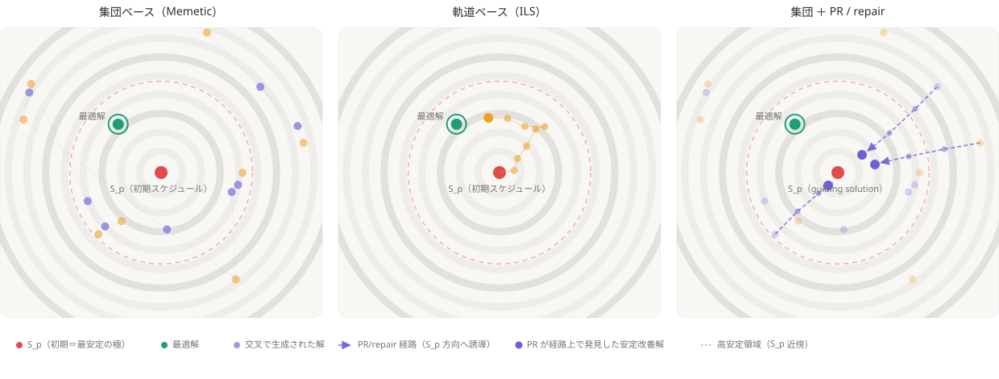

# [APIEMS 2026 投稿用] Asymmetric Effects of Stability-Inducing Operators across Trajectory and Population Search in Job-Shop Rescheduling

> **このファイルの位置づけ**
> APIEMS 2026（釜山, full paper 締切 2026-07-31）投稿版。母艦は [research_document.md](research_document.md)。
> 本ファイルに**日本語ドラフト（第1稿）**を書き起こし、確定後に英訳して `APIEMS FullPaperTemplate.docx` へ流し込む。
> 母艦 §4 は **B構成（H1→H2→スコアボード）** に更新済み・本稿も同順。「直交」→「独立な設計レバー」に統一。

---

## ⛓ 全体制約（テンプレ実測）

| 項目         | 制約                                                             |
| ------------ | ---------------------------------------------------------------- |
| 分量         | **8ページ以内**（A4・**2段組**・0.75cm段間）                     |
| 言語         | 英語（本稿は日本語ドラフト）                                     |
| 本文フォント | 10pt Times New Roman（節見出し11pt太字・タイトル20pt・著者10pt） |
| Abstract     | **200語未満**（日本語ソース目安 ≈ 380字）                       |
| キーワード   | 最大5                                                            |
| ページ番号   | 振らない                                                         |
| 見出し       | 3レベルまで（decimal）                                           |
| 数式         | 通し番号 (1),(2),... 右寄せ                                      |

## 📊 ページ＆字数予算

| 節                            | ページ     | 日本語字数目安         |
| ----------------------------- | ---------- | ---------------------- |
| Title/著者/Abstract/Keywords  | 0.4        | ≈ 400（Abstractのみ） |
| 1. Introduction               | 0.9        | ≈ 1,500               |
| 2. Related Work ＋ 位置づけ   | 1.0        | ≈ 1,800               |
| 3. Problem & Proposed Methods | 2.2        | ≈ 3,300               |
| 4. Computational Experiments  | 2.6        | ≈ 4,200               |
| 5. Conclusion                 | 0.5        | ≈ 900                 |
| References（15-20件に厳選）   | 0.4-0.7    | 別枠                   |
| **本文合計**                  | **≈ 8.0** | **≈ 12,100**          |

> 図表は **6〜8点**まで。図割り＝①H1密度差マップ（§4.2）②H2 PR経路長×改善発見率（§4.3）③横断スコアボード（§4.4, 3指標を最終稿で1図3パネルに統合——docx組版時に対応。英語ラベル化の際は scoreboard_heatmap.py で3パネル一括出力に直すと文字サイズを揃えられる）④集団/軌道/PR探索挙動の概念図 ga_vs_ils_pr（§3.3）／△アンタイム交差図・N5/swap概念図（紙幅次第）。図点数カウント=6（claim1, h1_density, claim2, mech_pr, スコアボード1図扱い, ga_vs_ils_pr）。

---

---

# 本文ドラフト（日本語・第1稿）

## Title / Authors / Abstract / Keywords

**Title（案）**: 探索構造を横断する安定性誘導演算子の非対称効果——安定性を考慮した JSSP 再スケジューリング
（英案: *Asymmetric Effects of Stability-Inducing Operators across Search Structures in Stability-Aware Job-Shop Rescheduling*）

**Abstract（≈380字 / 英200語未満）**

予測リアクティブ再スケジューリングでは外乱前の高品質スケジュール $S_p$ が既に存在し、修正解には効率（メイクスパン）と安定性（$S_p$ からの変更量の小ささ）が同時に求められるため、$S_p$ 近傍（高安定領域）の充填度が広域探索品質と並ぶ性能軸となる。本研究は N5 局所探索を揃えた統制比較で、軌道ベース（ILS）が連続変形でこの近傍を自力充填する一方、集団ベース（Memetic）は交叉ゆえ充填が構造的に粗いことを示す（H1）。これにより高安定域の覆域で ILS は全 8 シナリオを完全分離で上回る（|δ|=1.0）。さらに Path Relinking の guiding solution を $S_p$ に固定した再スケジューリング向け適応（PR）と、その 1 ステップ版 repair を、解を $S_p$ へ引き寄せる安定性誘導演算子として提案する。8 シナリオ・7 手法・n=10 の実験から、同一演算子の効果がホスト構造に依存して非対称に現れ（集団の高安定覆域を 2 倍以上押し上げ総合品質で首位へ、軌道は頭打ち, H2）、評価指標で首位手法が入れ替わる相補構造を定量化する。

**Keywords**: Rescheduling; Job-shop scheduling; Stability; Iterated local search; Path relinking

---

## 1. はじめに

製造現場では作業遅延や機械故障などの外乱が頻発し、当初スケジュールの実行を困難にする。対応は事前耐性設計の静的アプローチと事後修正の動的アプローチに大別され、本研究は後者のうち、外乱発生後に実行中スケジュールを実行可能な形へ修正する**予測リアクティブ再スケジューリング** [13] を対象とする。外乱には複数種があるが、本研究は機械割当を維持したまま処理順序の調整で対処でき「修正解を当初スケジュールの近傍に保つ」という前提が最も明確に成立する**作業遅延**に着目する。

再スケジューリングでは「修正後の効率（メイクスパン, MS）」と「外乱前スケジュール $S_p$ からの変更量（安定性）」がトレードオフの関係にある。大幅な変更は現場の混乱・段取り替え・資材や治具の再手配・作業者の再配置・下流工程や外注先への予定変更の波及といったコストを生むため、安定性は MS と並ぶ目的であり [3][14]、本研究はこれを**効率性と安定性の多目的最適化**として定式化する。

再スケジューリングの本質的特殊性は、**外乱前の高品質スケジュール $S_p$ が初期解として既に存在し、修正解はその $S_p$ からの変更量を抑えることが求められる**点にある。最適解は $S_p$ 近傍に分布する可能性が高く、探索手法の優劣は単なる大域探索能力ではなく、**$S_p$ 近傍（高安定領域）をどれだけ良く充填できるか**という軸を新たに帯びる。

本研究の目的は次の 3 点である。(1) 高品質初期解 $S_p$ が存在するという問題特性が単一解ベース・集団ベースの探索挙動に与える影響の比較分析、(2) 解を $S_p$ 方向へ引き寄せる**安定性誘導演算子（PR・repair）**の設計とベース手法構造との相互作用の分析、(3) 速度・Pareto 覆域・安定性帯別性能を統合した多角的評価方法論の構築である。本研究の主眼は、最先端手法との性能競争ではなく、安定性誘導機構とホスト構造の相互作用の構造分析にある [28]。

---

## 2. 既存研究と位置づけ

**効率と安定性の同時考慮.** JSSP は NP 困難でありメタヒューリスティクスが主流である [13]。再スケジューリングにおける効率と安定性の同時最適化は Wu ら [14] を先駆けとし、JSSP では Rangsaritratsamee ら [3]（ハイブリッド GA）、Zhang ら [4]（GA＋Tabu Search）、フローショップでは Katragjini ら [19] などが取り組んできた。これらは効率と安定性を重み付き和で単一スカラーに束ねる枠組みが主流であり（[3][4]）、安定性は独立した機構ではなく目的関数の一評価項として受動的に扱われる。また解法は、メタヒューリスティクスの二系統——軌道（単一解）ベースと集団ベース [30]——のうち GA を基軸とする**集団ベースが中心**である。

**安定性を機構として担う系譜（範囲限定型）.** 一方、安定性を**再スケジュール範囲の限定**で構造的に保証する系譜がある。match-up scheduling [15]、影響波及作業のみ再スケジュールする AOR [16]、染色体を区間に限定する Zakaria & Petrovic [17]、範囲を階層的に定式化した Sun ら [27] などがある。いずれも安定性を**探索空間の制限**で確保する点で共通する。

**残された課題と本研究の位置づけ.** 上記二系統を踏まえると課題は三つ残る。第一に、既存の再スケジューリング研究は解法が GA を基軸とする集団ベースに偏り、軌道ベースとの統制比較を欠く。再スケジューリング固有の「高品質初期解 $S_p$ が既に存在する」という特性が探索構造（軌道／集団）の挙動に与える影響は、われわれの知る限り正面から分析されていない。本研究は局所探索（N5）を揃えた ILS と Memetic の統制対比でこれを分析する。第二に、既存の安定性確保手段はいずれも探索を安定性へ能動的に導かない。確保手段は大別して、探索空間を制限する範囲限定型と、目的関数に受動的に組み込む併合型の二系統であり、前者は制限の外側にある効率‒安定トレードオフ解を探索対象から外し、後者は探索自体が安定性を志向せず、高安定領域の充填をベース探索構造の素の能力に委ねる。本研究は、解を $S_p$ 方向へ能動的に引き寄せる探索演算子（PR・repair）を提案する。安定性を探索空間の制限ではなく演算子として確保する点が、範囲限定型に対する核心的な設計上の主張である。第三に、既存評価は少数の固定重みによるスカラー比較が主で、Pareto 覆域・収束速度・安定性帯別といった多軸の評価方法論を欠く。本研究は統合 HV・高安定 HV・AOC の 3 指標で評価する（§3.4）。

この立場から次の 2 仮説を立てる。**H1（適合性）**: 交叉で解を大きく組み替える集団ベース（Memetic）は生成子が $S_p$ 近傍から離れやすく高安定領域（$S_p$ 近傍）の充填が構造的に粗い一方、$S_p$ を起点に連続変形で近傍を充填する軌道ベース（ILS）はこの領域を効率よく覆う。**H2（補完性）**: 解を $S_p$ へ引き寄せる演算子（PR・repair）は、集団が構造的に苦手とする近傍充填を補完するため、効果はホスト構造に依存して**非対称**に現れる（集団に大・軌道に僅少）。3 章で手法と機構を、4 章で両仮説を検証する。

---

## 3. 問題設定と提案手法

### 3.1 問題定義

$n$ ジョブ・$m$ 機械の JSSP に外乱（作業遅延）が発生した後、元スケジュール $S_p$ に対し修正スケジュール $S_q$ を求める。外乱は単一の作業遅延（遅延量 $\Delta$）とし、機械上の順序を $S_p$ のまま保って実行可能性を回復した **right-shift 解 $S_{RSR}$** を得る。再スケジューリング時刻 $t_r$（遅延解消時刻）より前に開始済みの作業は**凍結**し、$t_r$ 以降の作業を**最適化対象**とする。決定変数は最適化対象作業の機械ごとの処理順序のみで、解は凍結部を先頭に固定し、与えられた機械順序を保ったまま各作業を $t_r$ 以降の最早可能時刻へ詰め、実スケジュールに変換する。

**安定性指標.** 逸脱量は (i) 開始時刻偏差（時間安定, temporal stability）と (ii) 処理順序（順列）偏差（順序安定, sequence stability）の二系統に大別される。たとえば Sun ら [27] は両者を明示的に区別したうえで前者（開始時刻の絶対偏差和 ADST）を安定性指標に採る。本研究は探索機構（PR・repair の direct swap、N5 近傍）がいずれも順列操作であること、および MS との独立性が高いことから後者を採用する。

$$
D(S_p, S_q) = \sum_{(i,j) \in \mathcal{O}_{\mathrm{opt}}} \left\lvert r_{i,j}^p - r_{i,j}^q \right\rvert \quad (1)
$$

$r_{i,j}$ は機械 $i$ でのジョブ $j$ の処理順位、$\mathcal{O}_{\mathrm{opt}}$ は最適化対象（$t_r$ 以降）の作業集合である。$D=0$ は順序不変の right-shift 解 $S_{RSR}$ に対応する。開始時刻に基づく時間安定は本指標の射程外であり限界として明記する。

**多目的とスカラー化.** $\min_{S_q}\,(MS(S_q),\,D(S_p,S_q))$ を、重み $\lambda\in[0,1]$ の重み付き和で解く。

$$
F(S_q) = \lambda\,\hat D(S_p, S_q) + (1-\lambda)\,\widehat{MS}(S_q) \quad (2)
$$

$\hat\cdot$ は min-max 正規化値。重みを複数点掃引して解を統合し Pareto 覆域で評価する（§3.4）。なお $S_{RSR}$ から順序再最適化で MS を改善できる余地が残ること（非縮退）が、手法差の現れる前提である。

**なぜ Pareto native 手法でなく重みスカラー化か.** 第一に**運用形態との整合**——効率と安定性の優先度は意思決定者が事前に重みとして与える量であり（再スケジューリングの標準的枠組み [3]）、重みごとに解が定まるため、選好別の立ち上がりを測る重み別アンタイム HV($t$)（AOC, §3.4）と直接整合する。第二に**統制比較の共通基盤**——単一解の ILS と集団の Memetic に同一スカラー目的 $F(\lambda)$ を共有させてこそ、同一機構を両構造へ無改変で載せ構造差だけを切り分けられる（集団固有の非劣ソートを前提とする NSGA-II 等はこの統制に載らない）。単一重み依存を避けるため $\lambda$ を複数点掃引し、UEA [9] で全非劣解を統合して評価する。重み付き和は非凸フロントの凹部に届かない凸限界をもつ [8] が、全手法を同条件で評価する本研究では構造差の議論に影響しない（Pareto native 手法での再検証は今後の課題）。

### 3.2 ILS とその根拠（H1）

初期解 $S_p$ が高品質でその近傍に最適解が分布しやすい再スケジューリングでは、$S_p$ を起点に連続変形する軌道（単一解）ベースが高安定領域を充填的に探索できると期待される（H1）。そこで比較の中核を**局所探索（N5）を揃えた ILS と Memetic-LS の対比**に置き、局所探索の有無という交絡を排して探索構造のみを対照する。

単一解ベースの中でも ILS [22] を採るのは、深掘り（局所探索）と脱出（摂動）が分離され、**摂動強度を $S_p$ からの距離として直接制御**でき、安定性誘導機構（§3.3）を摂動として差し込みやすいためである。局所探索は JSSP 標準の **N5 近傍 [1]**（クリティカルブロック端の隣接 swap のみを候補とし makespan 改善見込みのある手に絞る）を用い、ILS と Memetic-LS で共有する。N5 の探索単位はクリティカル端の隣接 swap という最小の構造変更であり、$S_p$ からの逸脱を小刻みに刻みつつ高安定領域を充填できる点で、安定性を重視する本設定とも相性がよい。摂動は insert 移動で、強度（＝$S_p$ からの距離）を停滞度に応じ鋸歯状に巡回させ（VNS [10] 型）、$F(\lambda)$ を厳密改善したときのみ best を更新する。候補は makespan 動機で $\lambda$ 非依存だが採否は $F(\lambda)$ で評価するため、局所最適は $\lambda$ に応じ効率側・安定側へ移る。

**集団ベース（GA / Memetic-LS）.** H1 の統制対照となる集団ベースは、operation-based 表現 [25] の標準 GA（PPX 交叉 [11]・逆位突然変異・エリート保存付きトーナメント選択）に上記 N5 を各個体へ Lamarckian に適用した **Memetic-LS**（GA と局所探索の統合 [29]）とする（局所探索をもたない素の GA は参考ベースライン）。ILS と N5 を共有するため両者の差は探索構造（単一軌道 vs 集団＋交叉）のみに帰する。**交叉は 2 親の構造を切り貼りする破壊的操作で生成子が $S_p$ 近傍から飛びやすく、N5 を備えた Memetic-LS でも高安定領域の充填が構造的に粗くなる**——これが H1 の根幹である。

### 3.3 安定性誘導演算子（PR・repair）と H2

**Path Relinking（PR）.** PR は 2 つの高品質解を結ぶ経路上に優れた中間解が存在するという考えに基づく探索機構で、一般には Scatter Search 等と組み合わせ、エリート解プール内の解どうしを結ぶ形で用いられる [5][6]。本研究はこれを再スケジューリングの構造に合わせ、**guiding solution を外乱前スケジュール $S_p$ の一点に固定する**点が特徴である。すなわち現在の局所最適解（initiating）から $S_p$（guiding）へ向け、不一致位置を direct swap で 1 つずつ縮めながら経路を辿り、経路上最良解を返す。$S_p$ に固定する理由は、(a) $S_p$ が安定性目的の最適端点ゆえ PR を「安定性アンカーへの方向づけ移動」として一意に解釈できること、(b) $F(\lambda)$ 局所最適である $S_{cur}$ と $S_p$ を結ぶ経路の中間解が MS–安定性トレードオフ上に並び Pareto 充填に直接寄与すること、である。ムーブは各ステップで実行可能な不一致 swap を 1 つランダムに選び評価回数を $O(d)$（$d$=不一致数）に抑える（best 選択 $O(d^2)$ と HV 有意差なし・予備実験）。

**Stability Repair Kick（以下 repair）.** PR の「$S_p$ への 1 ステップ近接」を ILS の摂動キックに転用したもので、PR を途中で打ち切った Mini-PR にあたる。停滞時に direct swap を数回適用して解を $S_p$ 方向へ引き寄せ（＝$S_p$ から漂って失った安定性を"修復"し）、局所探索を再出発させる。depth も鋸歯状に巡回させ安定性側フロントを面で覆う。

**H2（補完仮説）.** PR・repair はいずれも「解を $S_p$ 方向へ引き寄せる」演算子で、集団ベースが苦手とする高安定域の充填をちょうど補完する。一方 ILS は H1 の通り近傍を自力充填済みのため伸びしろは小さい。機序は解の冗長性と経路長の差にある：GA 由来解は N5 ほど厳密な MS 最適化が及ばず「MS を壊さず安定性を改善できる冗長な順序」が残り、かつ $S_p$ から遠く PR の経路が長い。逆に ILS は $S_p$ 近傍に張り付き経路が短い。ゆえに**機構の効果は集団に大・軌道に僅少という非対称**を予測する。

下図に、$(MS, D)$ 平面上での 3 構造の探索挙動——集団の飛散（H1）・軌道の近傍充填（H1）・機構による引き戻し（H2）——を模式化する。

本研究の対象は 7 手法：ILS-baseline / ILS+repair / ILS+PR / GA / Memetic-LS / Memetic+PR / Memetic+repair。

### 3.4 評価フレームワーク

単一の重みでのスカラー値比較は、結論が重み選択に依存するうえ、探索が効率‒安定トレードオフ全体をどれだけ覆えたかを捉えられない。そこで重み $\lambda$ を複数点で掃引し（weighted-sum sweep）、各探索が訪問した全非劣解を保存する **UEA** [9] のもとで Pareto 覆域を測る。さらに再スケジューリングが実際に重視するのは効率端ではなく $S_p$ 近傍の安定解であり、「いつ計算を止めても良い解が得られるか」も実運用上重要である。この 3 つの問い——**総合品質・安定解の充填・速度**——に対応する 3 指標を用いる：

- **統合 HV（総合品質）**：全領域の hypervolume。
- **高安定 HV（本命）**：$D<$P50（$S_p$ 近傍）に限った hypervolume。P50 は全手法・全 trial の Pareto 解の $D$ をプールした中央値。
- **AOC（アンタイム性能 [26]）**：HV-対-対数時間曲線の時間平均。

HV はシナリオ横断比較のため各シナリオで $[0,1]^2$ にアフィン正規化し参照点 $(1.1,1.1)$ で算出する。AOC のアンタイム HV($t$) は壁時計上で測り、積分窓は**全手法共通**にとって対数幅で正規化する（手法間 apples-to-apples）。AOC 値は各重みのアンタイム HV($t$) を 10 重み掃引で平均する。

**統計.** 各シナリオ内を片側 Wilcoxon 符号順位検定（trial 対応あり。H1・H2 とも方向を事前に定めた仮説のため片側が妥当）＋効果量 Cliff's $\delta$ で評価する。なお $|\delta|$=1.0（完全分離）のとき n=10 の片側 Wilcoxon で $p$ は下限 $\approx$0.001 に達するため、以降の「$p$=0.001」は方向の完全な一貫性を意味する（差の大きさは $\delta$ と倍率で別示）。シナリオ横断の傾向は Friedman＋平均順位＋Kendall's $W$ で要約するが、8 シナリオは 5 インスタンスに由来し、la36 ラダーと ta21 対は同一インスタンス内で外乱条件のみを変えた相関シナリオであるため、横断統計は独立標本検定ではなく**順位一貫性の探索的要約**として扱う。性能差の大きさは最良手法からの相対偏差 ARPD%（$(\text{best}-x)/\text{best}\times100$, 低いほど良い）で併示する。

---

## 4. 計算機実験

本章は統制した対比較で H1（§4.2・軌道ベースの高安定域への適合性）と H2（§4.3・同一機構のホスト依存の非対称効果）を確立し、総合スコアボード（§4.4）でその含意を俯瞰する。中心となる知見は、安定性レバーを演算子として実装したことで**ホスト構造と安定性誘導機構の相互作用を統制下で切り分けられた**点にある。その帰結として、評価軸が変われば最良手法も替わる相補構造も観測される（§4.4）。

### 4.1 実験設定

ベンチマークは mt10・la21・la36・la40・ta21。外乱は計 8 シナリオ＝la36S/la36M/la36L（27/54/73%）・ta21S/ta21L（32/82%）・mt10（72%）・la21（35%）・la40（32%）で、各シナリオに付した百分率は**再スケジューリング率** $\rho=n_{res}/\text{ops}$——全作業のうち外乱で再最適化対象 $\mathcal{O}_{opt}$ となった割合——を表す。再スケジューリング率は本設定で問題の実効的な難度を左右する主軸と考えられるため、これを統制軸に据える（詳細は §4.4 末尾）。とりわけ **la36 ラダー**（27/54/73%）と **ta21 対**（32/82%）は、同一インスタンス・同一 $S_p$ のまま再スケジューリング率のみを段階的に変え、手法差の $\rho$ 依存性を交絡なく切り分ける目的で構成した。各シナリオの外乱は単一作業の完了遅延であり、遅延量 $\Delta$ は対象作業の処理時間の約 0.9〜1.5 倍（$\Delta$=60〜148）、再スケジューリング時刻 $t_r$ はその遅延解消時刻＝遅延後完了時刻にとる（§3.1）。各シナリオの対象作業・$\Delta$・$t_r$、および $\rho$ の制御法（外乱作業の $S_p$ 上の位置による）の完全な定義は公開リポジトリ（下記）に収録する。

**主な設定.**

- **重み・試行**: $\lambda$ を 10 点掃引（0〜0.9, 0.1 刻み。純安定端点 $\lambda$=1.0 は最適が自明解 $S_{RSR}$（$D$=0）に縮退するため除外）、各（シナリオ×手法）条件で 10 trial。解析単位は trial であり、1 trial は 10 重みの掃引全体——各重みの探索の訪問解を UEA で統合した非劣解集合——を指す。したがって HV は trial ごとに 1 値が得られ、以降の検定はすべて n=10 を標本とする。
- **計算予算**: ILS 反復上限 3000／GA・Memetic 500 世代（いずれも自然収束まで）。反復数と世代数は単位が異なるため族内で公称値を揃え、手法横断の速度は壁時計上の AOC で比較する。壁時計は族間で異なる（Memetic+PR は ILS の 5〜8 倍＝Python 実装での $S_p$ への経路 decode 由来）が、これは機構固有のコストであって打ち切りの産物ではない：収束診断では全 7 手法とも中央値 run が予算の半分以下で最終 HV の 99% に達する。
- **初期解・GA 設定**: $S_p$ は GA-500 で生成した高品質 active スケジュール（染色体を GT 法 [23] でデコード, §3.1 の非縮退条件を満たす）。全手法は $S_p$ を共通の出発点として受け取る（ILS は初期解として、GA・Memetic は初期集団に含めて）。GA バックボーン（$cx_{pb}$=0.85, $mut_{pb}$=0.1, pop=50）は標準値域に固定し独立変数としない。
- **環境・再現性**: AMD Ryzen 5 7530U／Python 3.12（NumPy・DEAP・SciPy）。全乱数シード固定。コードと外乱シナリオ定義は GitHub（https://github.com/kitotakumi/stability_scheduling）で公開。

### 4.2 結果1：軌道(ILS) vs 集団(Memetic)（H1）

機構の交絡を避け、局所探索を揃えた `ILS-baseline` vs `Memetic-LS` を比較する（**両手法は同一 N5 を備える**ため差は局所探索の有無でなく探索構造に由来する）。したがって高安定域の差は、同じ局所探索を積んだ有能な集団でも交叉ゆえ $S_p$ 近傍を構造的に充填しきれないことに帰せられる。

- **統合 HV：互角**（ILS 5 勝・Memetic 3 勝）。Memetic が勝つのはいずれも改善余地の大きい中〜高再スケジューリング率のシナリオ（la36M・mt10・la36L, 54〜73%）で、勝者は再スケジューリング率に応じて入れ替わる（対応の詳細は §4.4）。
- **高安定 HV（本命）：ILS が全 8 シナリオを完全分離で上回る**（$p$=0.001, $|\delta|$=1.0）。低再スケジューリング率の 3 シナリオ（la36S・ta21S・la40）では Memetic-LS が高安定域に解を 1 つも到達できず、ILS のみが $S_p$ 近傍を覆う。残る 5 シナリオでも ILS が 2〜4.5 倍。$|\delta|$=1.0 の完全分離のため、8 シナリオ族に多重比較補正（Holm）を施しても全シナリオで有意は保たれる。
- **AOC：6/8 で ILS 有意優位**（例外 la36S・mt10 は再最適化部分問題が小さく集団の早期被覆が効く）。

**構造的原因（訪問密度差マップ, 下図）.** 各手法の訪問密度を $(MS,D)$ 格子で正規化した差分マップは、ILS が低 $D$ のフロント帯に探索を集中する一方、Memetic は高 $D$ の不安定領域に分散することを示す。集団は低 $D$ 領域も訪問するが、破壊的な交叉ゆえ、同じ N5 を積んでも連続変形の ILS ほど低 $D$ 近傍の MS を煮詰められない。ゆえに同じ低 $D$ でも ILS 解に MS で劣って Pareto 的に充填できず——これが高安定 HV 差の構造的原因である。なお集団が $S_p$ から遠い解を多数保持するこの性質は経路長を長くし、機構（PR/repair）が引き戻しで充填できる余地を生む——この点は H2（§4.3）で回収する。

### 4.3 結果2：PR・repair 機構の非対称効果（H2）

機構を baseline に追加したときの高安定 HV の伸びをホスト別に見る。

- **集団（Memetic）：機構が高安定 HV を大幅改善**（全 8 シナリオで 2 倍以上, $p$=0.001, $|\delta|$=1.0）。届かなかった $S_p$ 近傍を機構が直接充填し、集団は機構によって**高安定で ILS に追いつき、総合品質（統合 HV）では ILS を追い越す**（スコアボード §4.4）。
- **軌道（ILS）：ほぼ頭打ち**。多くのシナリオで baseline 時点で高安定域を自力充填済みで天井タイ。機構が有意に効くのは**最高再スケジューリング率帯の la36L（73%）と ta21L（82%）のみ**（生 $p$=0.016, 0.001。ILS ホストの 8 シナリオ族に Holm 補正を施すと ta21L のみ補正後も有意に残る, $p_\text{adj}$≈0.008。改善幅は小さく——ta21L の ILS 高安定 HV 中央値が baseline 0.029→機構込み 0.031——だが改善方向は全 trial で一貫）。これは機構効果が「無い」のではなく、ILS が近傍を自力で埋めきるため伸びしろが乏しく、外乱が極端に大きく充填が追いつかない場合のみ僅かな上積み余地が残ることを示す。

**機構的原因（PR 経路統計, 下図）.** PR の経路統計が非対称を直接裏づける：**Memetic は経路長 $d_0$ が大きく経路上で約 30〜65% の確率で改善解を発見**するのに対し、**ILS は経路が短く改善発見率は全シナリオでほぼ 0%**（ta21L でも 0.4%）。これは経路の長短による試行機会の差だけでなく、ILS が $S_p$ 近傍をすでに自力充填済みで——経路が短いこと自体その表れ——PR がたどる区間に改善余地が残らない一方、Memetic では交叉で散った解と $S_p$ の間に未最適化の中間解が多く残ることを反映する。ゆえに方向づけ移動は ILS では空振りに終わる。la36L・ta21L で機構が僅かに効くのは方向づけ自体でなく、キック後の局所探索が ILS の自力充填で埋め残した高安定域を再最適化で埋める寄与による。

**PR か repair か——ホスト依存の使い分け.** PR と repair を品質（統合 HV・高安定 HV）とアンタイム（AOC）の両面で比べると、使い分けが要るかはホストで分かれる。**ILS**（$d$ 小）では両面ともほぼ差がない：品質は機構を足しても頭打ちで baseline とほぼ変わらず（有意なのは最高再スケジューリング率の la36L・ta21L のみ）、速度も——機構が停滞時のみ発動し（対数時間の AOC が重く見る序盤は未発動）経路も短く $O(d)$ で安いため——ILS-baseline・+repair・+PR の AOC 差が全 8 シナリオで有意でない（実質タイ）。ゆえに ILS では PR/repair の選択は問題にならない。**Memetic**（$d$ 大）では両面で棲み分けが明確で、品質は **PR が僅かに優る**一方、アンタイムは **repair が全 8 シナリオで PR に優る**（$\delta$ 最大 +1.00）——PR は $S_p$ までの長い経路を辿り切ってから最良中間解を返すため立ち上がりが遅く、repair は数手で打ち切って即座に incumbent を更新するためである。ゆえに Memetic では、最終品質最優先なら Memetic+PR、計算予算が厳しくアンタイム重視なら repair という使い分けが成立する。

### 4.4 総合スコアボードと結果の統合

H1・H2 で確立した構造を、全 7 手法 × 8 シナリオ × 3 指標の**総合スコアボード**（下図）で俯瞰し、冒頭で予告した「指標で首位が替わる」相補構造を裏付ける。Friedman 平均順位は 3 指標とも手法間で明確に分離し、横断的な順位一貫性は中〜大である（Kendall's $W$=0.59／0.81／0.63, $p$<0.001。ただし §3.4 のとおり 8 シナリオの相関ゆえ探索的要約）。

> 【図組み方針】以下 3 枚は最終稿では **1 図 3 パネル (a)(b)(c)・単一キャプション**として組む（図点数 1 としてカウント）。ドラフトでは編集しやすさのため別掲。

**指標別の読み.** 図の緑（最良）分布を指標ごとに読むと相補構造が具体化する（括弧内は Friedman 平均順位, 小さいほど良い）。**統合 HV（品質）**は機構込みの集団が首位群（Memetic+PR 2.0・Memetic+repair 2.5）、ILS 系 3 種と素の Memetic-LS が中位群（3.6〜4.8）、GA のみ下位（6.9）。§4.2 で ILS と互角だったのは素の集団（Memetic-LS）であり、機構を備えた Memetic+PR がその上に立って首位となる——この首位は leave-one-out に頑健で（どの 1 シナリオを除いても不変）、僅差が単一シナリオ駆動でない。**高安定 HV（本命）**は ILS 系と機構込み Memetic が首位群に密集する一方（2.6〜3.4）、機構をもたない素の集団だけが ARPD ≈70〜78% と壊滅して $S_p$ 近傍に届かず二分される（GA 6.4・Memetic-LS 6.6）——H1（軌道が地で充填）と H2（機構が集団の粗さを補完し追いつく）が予言したとおりである。**AOC（アンタイム）**は ILS 系 3 種が首位群（2.5〜2.8）、素の Memetic-LS と Memetic+repair が中位（3.5・4.0）、ウォームアップの遅い Memetic+PR と GA が下位（5.6・7.0）。評価軸が変われば最良手法も替わり（総合品質なら Memetic+PR、安定性重視・速さなら ILS 系）、両構造は再スケジューリングの異なる要求を補い合う。

**【探索的な気づき】統合 HV の勝者と再スケジューリング率.** 統合 HV の勝者は $\rho$ と対応し、~50% を境に低で ILS・中〜高で Memetic に二分する（同一 la36 ラダー 27/54/73% で ILS→Memetic→Memetic）。この二分を捉えるのは固定骨格の割合を織り込む $\rho$ のみで、可動工程の絶対数や問題規模では捉えられない。機序の見立て：安定性項は $S_p$（$D$=0）を引力点とする。$\rho$ が小さいうちは固定骨格が解の大半を占め、可動部を入れ替えても $S_p$ から離れた良質な局所最適が生じ得ず、良解は $S_p$ 近傍に限られるため ILS の近傍充填で足りる。だが $\rho$ が増して効率端が遠のくと、単一軌道の ILS は引力圏を脱しにくく、交叉で $S_p$ から離れた個体を保つ Memetic だけが届く（H1 と同型）。すなわち $\rho$ は軌道が引力圏を脱して遠方の良解に到達する難しさの代理と見なせる。ただし ta21L（82%）は例外（≒タイ, $p$=0.053）であり、初期解 $S_p$ 品質の交絡と順列偏差表現への依存も残るため、この対応は探索的見立てに留める。本命の高安定 HV 優位と機構非対称はこの対応に依存せず、全 8 シナリオの直接検定で独立に確立している。

**発散型と収束型.** ILS（$S_p$ 起点に外へ広がる）と Memetic+PR（散らばった集団を $S_p$ へ引き寄せる）は逆向きの探索方向ながら類似した最終 Pareto 品質に到達するが、ILS は早期から良い incumbent を持ち、Memetic+PRはウォームアップ後に立ち上がる（改善余地があれば後で逆転）。AOC はこの交差を対数時間で集約して早期性能を反映するため、ILS 系が明確に優位となる。

---

## 5. 結論

本研究は安定性を考慮した JSSP 再スケジューリングを対象に、軌道／集団の探索構造比較、安定性誘導機構（PR・repair）の提案、多角的評価方法論の構築を行い、8 シナリオ × 7 手法 × n=10 の実験で検証した。主張は 3 点である。

1. **軌道ベース（ILS）は高安定領域を効率的に充填する（H1）.** 総合品質では集団と互角だが、本命の高安定領域では同一 N5 を揃えた集団ベースを全 8 シナリオで完全分離で上回り（$p$=0.001, $|\delta|$=1.0。5 シナリオで 2〜4.5 倍・残る 3 シナリオでは集団ベースが高安定域到達ゼロ）、アンタイムでも 6/8 で上回る。これは局所探索の有無でなく探索構造に由来する。
2. **PR・repair の効果はホスト構造に依存して非対称に現れる（H2）.** 集団に対しては高安定 HV を 2 倍以上押し上げ ILS 水準へ引き上げる一方、近傍を自力充填済みの軌道ではほぼ頭打ちとなる。ただしこの非対称は固定的性質ではなく、ILS の充填が追いつかない極端な高再スケジューリング率（ta21L 82%）では軌道にも機構効果が有意に残る。
3. **軌道と集団の相補構造.** 評価指標により最良手法が替わり、両構造は再スケジューリングの異なる要求を補い合う。実務上の処方は明快である——最終品質を最優先するなら Memetic+PR、計算予算が厳しくアンタイム重視なら Memetic+repair、安定性と即応性を重視するなら ILS 系（§4.3）。

安定性レバーを「演算子」として実装したことで同一機構を両ホストへ移植でき、**そのホスト依存の非対称性を統制下で切り分けたことが本研究の中心的貢献である**。

**限界.** (i) n=10 に基づく（飽和した主結論は頑健だが境界事例は別）。(ii) 再スケジューリング率—統合 HV の勝者の対応には初期解 $S_p$ 品質の交絡と安定性目的の表現依存があり探索的観察に留める。(iii) 安定性を順列偏差でのみ測っており、開始時刻偏差（時間安定）下での妥当性は未検証である（§3.1）。

**今後の課題.** 開始時刻偏差（時間安定）下での再検証、機械故障など機械割当を変える外乱への拡張、範囲レバーと演算子レバーの統合（影響波及範囲内での誘導演算子の併用）の検証、集団側の代替処方 $S_p$ 偏向交叉との比較（H1 の交叉破壊性の直接検証）、および Pareto-native 手法（NSGA-II 等）での再検証が挙げられる。

---

## References

> ※ 番号は母艦 [research_document.md](research_document.md) のものを暫定流用（本文中の [n] と対応）。最終版では出現順に 1 から振り直す。

[1] Nowicki, E., & Smutnicki, C. (1996). A fast taboo search algorithm for the job shop problem. *Management Science*, 42(6), 797–813.

[3] Rangsaritratsamee, R., Ferrell Jr, W. G., & Kurz, M. B. (2004). Dynamic rescheduling that simultaneously considers efficiency and stability. *Computers & Industrial Engineering*, 46(1), 1–15.

[4] Zhang, L., Gao, L., & Li, X. (2013). A hybrid genetic algorithm and tabu search for a multi-objective dynamic job shop scheduling problem. *International Journal of Production Research*, 51(12), 3516–3531.

[5] Glover, F., Laguna, M., & Martí, R. (2000). Fundamentals of scatter search and path relinking. *Control and Cybernetics*, 29(3), 653–684.

[6] Peng, B., Lü, Z., & Cheng, T. C. E. (2015). A tabu search/path relinking algorithm to solve the job shop scheduling problem. *Computers & Operations Research*, 53, 154–164.

[8] Marler, R. T., & Arora, J. S. (2010). The weighted sum method for multi-objective optimization: new insights. *Structural and Multidisciplinary Optimization*, 41(6), 853–862.

[9] Ishibuchi, H., Pang, L. M., & Shang, K. (2020). A new framework of evolutionary multi-objective algorithms with an unbounded external archive. In *Proc. 24th European Conf. on Artificial Intelligence (ECAI 2020)*, IOS Press, pp. 283–290.

[10] Mladenović, N., & Hansen, P. (1997). Variable neighborhood search. *Computers & Operations Research*, 24(11), 1097–1100.

[11] Bierwirth, C., Mattfeld, D. C., & Kopfer, H. (1996). On permutation representations for scheduling problems. In *Parallel Problem Solving from Nature—PPSN IV*, LNCS 1141, pp. 310–318. Springer.

[13] Ouelhadj, D., & Petrovic, S. (2009). A survey of dynamic scheduling in manufacturing systems. *Journal of Scheduling*, 12(4), 417–431.

[14] Wu, S. D., Storer, R. H., & Chang, P.-C. (1993). One-machine rescheduling heuristics with efficiency and stability as criteria. *Computers & Operations Research*, 20(1), 1–14.

[15] Bean, J. C., Birge, J. R., Mittenthal, J., & Noon, C. E. (1991). Matchup scheduling with multiple resources, release dates and disruptions. *Operations Research*, 39(3), 470–483.

[16] Abumaizar, R. J., & Svestka, J. A. (1997). Rescheduling job shops under random disruptions. *International Journal of Production Research*, 35(7), 2065–2082.

[17] Zakaria, Z., & Petrovic, S. (2012). Genetic algorithms for match-up rescheduling of the flexible manufacturing systems. *Computers & Industrial Engineering*, 62(2), 670–686.

[19] Katragjini, K., Vallada, E., & Ruiz, R. (2013). Flow shop rescheduling under different types of disruption. *International Journal of Production Research*, 51(3), 780–797.

[22] Lourenço, H. R., Martin, O. C., & Stützle, T. (2019). Iterated local search: framework and applications. In Gendreau, M., & Potvin, J.-Y. (eds.), *Handbook of Metaheuristics*, 3rd ed., pp. 129–168. Springer.

[23] Giffler, B., & Thompson, G. L. (1960). Algorithms for solving production-scheduling problems. *Operations Research*, 8(4), 487–503.

[25] Bierwirth, C. (1995). A generalized permutation approach to job shop scheduling with genetic algorithms. *OR Spektrum*, 17(2–3), 87–92.

[26] López-Ibáñez, M., & Stützle, T. (2014). Automatically improving the anytime behaviour of optimisation algorithms. *European Journal of Operational Research*, 235(3), 569–582.

[27] Sun, R., Cheng, G., Ding, Q., & Zhao, X. (2026). Impact of optimization scope on solution quality and stability in dynamic flexible job shop rescheduling. *Computers & Industrial Engineering*, 215, Article 111943.

[28] Sörensen, K. (2015). Metaheuristics—the metaphor exposed. *International Transactions in Operational Research*, 22(1), 3–18.

[29] Neri, F., & Cotta, C. (2012). Memetic algorithms and memetic computing optimization: A literature review. *Swarm and Evolutionary Computation*, 2, 1–14.

[30] Blum, C., & Roli, A. (2003). Metaheuristics in combinatorial optimization: overview and conceptual comparison. *ACM Computing Surveys*, 35(3), 268–308.

---

---

# 付録: 計画メモ（投稿前作業用・最終稿では削除）

## References 厳選（30→15-20件）

- 必須: [1]N5, [5]PR, [22]ILS, [27]Sun2026（範囲限定の比較対象）, [9]UEA, [26]AOC, [28]メタファー批判, [3]効率×安定GA, [13]サーベイ（§2冒頭で引用済み・Ouelhadj & Petrovic 2009 を採用, [12]Vieira2003 は落とす）, [11]PPX, [23]GT, [25]operation-based。
- 落とす候補: [4][18][19][20][21] の一部（背景網羅のための引用は数を絞る）。

## 作業手順

1. 本日本語ドラフトをレビュー → 節ごとに字数実測・過不足調整。
2. 英訳（"independent design dimension" 等、母艦の語選びと統一）。
3. 図を 6-8 点に厳選・英語ラベル化（①h1_density ②mech_pr ③scoreboard）。
4. `.docx` テンプレートへ流し込み → 8ページ実測 → 溢れたら §4.4 気づき／限界／関連研究の順で削る。
5. Abstract 200語・キーワード5・ページ番号なしを最終チェック。
