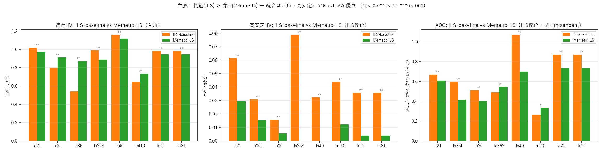
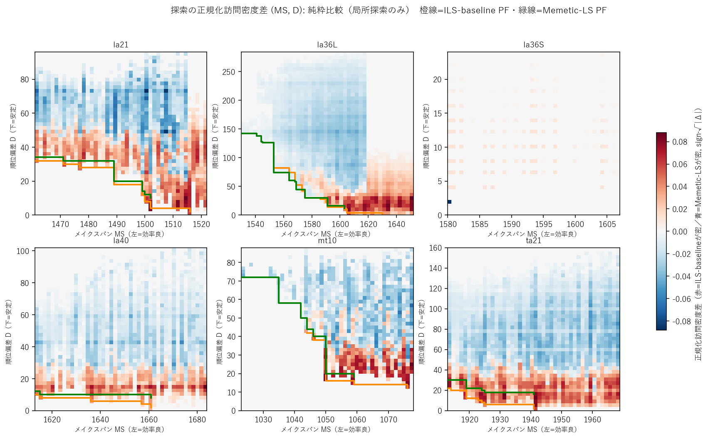
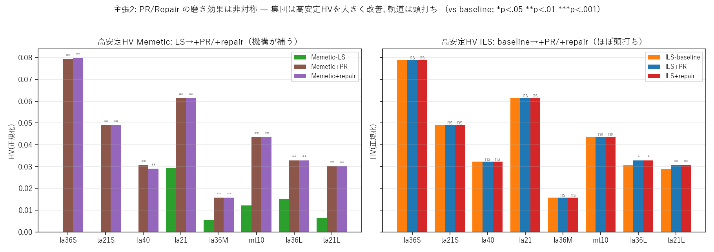
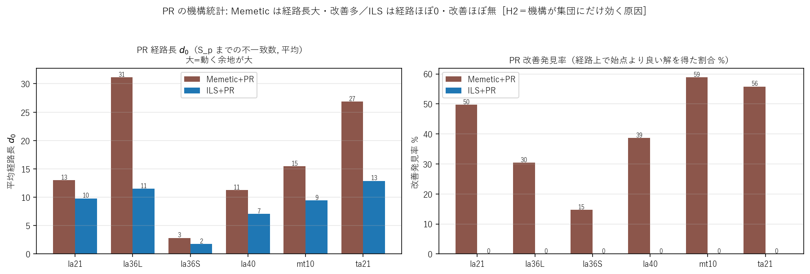
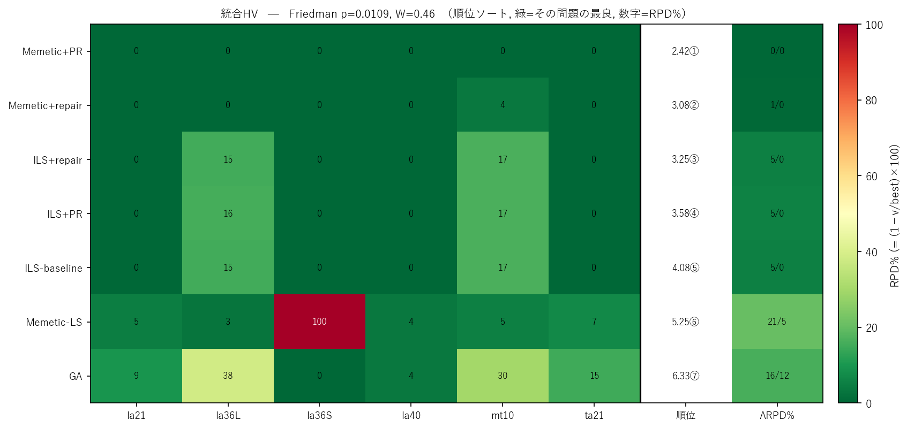
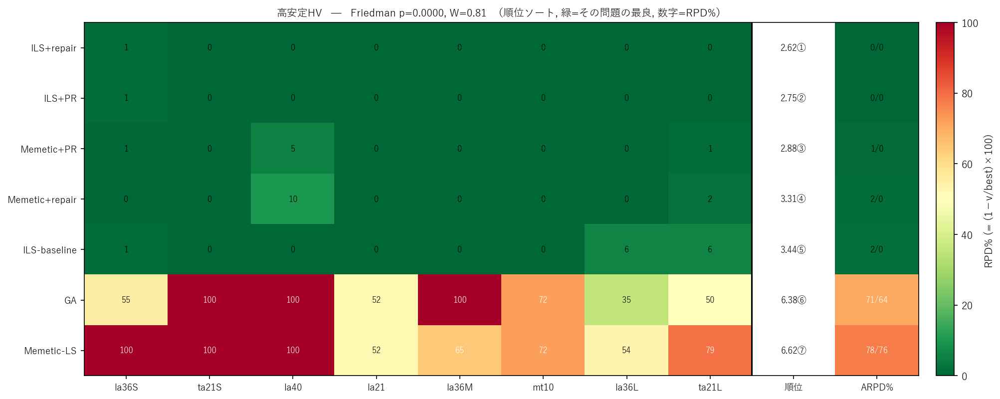
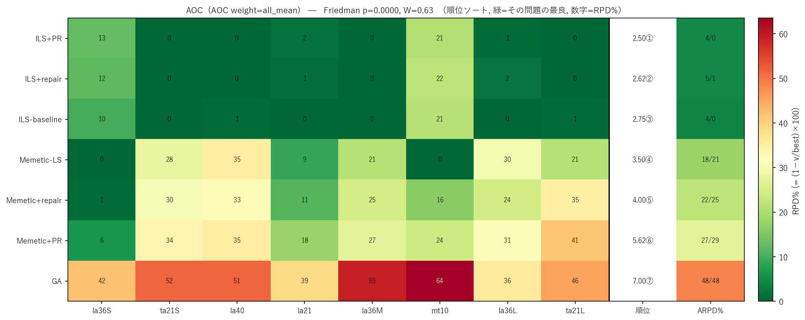

# [APIEMS 2026 投稿用] Metaheuristic Search-Structure Analysis for Stability-Aware JSSP Rescheduling

> **このファイルの位置づけ**
> APIEMS 2026（釜山, full paper 締切 2026-07-31）投稿版。母艦は [research_document.md](research_document.md)。
> 本ファイルに**日本語ドラフト（第1稿）**を書き起こし、確定後に英訳して `APIEMS FullPaperTemplate.docx` へ流し込む。
> 母艦 §4 は **B構成（H1→H2→スコアボード）** に更新済み・本稿も同順。「直交」→「独立な設計レバー」に統一。

---

## ⛓ 全体制約（テンプレ実測）

| 項目 | 制約 |
|---|---|
| 分量 | **8ページ以内**（A4・**2段組**・0.75cm段間） |
| 言語 | 英語（本稿は日本語ドラフト） |
| 本文フォント | 10pt Times New Roman（節見出し11pt太字・タイトル20pt・著者10pt） |
| Abstract | **200語未満**（日本語ソース目安 ≈ 380字） |
| キーワード | 最大5 |
| ページ番号 | 振らない |
| 見出し | 3レベルまで（decimal） |
| 数式 | 通し番号 (1),(2),... 右寄せ |

## 📊 ページ＆字数予算

| 節 | ページ | 日本語字数目安 |
|---|---|---|
| Title/著者/Abstract/Keywords | 0.4 | ≈ 400（Abstractのみ） |
| 1. Introduction | 0.9 | ≈ 1,500 |
| 2. Related Work ＋ 位置づけ | 1.0 | ≈ 1,800 |
| 3. Problem & Proposed Methods | 2.2 | ≈ 3,300 |
| 4. Computational Experiments | 2.6 | ≈ 4,200 |
| 5. Conclusion | 0.5 | ≈ 900 |
| References（15-20件に厳選） | 0.4-0.7 | 別枠 |
| **本文合計** | **≈ 8.0** | **≈ 12,100** |

> 図表は **6〜8点**まで。図割り＝①H1密度差マップ（§4.2）②H2 PR経路長×改善発見率（§4.3）③横断スコアボード（§4.4）④ga_vs_ils概念図（§3.2・任意）／△アンタイム交差図・N5/swap概念図（紙幅次第）。

---
---

# 本文ドラフト（日本語・第1稿）

## Title / Authors / Abstract / Keywords

**Title（案）**: 探索構造を横断する安定性誘導演算子の非対称効果——安定性を考慮した JSSP 再スケジューリング
（英案: *Asymmetric Effects of Stability-Inducing Operators across Search Structures in Stability-Aware Job-Shop Rescheduling*）

**Abstract（≈380字 / 英200語未満）**

予測リアクティブ再スケジューリングでは外乱前の高品質スケジュール $S_p$ という強い事前情報が与えられ、修正解には効率（メイクスパン）と $S_p$ からの変更量の小ささ（安定性）が同時に求められる。安定性が重視されるこの設定では、広域探索品質に加えて $S_p$ 近傍（高安定領域）の充填度が重要な性能軸となる。本研究はまず同一の N5 局所探索を揃えた統制比較で、軌道ベース（ILS）が連続変形でこの近傍を自然に充填する一方、交叉で解を組み替える集団ベース（Memetic）は近傍充填が構造的に粗くなることを示す（H1）。そこで解を $S_p$ 方向へ引き寄せる 2 つの安定性誘導演算子（Path Relinking・repair）を提案する。これは安定性レバーを従来の「探索範囲の限定」ではなく「探索演算子」に置くもので、軌道・集団の双方へ無改変で組み込める。8 シナリオ・7 手法・n=10 の実験から、同一演算子でもその効果はホスト構造に依存して非対称に現れ（集団に大・軌道に頭打ち, H2）、評価指標により首位手法が系統的に入れ替わる相補構造を定量化する。

**Keywords**: Rescheduling; Job-shop scheduling; Stability; Iterated local search; Path relinking

---

## 1. はじめに

製造現場では作業遅延や機械故障などの外乱が頻発し、当初スケジュールの実行を困難にする。対応は事前耐性設計の静的アプローチと事後修正の動的アプローチに大別され、本研究は後者のうち、外乱発生後に実行中スケジュールを実行可能な形へ修正する**予測リアクティブ再スケジューリング**を対象とする。外乱には複数種があるが、本研究は機械割当を維持したまま処理順序の調整で対処でき「修正解を $S_p$ の近傍に保つ」という前提が最も明確に成立する**作業遅延**に着目する（機械故障は解空間構造が異なり今後の課題）。

再スケジューリングでは「修正後の効率（メイクスパン, MS）」と「修正前 $S_p$ からの変更量（安定性）」がトレードオフの関係にある。大幅な変更は現場の混乱・資材再手配・作業者再配置などのコストを生むため、安定性は MS と並ぶ目的であり、本研究はこれを**効率性と安定性の多目的最適化**として定式化する。

再スケジューリングの本質的特殊性は、**外乱前の高品質スケジュール $S_p$ が初期解として既に存在し、修正解はその $S_p$ からの変更量を抑えることが求められる**点にある。最適解は $S_p$ 近傍に分布する可能性が高く、探索手法の優劣は単なる大域探索能力ではなく、安定性が重視されるがゆえに**$S_p$ 近傍（高安定領域）をどれだけ良く充填できるか**という軸を新たに帯びる。

本研究の目的は次の 3 点である。(1) 高品質初期解 $S_p$ が存在するという問題特性が単一解ベース・集団ベースの探索挙動に与える影響の比較分析、(2) 安定性を積極的に向上させる探索機構（PR・repair）の提案とベース手法構造との相互作用の分析、(3) 速度・Pareto 覆域・安定性帯別性能を統合した多角的評価方法論の構築。これらの背後にある中心予測は「**同一の安定性確保機構でも、その効果はホストアルゴリズムの探索構造に依存して非対称に現れる**」というものであり、以下で実験的に検証する。

---

## 2. 既存研究と位置づけ

**効率と安定性の同時考慮.** JSSP は NP 困難でありメタヒューリスティクスが主流である。効率と安定性の同時最適化は Wu ら [14] を先駆けとし、JSSP では Rangsaritratsamee ら [3]（ハイブリッド GA）、Zhang ら [4]（GA＋Tabu Search）、フローショップでは Katragjini ら [19] などが取り組んできた。これら既存解法は GA を基軸とする**集団ベースが中心**である。

**安定性を機構として担う系譜（範囲限定型）.** 一方、安定性を**再スケジュール範囲の限定**で構造的に保証する系譜がある。match-up scheduling [15]、AOR（影響波及作業のみ再スケ）[16]、染色体表現を区間に限定する Zakaria & Petrovic [17]、近年では Sun ら [27] が範囲を 4 階層に形式化し影響波及範囲限定の ERRE を提案、同一カーネルの全範囲適用との ablation で性能源泉が範囲限定機構そのものにあることを示した。これらに共通するのは安定性を**探索空間の制限**で保証する点である。

**残された課題.** (a) 再スケジューリングには「高品質初期解が既に存在する」特殊性があるが、これと単一解ベース探索の適合性を JSSP で正面から分析した研究はない。(b) 既存の安定性機構はいずれも探索空間の制限であり、限定は収束効率と構造的な安定性を得る一方、制限の外側に存在しうる効率‒安定トレードオフ解は探索対象に含まれない。全空間を探索しつつ**安定性方向への誘導を探索演算子として組み込む**設計と、その効果がホスト構造にどう依存するかの分析は行われていない。(c) 既存研究の多くは効率と安定性を重み付き和でスカラー化し（単一ないし少数の固定重みで）、hypervolume 等の Pareto 覆域指標・収束速度（アンタイム）・安定性帯別といった複数軸の評価方法論を欠く。

**本研究の位置づけ.** 本研究は安定性を制御するレバーを「範囲（スコープ）」ではなく「**演算子**」に置く。$S_p$ を初期解・初期集団の種に与えること自体は先行研究 [27] とも共通だが、PR・repair はさらに探索の途中で解を $S_p$ 方向へ能動的に引き寄せる点に新規性がある。要は機構を探索演算子として実装したことによる**host 横断の移植可能性**であり、同じ機構を軌道ベース（ILS）と集団ベース（Memetic）の双方へ無改変で組み込める。範囲レバーと演算子レバーは独立に設定できる別の設計次元であり、本研究は演算子レバーを特徴づける（両者の統合＝厳密な直交性の実証は今後の課題）。本研究の目的は最先端手法との性能競争（horse-race）ではなく、ホスト構造と機構の相互作用の解明にあり、比較は探索構造の対（軌道／集団・機構の有無）に統制して行う [28][30]。

この立場から本研究は次の 2 仮説を立てる。**H1（適合性仮説）**: 軌道ベース（ILS）は $S_p$ を起点とする連続変形で近傍を充填的に探索でき、交叉で解を組み替える集団ベース（Memetic）より高安定領域（$S_p$ 近傍）を効率的に覆う。**H2（補完仮説）**: 解を $S_p$ 方向へ引き寄せる演算子（PR・repair）は集団ベースが構造的に苦手とする近傍充填をちょうど補完し、その効果はホスト構造に依存して**非対称**に現れる（集団に大・軌道に僅少）。3 章で各手法と機構を、4 章でこの 2 仮説を検証する。

---

## 3. 問題設定と提案手法

### 3.1 問題定義

$n$ ジョブ・$m$ 機械の JSSP に外乱（作業遅延）が発生した後、元スケジュール $S_p$ に対し修正スケジュール $S_q$ を求める。$S_p$ は静的 JSSP をメタヒューリスティクスで解いた高品質 active スケジュールで、全手法共通の外生入力である。外乱は単一の作業遅延（遅延量 $\delta$）とし、機械上の順序を $S_p$ のまま保って実行可能性を回復した **right-shift 解 $S_{RSR}$** を得る。再スケジューリング時刻 $t_r$（遅延解消時刻）より前に開始済みの作業は**凍結**し、$t_r$ 以降の作業を**最適化対象**とする。決定変数は最適化対象作業の機械ごとの処理順序のみで、解は凍結部を接頭辞として GT 法 [23] で active スケジュールにデコードする。

**安定性指標.** 逸脱量は (i) 開始時刻偏差と (ii) 処理順序（順列）偏差に大別される。本研究は探索機構（PR・repair の direct swap、N5 近傍）がいずれも順列操作であること、および MS との独立性が高いことから後者を採用する。

$$D(S_p, S_q) = \sum_{i \in M} \sum_{j \in J} \left| r_{i,j}^p - r_{i,j}^q \right| \quad (1)$$

$r_{i,j}$ は機械 $i$ でのジョブ $j$ の処理順位。$D$ は最適化対象上で測り、$D=0$ は順序不変の right-shift 解 $S_{RSR}$ に対応する。開始時刻に基づく時間安定は本指標の射程外であり限界として明記する。

**多目的とスカラー化.** $\min_{S_q}\,(MS(S_q),\,D(S_p,S_q))$ を、重み $\lambda\in[0,1]$ の重み付き和で解く。

$$F(S_q) = \lambda\,\hat D(S_p, S_q) + (1-\lambda)\,\widehat{MS}(S_q) \quad (2)$$

$\hat\cdot$ は min-max 正規化値。重みを複数点掃引して解を統合し Pareto 覆域で評価する。なお $S_{RSR}$ の MS と順序再最適化後の最小 MS の差を **headroom** と呼び、これが正であること（非縮退）が手法差の現れる前提となる。

### 3.2 ILS とその根拠（H1）

高品質初期解 $S_p$ が存在し近傍バイアスが強いという特性から、$S_p$ を起点に連続変形で近傍を充填的に探索できる**軌道ベース手法**が有利と考えられる（H1）。比較の中核は**局所探索（N5）を揃えた ILS と Memetic-LS の対比**に置き、局所探索の有無という交絡を排す（局所探索を持たない GA は参考ベースライン）。集団ベースの交叉は 2 親の構造を切り貼りする破壊的操作で、生成子は $S_p$ 近傍から飛びやすく、局所探索を備えた Memetic でも高安定領域の充填は構造的に粗くなる。これが H1 の根幹である。

単一解ベースの中でも ILS [22] を採る理由は、深掘り（局所探索）と脱出（摂動）が分離され、摂動強度として $S_p$ からの距離を直接制御でき、PR・repair を摂動として差し込みやすい点にある。

**N5 局所探索.** クリティカルブロック内部の入れ替えでは makespan が改善しないという性質から、N5 近傍 [1] はクリティカルブロック端の隣接 2 ジョブ swap のみに候補を絞る。これにより **makespan 改善の見込みがある手だけを、少ない順序変更で効率的に探索**でき、閉路（実行不可能解）が生じないことも保証される。候補は makespan 動機で重み $\lambda$ に依らず固定だが、各手の採否はスカラー化目的 $F(\lambda)$ で評価するため、得られる局所最適は $\lambda$ に応じて効率側・安定側へ移る。

**摂動と受理.** 摂動はクリティカルパス上のジョブを抜いて別位置・別機械へ挿入する insert 摂動を用い、強度（連続適用回数＝$S_p$ からの距離）は停滞度に応じ下限〜上限を鋸歯状に巡回させる（VNS [10] の shaking と同型）。受理は「摂動→N5」で得た解の $F(\lambda)$ が現 best を厳密改善した場合のみ best・current を更新し（best 受理・best から再出発）、改善しなければ best へ戻す。

### 3.3 安定性誘導演算子（PR・repair）と H2

**Path Relinking（PR）.** PR は 2 つの高品質解を結ぶ経路上に優れた中間解が存在するという考えに基づく探索機構で、一般には Scatter Search 等と組み合わせ、エリート解プール内の解どうしを結ぶ形で用いられる [5][6]。本研究はこれを再スケジューリングの構造に合わせ、**guiding solution を外乱前スケジュール $S_p$ の一点に固定する**点が特徴である。すなわち現在の局所最適解（initiating）から $S_p$（guiding）へ向け、不一致位置を direct swap で 1 つずつ縮めながら経路を辿り、経路上最良解を返す。$S_p$ に固定する理由は、(a) $S_p$ が安定性目的の最適端点ゆえ PR を「安定性アンカーへの方向づけ移動」として一意に解釈できること、(b) $F(\lambda)$ 局所最適である $S_{cur}$ と $S_p$ を結ぶ経路の中間解が MS–安定性トレードオフ上に並び Pareto 充填に直接寄与すること、である。ムーブは各ステップで実行可能な不一致 swap を 1 つランダムに選び評価回数を $O(d)$（$d$=不一致数）に抑える（best 選択 $O(d^2)$ と HV 有意差なし・予備実験）。

**Stability Repair Kick（以下 repair）.** PR の「$S_p$ への 1 ステップ近接」を ILS の摂動キックに転用したもので、PR を途中で打ち切った Mini-PR にあたる。停滞時に direct swap を数回適用して解を $S_p$ 方向へ引き寄せ（＝$S_p$ から漂って失った安定性を"修復"し）、局所探索を再出発させる。depth も鋸歯状に巡回させ安定性側フロントを面で覆う。

**H2（補完仮説）.** PR・repair はいずれも「解を $S_p$ 方向へ引き寄せる」演算子で、集団ベースが苦手とする高安定域の充填をちょうど補完する。一方 ILS は H1 の通り近傍を自力充填済みのため伸びしろは小さい。機序は解の冗長性と経路長の差にある：GA 由来解は N5 ほど厳密な MS 最適化が及ばず「MS を壊さず安定性を改善できる冗長な順序」が残り、かつ $S_p$ から遠く PR の経路が長い。逆に ILS は $S_p$ 近傍に張り付き経路が短い。ゆえに**機構の効果は集団に大・軌道に僅少という非対称**を予測する。

本研究の対象は 7 手法：ILS-baseline / ILS+repair / ILS+PR / GA / Memetic-LS / Memetic+PR / Memetic+repair。

### 3.4 評価フレームワーク

単一の重みでのスカラー値比較は、結論が重み選択に依存するうえ、探索が効率‒安定トレードオフ全体をどれだけ覆えたかを捉えられない。そこで重み $\lambda$ を複数点で掃引し（weighted-sum sweep）、各探索が訪問した全非劣解を保存する **UEA** [9] のもとで Pareto 覆域を測る。さらに再スケジューリングが実際に重視するのは効率端ではなく $S_p$ 近傍の安定解であり、「いつ計算を止めても良い解が得られるか」も実運用上重要である。この 3 つの問い——**総合品質・安定解の充填・速度**——にそれぞれ対応する 3 指標を用いる：**統合 HV**（全領域＝総合品質）、**高安定 HV**（$D<$P50 = $S_p$ 近傍＝本命）、**AOC**（HV-対-対数時間曲線の時間平均＝アンタイム性能 [26]）。HV は問題横断比較のため各（問題・外乱）で $[0,1]^2$ にアフィン正規化し参照点 $(1.1,1.1)$ で算出する。AOC のアンタイム HV(t) は壁時計上で測り、積分窓 $[t_{\min},t_{\max}]$ は**全手法共通**（$t_{\max}$＝最遅手法の PF 更新時刻中央値、$t_{\min}=10^{-3}t_{\max}$）で同一の対数幅正規化を施す（手法間 apples-to-apples）。統計は問題横断を Friedman＋平均順位＋Kendall's $W$、各問題内を片側 Wilcoxon＋Cliff's $\delta$ で評価し、頑健性確認として 8 問題を 1 ファミリーとみなす Holm 補正も併用する。

---

## 4. 計算機実験

本実験の最も顕著な発見は**同一データでも評価指標で首位手法が系統的に入れ替わること**（万能手の不在）である。本章はこれを機序から積み上げる：まず統制した対比較で H1（§4.2）と H2（§4.3）を確立し、最後に総合スコアボード（§4.4）がこの相補構造を裏付ける。

### 4.1 実験設定

ベンチマークは mt10・la21・la36・la40・ta21。外乱は計 8 シナリオで、**la36 リスケ率ラダー**（27/54/73%, 同一インスタンス・同一 $S_p$）と **ta21 高リスケ率対**（32%/82%）を含み、リスケ率 $\rho=n_{res}/\text{ops}$ を within-instance で統制する。重み 11 点（0.1 刻み）、trial 10 回、ILS 反復上限 3000・GA/Memetic 500 世代（いずれも自然収束まで）。$S_p$ は GA-500（強い局所探索を持たず、高品質だが非最適＝再スケ余地を自然に残す）で生成。GA バックボーン（$cx_{pb}$=0.85, $mut_{pb}$=0.1, pop=50）は標準値域に固定し独立変数としない。計算予算は族ごとに公称値を揃えるが壁時計は揃わない（Memetic+PR は ILS の 5〜8 倍, PR の $O(d^2)$ 由来）。ただし ILS は予算の半分以下で飽和し終盤 20% の HV 増分は中央値 0% のため、ILS のアンタイム優位は予算配分の産物ではない。実行環境は AMD Ryzen 5 7530U / Python 3.12（NumPy・DEAP・SciPy）。

### 4.2 結果1：軌道(ILS) vs 集団(Memetic)（H1）

機構の交絡を避け、局所探索を揃えた `ILS-baseline` vs `Memetic-LS` を比較する。本比較は H1 の非自明性を支える 2 統制のうえで読む：**第一に両手法は同一 N5 を備える**ため差は局所探索の有無でなく探索構造に由来し、**第二に Memetic-LS は弱いベースラインではなく**統合 HV で複数問題で ILS を上回る有能な代表である。ゆえに示されるのは「強い手法が弱い手法に勝つ」ことではなく「同じ局所探索を積んだ有能な集団でも交叉ゆえ高安定域を構造的に充填しきれない」非自明な現象である。

- **統合 HV：互角**（ILS 5 勝・Memetic 3 勝）。Memetic が勝つのは改善余地の大きい高リスケ率・多峰問題。問題規模・リスケ率・多峰性で逆転する。
- **高安定 HV（本命）：ILS が全 8 問題で完全優越**（2〜4.5 倍, $p$=0.001, $\delta$=−1.0。低リスケ率の 3 問題では Memetic-LS が高安定域に解を 1 つも到達できず ∞ 倍）。
- **AOC：6/8 で ILS 有意優位**（例外 la36S・mt10 は小規模問題で集団の早期被覆が効く）。

**構造的原因（訪問密度差マップ, 下図）.** 各手法の訪問密度を $(MS,D)$ 格子で正規化した差分マップは、ILS が低 $D$ のフロント帯に探索を集中する一方、Memetic は高 $D$ の不安定領域に分散することを示す。集団は低 $D$ 領域も訪問するが GA デコードゆえ MS が劣り Pareto 的に充填できない——これが高安定 HV 差の構造的原因である。なおこの「集団は $S_p$ から遠い解を多数保持する」性質は H2 の伏線でもある（経路長が長く機構の余地が大きい）。

### 4.3 結果2：PR・repair 機構の非対称効果（H2）

機構を baseline に追加したときの高安定 HV の伸びをホスト別に見る。

- **集団（Memetic）：機構が高安定 HV を大幅改善**（全 8 問題で 2〜∞ 倍, $p$=0.001, $\delta$=−1.0）。届かなかった $S_p$ 近傍を機構が直接充填し、横断 Friedman 順位は高安定 HV で ⑦→③、統合 HV で ⑥→**①**（Memetic+PR が全 ILS 系を抜いて首位）へ跳ね上がる。集団は機構によって「高安定で ILS に追いつき、総合品質で ILS を追い越す」。
- **軌道（ILS）：ほぼ頭打ち**。多くの問題で baseline 時点で高安定域を自力充填済みで天井タイ。生 $p$ で効くのは la36L と ta21_high のみで、Holm 補正後は**最高リスケ率 ta21_high（82%）だけが有意に残る**（$p_\text{adj}$≈0.008, $\delta$=−1.0。ただし改善幅は 0.029→0.031 と小）。これは機構効果が「無い」のではなく、ILS が近傍を自力で埋めきるため伸びしろが乏しく、外乱が極端に大きく充填が追いつかない場合のみ僅かな上積み余地が残ることを示す。

**機構的原因（PR 経路統計, 下図）.** PR の経路統計が非対称を直接裏づける：**Memetic は経路長 $d_0$ が大きく経路上で約 30〜65% の確率で改善解を発見**するのに対し、**ILS は経路が短く改善発見率は全問題でほぼ 0%**（ta21_high でも 0.4%）。方向づけ移動では ILS に動く余地がなく PR は no-op になる。

**PR か repair か.** Memetic 内で比較すると、品質（統合 HV・高安定 HV）は **PR が僅かに優る**一方、アンタイム（AOC）は **repair が全 8 問題で優る**（PR は経路評価 $O(d^2)$ で立ち上がりが遅い）。最終品質重視なら Memetic+PR、計算予算が厳しくアンタイム重視なら repair という使い分けが成立する。

### 4.4 総合スコアボードと結果の統合

H1・H2 で確立した構造を、全 7 手法 × 8 問題 × 3 指標の**総合スコアボード**（下図）で俯瞰し、冒頭で予告した「指標で首位が替わる」相補構造を裏付ける。3 指標で緑（最良）の分布が入れ替わることが「王者が替わる」ことの視覚的証拠である。Friedman 検定はいずれも有意（統合 HV $p$=0.0001, $W$=0.59 ／ 高安定 HV $p$<0.0001, $W$=0.81 ／ AOC $p$<0.0001, $W$=0.63）。

| 指標 | 1位 | 明確な敗者 | 一言 |
|---|---|---|---|
| 統合HV（品質） | **Memetic+PR**（LOO 頑健） | GA, Memetic-LS | 集団＋機構が広く取る |
| 高安定HV（本命） | **ILS系**（≈首位群） | GA, Memetic-LS | 軌道が近傍を地で取る |
| AOC（アンタイム） | **ILS系**（≈首位群） | GA, Memetic | 軌道が速く確実 |

機構なしの集団（GA・Memetic-LS）だけが高安定 HV で ARPD ≈70〜78% と壊滅し $S_p$ 近傍に届かない——H1（軌道の充填／集団の粗さ）と H2（機構が集団の粗さを補完）が予言したとおりの帰結である。**万能手法は存在しない**（NFL [30] の経験的発現）。総合品質なら Memetic+PR、安定性重視・速さなら ILS 系。

**【探索的な気づき】union 勝者とリスケ率.** union 勝者は問題構造に依存し、探索的には **リスケ率**（再スケ部分問題のサイズ比）と相関する：~50% を境に低→ILS・中〜高→Memetic と二分し、同一 la36 ラダー（27/54/73%）で勝者が ILS→Memetic→Memetic と切り替わる（headroom・規模では分離しない）。ただしこれは結果の主軸ではなく探索的観察である——ラダーが除くのはインスタンス交絡のみで初期解 $S_p$ 品質との交絡は残り、ta21_high（82%）は二分の例外（union が ILS 寄り≒タイ, $p$=0.053）、安定性目的の表現（順列偏差）にも依存しうる。本命の高安定 HV 優位・機構非対称はいずれの交絡にも頑健である。

**発散型と収束型.** ILS（$S_p$ 起点に外へ広がる）と Memetic+PR（散らばった集団を $S_p$ へ引き寄せる）は逆向きの探索方向ながら類似した最終 Pareto 品質に到達するが、ILS は早期から良い incumbent を持ち、Memetic はウォームアップ後に立ち上がる（headroom があれば後で逆転）。AOC はこの交差を対数時間で集約し、早期性能を正当に評価した結果 ILS 系が圧勝する。

---

## 5. 結論

本研究は安定性を考慮した JSSP 再スケジューリングを対象に、安定性誘導機構（PR・repair）の提案、軌道／集団の探索構造比較、多角的評価方法論の構築を行い、8 シナリオ × 7 手法 × n=10 の実験で検証した。主張は 3 点である。

1. **軌道ベース（ILS）は再スケのコア要求で効率的に探索する（H1）.** 総合品質では集団と互角だが、本命の高安定領域では同一 N5 を揃えた集団ベースを全 8 問題で完全優越し（2〜4.5 倍, $p$=0.001, $\delta$=−1.0）、アンタイムでも 6/8 で上回る。これは局所探索の有無でなく探索構造に由来する。
2. **PR・repair の効果はホスト構造に依存して非対称に現れる（H2）.** 集団に対しては高安定 HV を 2 倍以上押し上げ ILS 水準へ引き上げる一方、近傍を自力充填済みの軌道ではほぼ頭打ちとなる。ただしこの非対称は固定的性質ではなく、ILS の充填が追いつかない極端な高リスケ率（ta21_high 82%）では軌道にも機構効果が有意に残る。
3. **軌道と集団の相補構造.** 評価指標により首位が替わり万能手法は存在しない（NFL）。安定性レバーを「演算子」として実装したことで同一機構を両ホストへ移植でき、その非対称性の解明が本研究の中心的貢献である。

**限界.** (i) n=10 に基づく（飽和した主結論は頑健だが境界事例は別）。(ii) リスケ率—union 勝者の対応には初期解 $S_p$ 品質の交絡と安定性目的の表現依存があり探索的観察に留める。(iii) Memetic+PR は品質最上位だがアンタイムを犠牲にするため予算に応じ PR/repair を使い分ける。

**今後の課題.** 開始時刻偏差（時間安定）下での再検証、機械故障など機械割当を変える外乱への拡張、および範囲レバーと演算子レバーを統合（影響波及範囲内で誘導演算子を併用）して厳密な直交性を実証する検証、集団側の代替処方 $S_p$ 偏向交叉との比較（H1 の交叉破壊性の直接検証）が挙げられる。

---

## References

> ※ 番号は母艦 [research_document.md](research_document.md) のものを暫定流用（本文中の [n] と対応）。最終版では出現順に 1 から振り直す。

[1] Nowicki, E., & Smutnicki, C. (1996). A fast taboo search algorithm for the job shop problem. *Management Science*, 42(6), 797–813.

[3] Rangsaritratsamee, R., Ferrell Jr, W. G., & Kurz, M. B. (2004). Dynamic rescheduling that simultaneously considers efficiency and stability. *Computers & Industrial Engineering*, 46(1), 1–15.

[4] Zhang, L., Gao, L., & Li, X. (2013). A hybrid genetic algorithm and tabu search for a multi-objective dynamic job shop scheduling problem. *International Journal of Production Research*, 51(12), 3516–3531.

[5] Glover, F., Laguna, M., & Martí, R. (2000). Fundamentals of scatter search and path relinking. *Control and Cybernetics*, 29(3), 653–684.

[6] Peng, B., Lü, Z., & Cheng, T. C. E. (2015). A tabu search/path relinking algorithm to solve the job shop scheduling problem. *Computers & Operations Research*, 53, 154–164.

[9] Ishibuchi, H., Pang, L. M., & Shang, K. (2020). A new framework of evolutionary multi-objective algorithms with an unbounded external archive. In *Proc. 24th European Conf. on Artificial Intelligence (ECAI 2020)*, IOS Press, pp. 283–290.

[10] Mladenović, N., & Hansen, P. (1997). Variable neighborhood search. *Computers & Operations Research*, 24(11), 1097–1100.

[14] Wu, S. D., Storer, R. H., & Chang, P.-C. (1993). One-machine rescheduling heuristics with efficiency and stability as criteria. *Computers & Operations Research*, 20(1), 1–14.

[15] Bean, J. C., Birge, J. R., Mittenthal, J., & Noon, C. E. (1991). Matchup scheduling with multiple resources, release dates and disruptions. *Operations Research*, 39(3), 470–483.

[16] Abumaizar, R. J., & Svestka, J. A. (1997). Rescheduling job shops under random disruptions. *International Journal of Production Research*, 35(7), 2065–2082.

[17] Zakaria, Z., & Petrovic, S. (2012). Genetic algorithms for match-up rescheduling of the flexible manufacturing systems. *Computers & Industrial Engineering*, 62(2), 670–686.

[19] Katragjini, K., Vallada, E., & Ruiz, R. (2013). Flow shop rescheduling under different types of disruption. *International Journal of Production Research*, 51(3), 780–797.

[22] Lourenço, H. R., Martin, O. C., & Stützle, T. (2019). Iterated local search: framework and applications. In Gendreau, M., & Potvin, J.-Y. (eds.), *Handbook of Metaheuristics*, 3rd ed., pp. 129–168. Springer.

[23] Giffler, B., & Thompson, G. L. (1960). Algorithms for solving production-scheduling problems. *Operations Research*, 8(4), 487–503.

[26] López-Ibáñez, M., & Stützle, T. (2014). Automatically improving the anytime behaviour of optimisation algorithms. *European Journal of Operational Research*, 235(3), 569–582.

[27] Sun, R., Cheng, G., Ding, Q., & Zhao, X. (2026). Impact of optimization scope on solution quality and stability in dynamic flexible job shop rescheduling. *Computers & Industrial Engineering*, 215, Article 111943.

[28] Sörensen, K. (2015). Metaheuristics—the metaphor exposed. *International Transactions in Operational Research*, 22(1), 3–18.

[30] Wolpert, D. H., & Macready, W. G. (1997). No free lunch theorems for optimization. *IEEE Transactions on Evolutionary Computation*, 1(1), 67–82.

---
---

# 付録: 計画メモ（投稿前作業用・最終稿では削除）

## References 厳選（30→15-20件）

- 必須: [1]N5, [5]PR, [22]ILS, [27]Sun2026（範囲限定の比較対象）, [9]UEA, [26]AOC, [30]NFL, [28]メタファー批判, [3]効率×安定GA, [12 or 13]サーベイ, [11]PPX, [23]GT, [25]operation-based。
- 落とす候補: [4][18][19][20][21] の一部（背景網羅のための引用は数を絞る）。

## 作業手順

1. 本日本語ドラフトをレビュー → 節ごとに字数実測・過不足調整。
2. 英訳（"independent design dimension" 等、母艦の語選びと統一）。
3. 図を 6-8 点に厳選・英語ラベル化（①h1_density ②mech_pr ③scoreboard）。
4. `.docx` テンプレートへ流し込み → 8ページ実測 → 溢れたら §4.4 気づき／限界／関連研究の順で削る。
5. Abstract 200語・キーワード5・ページ番号なしを最終チェック。
