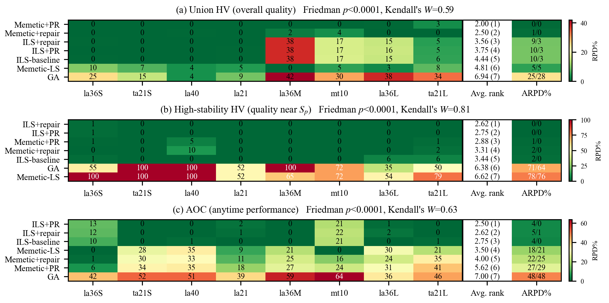

# [APIEMS 2026 投稿用・v2] Asymmetric Effects of Stability-Inducing Operators across Trajectory and Population Search in Job-Shop Rescheduling

> **このファイルの位置づけ（v2）**
> [v1](../paper_apiems2026/apiems2026_manuscript.md) の論理構成を「結論先出し・図1前倒し・§3＝実験設計・貢献1本化」に再編した版。細部の表現・数値・引用は v1 から流用し、**章の役割と順序だけを変えた**。v1 は `doc/paper_apiems2026/` にそのまま保持する（英訳 docx パイプライン `builder.py` / `make_docx.py` / `content_ja.py` / `content_en.py` も v1 準拠のまま同ディレクトリにある）。v2 の原稿・図・今後の docx 生成物はすべて本ディレクトリ `doc/paper_apiems2026_v2/` に置く。
>
> **v2 で変えたこと（作業メモ・本文には書かない）**
> 1. §1 を「状況 → 特殊性 → 問い3つ → 答え3つ → 型の宣言」の順にし、**図1（(D, MS) 平面の模式図）を §1 に置いた**。§1 は具体、§2 は文献で論証、§3 は検定可能な形に落とす、と高度＝役割で分担する（抽象度で分担しない）。
> 2. §2 の残された課題を**ギャップ2つ＋各々への本研究の対応**に束ねた。評価方法論への批判は「なぜギャップ1が見過ごされてきたか」の従属文として残し、貢献としては数えない。仮説の鎖（H2 は H1 の系）は v1 のまま。
> 3. §3 を「因子1＝探索構造／因子2＝安定性誘導演算子／応答＝3指標」の**実験設計**として再機能化。シナリオ・予算・環境は従来通り §4.1（§3 は一般論・§4 は具体）。
> 4. §4 の小節見出しを主張文にした。**図2（実 Pareto フロント, ta21S/ta21L）を §4.2 冒頭**、**図3（none/repair/PR × 探索構造の折れ線）を §4.3** に新設。PR 経路統計（図4）は §4.4「機序」として独立させ、H1 の構造差・H2・非対称をまとめて説明する。v1 の claim1 棒グラフ（H1 の 3 指標）は図2＋本文数値に吸収して削除し（AOC の H1 結果は §4.2 の箇条書き 1 行と §4.5 の図5(c) に残る）、訪問密度差マップも載せず §4.2 の構造的原因は数値の文で書く。図2 に Memetic+PR を残すのは、§1 で答えを先出しした構成では先取りが矛盾せず、「帯内で ILS に重なる」フロントの絵が H2 の最も直接的な視覚証拠だから（§4.3 から図2 を読み返す）。
> 5. §5 は「Q1〜Q3 の答え → 中心的貢献1本 → 限界 → 今後」。
> 6. 型の宣言は平文にし、典拠（Sörensen [28]・Hooker）は引用しない。[28] は v2 本文で未引用（削除候補として残置）。
> 7. 用語：演算子の名称は題名（stability-inducing operators）との整合で「**安定性誘導演算子**」を維持し、§1 初出で「解を $S_p$ の方向へ引き戻す演算子」と平文で定義する。「交互作用」は本文で使わない（§4.3 の DOE 言及と防御文は削除。演算子の発動方法が探索構造で異なるため純粋な 2×3 因子実験ではなく、言い切るならシナリオをブロックとした因子分析が要る）。3 指標は §1〜§3.4 では平文名（トレードオフ全体の品質／高安定領域の品質／速度）、§3.4 で定義した後の §4・§5 は指標名（統合 HV／高安定 HV／AOC）で呼ぶ。図のキャプションは自立させるため両方を併記。
> 8. 図は 5 点：図1 `figures/fig_v2_concept_en.png`（新規。§1 の語彙だけで読めるよう、P50・H1/H2・ホストの語を図中から外し、主な知見の箇条書きの直後に置く。(b) は演算子の経路 1 本だけを描く）／図2 `fig_v2_front_en.png`（新規。ta21 対。中央値 trial のフロントのみ表示し、x 軸はその最大 D で切る。他 trial の薄い点は `SHOW_ALL_TRIALS` で再表示可）／図3 `fig_v2_interaction_en.png`（claim2 の描き直し。有意水準は両側検定）／図4 `fig_v2_mech_pr_en.png`（1 段幅の散布図。始点ごとの経路長 d0 と経路上に改善解が残る割合を、全 trial・全重みの始点を合算して示す）／図5 `fig_v2_scoreboard_en.png`（v1 と同じ図, 3 パネル）。§4.1 の設定は表 1 に集約（図表計 6 点）。§4.3 は「図3 → 集団/軌道の箇条書き → PR か repair か」の順（PR/repair の使い分けは図3 から読めるので図3 の直後に置く）、§4.4 は機序（図4）。図1〜5 の生成はすべて本ディレクトリの `make_figures_v2.py`（データは v1 と同じ main_v1）。図2 のシナリオ選定用に全 8 シナリオを並べた `figures/sel_front_all8.png` を `python make_figures_v2.py --select` で出せる（論文には載せない）。
> 9. **語彙の統一（2026-09-13, 経営工学会予稿・修論にも適用）**：同じものを複数の語で呼ばない。機構→**演算子**（説明の意味の「機序」は別）／充填・覆域・覆う→**埋める**（指標は HV）／$S_p$ 近傍→**高安定領域**（Abstract と §1 で「$S_p$ 近傍（以下、高安定領域）」と結ぶ。N5 近傍は別物）／ホスト→**両構造・載せる探索構造**（固有句「ホスト依存の非対称効果」のみ残す）。飾りの語（適合性・補完性・天井タイ・安定性アンカー・方向づけ移動・冗長性・引力圏・固定骨格・空振り・張り付く・煮詰める・飛散・棲み分け）は平文に戻した。残す造語は 安定性誘導演算子／高安定領域／ホスト依存の非対称効果／統合 HV・高安定 HV／併合型・範囲限定型。英語では fill・cover・host・pull back は普通の語なので造語に残るのは stability-inducing operator・high-stability region・host-dependent asymmetric effect の三つ。

---

## ⛓ 全体制約（テンプレ実測）

| 項目         | 制約                                                             |
| ------------ | ---------------------------------------------------------------- |
| 分量         | **8ページ以内**（A4・**2段組**・0.75cm段間）                     |
| 言語         | 英語（本稿は日本語ドラフト）                                     |
| 本文フォント | 10pt Times New Roman（節見出し11pt太字・タイトル20pt・著者10pt） |
| Abstract     | **200語未満**（日本語ソース目安 ≈ 380字）                       |
| キーワード   | 最大5                                                            |
| ページ番号   | 振らない                                                         |
| 見出し       | 3レベルまで（decimal）                                           |
| 数式         | 通し番号 (1),(2),... 右寄せ                                      |

## 📊 ページ＆字数予算（v2）

| 節                                   | ページ     | 日本語字数目安 | v1 からの増減                       |
| ------------------------------------ | ---------- | -------------- | ----------------------------------- |
| Title/著者/Abstract/Keywords         | 0.4        | ≈ 400          | —                                   |
| 1. Introduction（図1 含む）          | 1.1        | ≈ 1,700        | +0.2（結論先出し＋図1）             |
| 2. Related Work and Hypotheses       | 0.9        | ≈ 1,700        | −0.1（課題を2つに束ねる）           |
| 3. Problem and Experimental Design   | 2.0        | ≈ 3,000        | −0.2（スカラー化防御を圧縮）        |
| 4. Computational Experiments         | 2.7        | ≈ 4,300        | +0.1（図2・図3 追加、claim1 図・密度差マップ削除） |
| 5. Conclusion                        | 0.5        | ≈ 900          | —                                   |
| References（16-20件）                | 0.4-0.7    | 別枠           | —                                   |
| **本文合計**                         | **≈ 8.0**  | **≈ 12,000**   |                                     |

---

---

# 本文ドラフト（日本語・v2）

## Title / Authors / Abstract / Keywords

**Title**: ジョブショップ再スケジューリングにおける安定性誘導演算子の非対称効果——軌道探索と集団探索の横断比較
（英: *Asymmetric Effects of Stability-Inducing Operators across Trajectory and Population Search in Job-Shop Rescheduling*）

**Abstract（≈380字 / 英200語未満）**

予測リアクティブ再スケジューリングでは高品質な元計画 $S_p$ が既に存在し、修正解には効率（メイクスパン）と安定性（$S_p$ からの変更の小ささ）が同時に求められる。ゆえに探索手法は、$S_p$ 近傍（以下、高安定領域）をどれだけ良く埋められるかでも評価すべきである。局所探索を揃えた統制比較の結果、$S_p$ から連続変形する軌道ベース（ILS）は、交叉で解を組み替える集団ベース（Memetic）を高安定領域の HV で全 8 シナリオの全試行で上回った。次に、解を $S_p$ へ引き戻す安定性誘導演算子（Path Relinking に基づく PR と repair）を両構造に搭載すると、効果は非対称に現れた。集団では高安定領域の HV が全シナリオの全試行で改善して ILS と並び、トレードオフ全体の品質で首位となった一方、軌道での改善はわずかであった。最良手法は評価軸によって入れ替わる。

**Keywords**: Rescheduling; Job-shop scheduling; Stability; Iterated local search; Path relinking

---

## 1. はじめに

製造現場では作業遅延や機械故障などの外乱が頻発し、当初スケジュールの実行を困難にする。これへの対応は、あらかじめ余裕を見込んで耐性を高める静的アプローチと、発生後にスケジュールを修正する動的アプローチに大別される [12]。本研究は後者のうち、実行中のスケジュールを実行可能な形へ修正する**予測リアクティブ再スケジューリング** [13] を対象とする。

再スケジューリングでは「修正後の効率（メイクスパン, MS）」と「外乱前のスケジュール（以下、元計画 $S_p$）からの変更量（安定性）」がトレードオフの関係にある。大幅な変更は、現場の混乱・段取り替え・資材や治具の再手配・作業者の再配置・下流工程や外注先への予定変更の波及といったコスト（以下、**スケジュール変更コスト**）を生む。このため安定性は MS と並ぶ目的であり [3][14]、本研究はこれを**効率性と安定性の多目的最適化**として定式化する。

再スケジューリングには静的スケジューリングにない特殊性がある。**外乱前に最適化された元計画 $S_p$ の順序を保ったまま遅延を吸収した解が、安定性の目的では最適解であり、探索を始める前から与えられている**ことである。この解は、横軸に順序変更量 $D$・縦軸に MS をとった平面（図 1）の $D=0$ に位置するが、遅延を吸収したぶん効率では劣る。求めたいのはその近く——本稿でいう**高安定領域**——にある、変更を小さく抑えたうえで効率も改善した解である。したがってこの問題では、手法をトレードオフ全体の品質だけでなく、**高安定領域をどれだけ良く埋められるか**でも評価する必要がある。

本研究が対象とする**ジョブショップスケジューリング問題（JSSP）**は NP 困難であり [33]、実用規模では厳密解法でなくメタヒューリスティクスが用いられる [13]。これらは、1 つの解を少しずつ変形しながら進む**軌道ベース**と、複数の解を保持して互いに組み替えながら進む**集団ベース**の二系統に大別される [30]。再スケジューリングの解法は、GA を基軸とする集団ベースが主流である（§2）。しかし、$S_p$ という高品質な初期解が与えられるこの問題では、**それを少しずつ変形していく軌道ベースのほうが、高安定領域を埋めるのに向いているのではないか**。これが本研究の出発点となる仮説である。

本研究はこの仮説を、局所探索を揃えた ILS（軌道ベースの代表）と Memetic（GA に局所探索を組み込んだ集団ベースの代表）の統制比較で検証し、あわせて、解を $S_p$ の方向へ引き戻す**安定性誘導演算子**（以下、演算子）を両者に載せて、その効果が探索構造によってどう変わるかを調べる。主な知見は次の通りである。

- **軌道（ILS）は集団（Memetic）より高安定領域を良く埋める.** ILS はこの領域を自力で埋めるのに対し、同じ局所探索を備えた Memetic は埋められない。高安定領域の hypervolume（HV）で ILS が全 8 シナリオの全試行で上回る。
- **演算子は集団を ILS に並ばせ、軌道にはほとんど効かない.** 集団が届かなかった高安定領域を演算子が埋め、Memetic は全 8 シナリオの全試行で高安定領域の HV が改善して ILS に並び、トレードオフ全体の品質でも ILS に並ぶか上回る。一方、この領域を自力で埋めている ILS での改善はわずかである。
- **重視する軸で最良手法は替わる.** 高安定領域の品質では ILS と Memetic＋演算子が並ぶため、選択は残る 2 軸で決まる：変更の少ない再計画を早く出すなら ILS、計算時間を許容してトレードオフ全体の品質を追求するなら Memetic＋演算子が有利であり、両構造は再スケジューリングの異なる要求を補い合う。

図 1 はこれらの知見を、横軸 $D$・縦軸 MS の平面に模式的に描いたものである。

本研究の主眼は、最先端手法との性能競争ではなく、仮説を立てて条件を統制し、探索構造と演算子の関係を切り分けることにある。

---

## 2. 既存研究と仮説

**安定性を目的関数に組み込む系譜（併合型）.** 再スケジューリングで効率と安定性を同時に最適化する試みは、単一機械で両者を評価基準として定式化した Wu ら [14] に始まる。JSSP では Rangsaritratsamee ら [3] が GA に局所探索を組み込んだハイブリッド GA を、Zhang ら [4] が開始時刻偏差を安定性指標とする GA と tabu search のハイブリッドを提案し、フレキシブル JSSP（FJSP）では Fattahi & Fallahi [18] の genetic local search や、ファジィ FJSP への人工蜂コロニーの適用 [20] がある。いずれも安定性を**目的関数の一項**として扱い、重みを通じて効率との釣り合いを取る点で共通する。解法の構成に注目すると、**この系譜は一貫して集団ベースであり、その多くは集団に局所探索を組み合わせた形をとる** [3][4][18]。軌道ベースの適用例はフローショップの iterated greedy [19] にとどまり、JSSP の再スケジューリングでは見当たらない。本研究が集団ベースの代表に素の GA ではなく Memetic を採るのは、この標準構成に合わせるためである（§3.2）。

**安定性を探索空間の制限で担う系譜（範囲限定型）.** 一方、安定性を**再スケジュール範囲の限定**で構造的に保証する系譜がある。match-up scheduling [15]、影響波及作業のみ再スケジュールする AOR [16]、染色体を区間に限定する Zakaria & Petrovic [17]、範囲を 4 階層に定式化した Sun ら [27] などがある。いずれも安定性を**探索空間の制限**で確保する点で共通する。

**残された課題と本研究の対応.** 上記二系譜を踏まえると、課題は二つ残る。**第一に、解法が GA を基軸とする集団ベースに偏り**、再スケジューリング固有の「高品質な元計画 $S_p$ が既に存在する」という特性が探索構造（軌道／集団）の挙動に与える影響は、われわれの知る限り正面から分析されていない。この分析が行われてこなかった一因は評価方法にもある：既存評価は少数の固定重みによるスカラー比較が主で、一点の比較では高安定領域がどれだけ埋まっているかが見えない。本研究は局所探索（N5）を揃えた ILS と Memetic の統制比較でこれを分析し、評価にはトレードオフ全体の品質・高安定領域の品質・速度に対応する 3 指標を用いる（§3.4）。**第二に、既存の安定性確保手段は、われわれの知る限り、探索空間を保ったまま探索を高安定領域へ引き寄せる演算子を持たない**：探索空間を制限する範囲限定型は、安定性を構造的に保証する代わりに、制限の外側にある効率‒安定トレードオフ解を探索対象から外す。目的関数に組み込む併合型は、空間を保つ代わりに、高安定領域を埋める役目をベース探索構造の素の能力に委ねる。本研究は、解を $S_p$ へ能動的に引き寄せる演算子（§1）を両構造に搭載する。安定性を探索空間の制限ではなく演算子として確保する点が範囲限定型との設計上の違いであり、同一の演算子を両構造に載せられることが、第一の課題（構造間の差）を演算子の効き方の違いとしても検証可能にする。

この立場から、§1 の出発点を検定可能な形に定め、二つの仮説を立てる（図 1）。$S_p$ から連続変形を重ねる軌道ベース（ILS）は、$S_p$ を起点に外へ広がりながら高安定領域を小刻みに埋めていけるのに対し、集団ベース（Memetic）は 2 親の構造を組み替えて解を作ることで探索を進める。組み替えは $S_p$ からの小さな変更では表せない飛躍を伴うため、子個体は高安定領域から外れやすく、同じ局所探索を備えてもこの領域の埋まり方が構造的に粗くなるはずである——**H1**（図 1(a)）。H1 が成り立つなら、集団に欠けているのは高安定領域を埋める力である。解を $S_p$ 方向へ引き戻す演算子は、$S_p$ から離れて散った個体を**外側から $S_p$ へ戻す**経路上の中間解でこの欠落を補い、集団の高安定領域の品質を押し上げるはずである——**H2**（図 1(b)）。一方、$S_p$ から広がる探索で既にこの領域を埋めている軌道に、同じ演算子が上積みをもたらすかは自明でない。そこで本研究は同一の演算子を両構造へ載せ、その効果を構造間で比較する。

---

## 3. 問題設定と実験設計

本節は §2 の仮説を検定可能な形に落とす。まず問題と目的関数を定式化し（§3.1）、H1 を検定する因子 1＝探索構造——局所探索を揃えた ILS と Memetic——を設計し（§3.2）、H2 と構造間比較を担う因子 2＝安定性誘導演算子を両構造へ搭載する（§3.3）。応答は 3 指標の枠組みで測る（§3.4）。ベンチマークシナリオと計算予算は §4.1 に示す。

### 3.1 問題定義

本研究が外乱のうち作業遅延を対象とするのは、それが作業集合を変えず処理順序の再調整だけで対処でき、修正解を高安定領域に保つ前提が最も素直に成立する外乱だからである。$n$ ジョブ・$m$ 機械の JSSP に外乱（作業遅延）が発生した後、元スケジュール $S_p$ に対し修正スケジュール $S_q$ を求める。外乱は単一の作業遅延（遅延量 $\Delta$）とし、機械上の順序を $S_p$ のまま保って遅延を吸収した現場の実スケジュール **right-shift 解 $S_{RSR}$** を得る。再スケジューリング時刻 $t_r$（遅延解消時刻）より前に開始済みの作業は**凍結**し、$t_r$ 以降の作業を**最適化対象**とする。決定変数は最適化対象作業の機械ごとの処理順序のみで、解は凍結部を先頭に固定し、与えられた機械順序を保ったまま各作業を $t_r$ 以降の最早可能時刻へ詰め、実スケジュールに変換する。

**安定性指標.** 逸脱量は (i) 開始時刻偏差（時間安定, temporal stability）と (ii) 処理順序（順列）偏差（順序安定, sequence stability）の二系統に大別される。たとえば Sun ら [27] は両者を明示的に区別したうえで前者（開始時刻の絶対偏差和 ADST）を安定性指標に採る。本研究は、探索で用いる操作（N5 近傍と安定性誘導演算子の swap 移動, §3.2–3.3）がいずれも順列操作であること、および MS との独立性が高いことから後者を採用する。

$$
D(S_p, S_q) = \sum_{(i,j) \in \mathcal{O}_{\mathrm{opt}}} \left\lvert r_{i,j}^p - r_{i,j}^q \right\rvert \quad (1)
$$

$r_{i,j}$ は機械 $i$ でのジョブ $j$ の処理順位、$\mathcal{O}_{\mathrm{opt}}$ は最適化対象（$t_r$ 以降）の作業集合である。$D=0$ は順序不変の right-shift 解 $S_{RSR}$ に対応する。

**多目的とスカラー化.** $\min_{S_q}\,(MS(S_q),\,D(S_p,S_q))$ を、重み $\lambda\in[0,1]$ の重み付き和で解く。

$$
F(S_q) = \lambda\,\hat D(S_p, S_q) + (1-\lambda)\,\widehat{MS}(S_q) \quad (2)
$$

$\hat\cdot$ は min-max 正規化値。重み付き和を用いるのは、効率と安定性の優先度を意思決定者が重みとして事前に与える再スケジューリングの標準的枠組み [3] と整合し、かつ単一解の ILS と集団の Memetic に同一のスカラー目的 $F(\lambda)$ を共有させることで、同一の演算子を両構造へ無改変で載せられるからである。$\lambda$ は複数点で掃引する（§3.4）。重み付き和は非凸フロントの凹部に届かない [8] が、全手法が同じスカラー化を共有し、探索中に訪問した凹部の解も UEA（§3.4）で記録されるため、構造差の比較への影響は限定的と考える。

### 3.2 因子 1：探索構造——ILS と Memetic-LS（H1）

H1（§2）を検定するため、比較の中核を**局所探索（N5）を揃えた ILS と Memetic-LS の対比**に置き、局所探索の有無という交絡を排して探索構造（単一軌道 vs 集団＋交叉）を対照する。

ILS [22] は、現在解に摂動を加え、そこから局所探索で解を改善し、得られた解を受理するかを判定する、という反復で 1 つの解を改善していく枠組みである。単一解ベースの中で ILS を採る理由は、深掘り（局所探索）と脱出（摂動）が明確に分離されている点にある。この分離ゆえに、**摂動強度——現在解から一度にどれだけ離れるか——を挿入手数として直接制御**でき、安定性誘導演算子（§3.3）も摂動として自然に組み込める。**局所探索**は ILS と Memetic-LS で共有する JSSP 標準の N5 近傍 [1] で、候補をクリティカルブロック端の隣接 swap（makespan 改善見込みのある手）に絞り、採否は $F(\lambda)$ で評価する。この隣接 swap は最小の構造変更ゆえ、$S_p$ からの逸脱を小刻みに刻みつつ高安定領域を埋めることができ、高安定領域の解を重視する本設定と相性がよい。**摂動**は insert 移動で、強度（挿入手数）を停滞度に応じ鋸歯状に巡回させる（VNS [10] 型）。**受理判定**は改善時受理（better acceptance）で、摂動後に得た局所最適が best の $F(\lambda)$ を厳密改善したときのみ現在解を置き換える。

**集団ベース（GA / Memetic-LS）.** H1 の対照となる集団ベースは、operation-based 表現 [25] の標準 GA とする。染色体は作業の並びで、GT 法 [23] でスケジュールにデコードし $F(\lambda)$ で評価する。各世代は、エリート保存付きトーナメント選択で親を選び、PPX 交叉 [11] と逆位突然変異で子個体を作る。**Memetic-LS** は、この GA に局所探索を統合したもの [29] で、上記 N5 を各個体へ適用し、得られた改善解を染色体に書き戻す（Lamarckian）。集団側の代表をこの Memetic-LS とするのは、局所探索の有無という交絡を排すためであると同時に、集団に局所探索を組み合わせる構成が既存研究の標準だからでもある（§2）。局所探索をもたない素の GA は参考ベースラインとする。

### 3.3 因子 2：安定性誘導演算子——PR・repair（H2）

**Path Relinking（PR）.** PR は 2 つの高品質解を結ぶ経路上に優れた中間解が存在するという考えに基づく探索法で、一般には Scatter Search 等と組み合わせ、エリート解プール内の解どうしを結ぶ形で用いられる [5][6]。本研究はこれを再スケジューリングの構造に合わせ、**guiding solution を外乱前スケジュール $S_p$ の一点に固定する**点が特徴である。すなわち現在の局所最適解（initiating）から $S_p$（guiding）へ向け、現在解と $S_p$ が食い違う機械上の位置を選びそこに $S_p$ の作業が来るよう入れ替える swap 移動で不一致を 1 つずつ縮めながら経路を辿り、経路上の最良解を返す（集団側では、経路上の上位の中間解を N5 で再最適化し、その最良を返す）。$S_p$ に固定する理由は、(a) $S_p$ が安定性目的の最適端点ゆえ PR を「安定性の最適端点へ向かう移動」として一意に解釈できること、(b) $F(\lambda)$ 局所最適である $S_{cur}$ と $S_p$ を結ぶ経路の中間解が MS–安定性トレードオフ上に並び Pareto フロントを埋めることに直接寄与すること、である。ムーブは各ステップで実行可能な不一致 swap を 1 つランダムに選び、評価回数を $O(d)$（$d$=不一致数）に抑える。全候補を評価する best 選択は $O(d^2)$ となり、品質の利得は僅か（統合 HV で約 +1%）である一方、外乱の大きいインスタンスでは経路長が伸びて計算時間が約 8 倍になるため採らない（予備実験）。

**Stability Repair Kick（以下 repair）.** PR を途中で打ち切った演算子である。同じ swap 移動を深さ $k$（$1\le k\le$ 不一致数）回だけ適用して解を $S_p$ 方向へ引き寄せ（＝$S_p$ から漂って失った安定性を"修復"し）、経路上の中間解は評価せずに到達点を局所探索で再最適化する。$k$ が不一致数に等しければ $S_p$ まで戻り、小さければ現在解の近くに留まるため、$k$ を変えて繰り返すことで現在解と $S_p$ の間を幅広く埋める。

**両構造への搭載.** 軌道ベース（ILS）では両演算子は摂動として働く：停滞時に発動し、repair の深さ $k$ は発動のたびに 1 から不一致数まで 1 ずつ増やし、上限に達するか best が改善したら 1 に戻す（鋸歯状）。集団ベース（Memetic）では各個体の精緻化に組み込む：局所探索の後、演算子を個体ごとに確率的に適用し（repair の深さ $k$ は 1〜不一致数から一様に引く）、結果を N5 で再最適化して無条件に集団へ戻す——採否はトーナメント選択に委ねる。両構造に載るのは同一の演算子（$S_p$ 方向への swap 移動）であり、異なるのは発動のさせ方だけである。
本研究の対象は 7 手法：ILS-baseline / ILS+repair / ILS+PR / GA / Memetic-LS / Memetic+PR / Memetic+repair。

### 3.4 応答：評価指標と統計

重み $\lambda$ を複数点で掃引し（weighted-sum sweep）、各探索が訪問した全非劣解を保存する **UEA** [9] のもとで Pareto フロントの hypervolume（HV）[24] を測る。さらに再スケジューリングが実際に重視するのは効率端ではなく高安定領域の解であり、いつ止めても良い解が得られるアンタイム性も実運用上重要である。この 3 つの問い——**トレードオフ全体の品質・高安定領域の品質・速度**——に対応する 3 指標を用いる：

- **統合 HV**（トレードオフ全体の品質）：全領域の hypervolume。
- **高安定 HV**（高安定領域の品質）：高安定領域 $D<P_\theta$ に限った hypervolume。$P_\theta$ は全手法・全 trial の Pareto 解の $D$ をプールした $\theta$ 百分位であり、$\theta$ の値と感度は §4 で扱う（図 1・図 2 の網掛け領域）。
- **AOC**（速度＝アンタイム性能 [26]）：HV-対-対数時間曲線の時間平均。

HV はシナリオ横断比較のため各シナリオで $[0,1]^2$ にアフィン正規化し参照点 $(1.1,1.1)$ で算出する。$S_p$ の機械順序を保ったままの解（$D=0$。$S_{RSR}$ など）は全手法が探索せずに得る自明解なので、HV の算出から除く。AOC のアンタイム HV($t$) は壁時計上で測り、積分窓は**全手法で共通**にとり、対数幅で正規化する。AOC 値は各重みのアンタイム HV($t$) を 重み掃引の全点で平均する。

**統計.** 各シナリオ内の手法比較は Mann–Whitney の U 検定と効果量 Cliff's $\delta$ で評価し [32]、検定はすべて両側で行う。$|\delta|$=1.0 は一方の全 trial が他方の全 trial を上回る完全分離を意味する。差の大きさは中央値の倍率・相対差と、最良手法からの相対偏差 ARPD%（$(\text{best}-x)/\text{best}\times100$, 低いほど良い）で示す。シナリオ横断の傾向は Friedman＋平均順位＋Kendall's $W$ で要約するが、la36 ラダーと ta21 対は同一インスタンスで外乱条件のみを変えたシナリオで互いに独立でないため、**順位一貫性の探索的要約**として扱う。

**仮説と検定の対応.** H1 は、局所探索を揃えた ILS-baseline と Memetic-LS の高安定 HV の比較で検定し、全 8 シナリオで ILS が有意に上回れば支持されたとみなす。H2 は、Memetic-LS に対する Memetic＋演算子の高安定 HV の伸びを同じ形で検定する。軌道側の対応する比較（ILS-baseline 対 ILS＋演算子）については効果の向きを事前に予測せず、集団側との効き方の違いとして §4.3 で対比する。多重比較は、各仮説について 8 シナリオを 1 族として Holm 補正で扱う（演算子効果は探索構造ごとに族を分ける）。統合 HV と AOC にはいずれの仮説も方向の予測を置かず、手法間の比較として報告する。

---

## 4. 計算機実験

本節は §3 の設計に従い、H1（§4.2）と H2・構造間比較（§4.3）を検定したうえで、両者に共通する機序を PR の経路統計で調べ（§4.4）、総合スコアボードで含意を俯瞰する（§4.5）。

### 4.1 実験設定

ベンチマークは mt10・la21・la36・la40・ta21。外乱は計 8 シナリオ＝la36S/la36M/la36L（27/54/73%）・ta21S/ta21L（32/82%）・mt10（72%）・la21（35%）・la40（32%）で、各シナリオに付した百分率は**再スケジューリング率** $\rho=n_{res}/\text{ops}$——全作業のうち外乱で再最適化対象 $\mathcal{O}_{opt}$ となった割合——を表す。**la36 ラダー**（27/54/73%）と **ta21 対**（32/82%）は、同一インスタンス・同一 $S_p$ のまま外乱を変えて再スケジューリング率を段階的に変えたシナリオ群である。各シナリオの外乱は単一作業の完了遅延で、遅延量 $\Delta$=60〜148（対象作業の処理時間の約 0.9〜1.5 倍）、再スケジューリング時刻 $t_r$ はその遅延解消時刻にとる（§3.1）。各シナリオの完全な定義は公開リポジトリ（https://github.com/kitotakumi/stability_scheduling）に収録する。全 8 シナリオ共通の実験設定は表 1 に示す。

**表 1.** 実験設定（全 8 シナリオ共通）

| 項目 | 設定 |
| --- | --- |
| 重み掃引 | $\lambda$ = 0, 0.1, …, 0.9 の 10 点（$\lambda$=1.0 は最適が自明解 $S_{RSR}$（$D$=0）に縮退するため除外） |
| 試行 | 各（シナリオ×手法）10 trial。解析単位は 1 trial（＝10 重みの掃引全体）で HV は trial あたり 1 値、代表値は特記なき限り中央値、検定は n=10 |
| 高安定領域の境界 | $\theta$=50（全手法・全 trial の Pareto 解の $D$ の中央値） |
| 計算予算 | ILS 3000 反復／GA・Memetic 500 世代（早期終了なし・全 run を上限まで実行） |
| 初期解 $S_p$ | GA-500 で生成した高品質スケジュール。ILS は初期解として、GA・Memetic は初期集団に含めて受け取る（残る 49 個体は無作為生成） |
| 集団（GA・Memetic） | $cx_{pb}$=0.85, $mut_{pb}$=0.1, pop=50 |
| 軌道（ILS） | insert 摂動の強度（挿入手数）2〜5 手を鋸歯状に巡回 |
| 演算子（集団側） | 各個体に確率 0.3 で発動。PR は経路上位 3 中間解を N5 で再最適化し最良を返す。repair の深さは 1〜不一致数から一様 |
| 演算子（軌道側） | 停滞時に摂動として発動（無改善 400 反復で初回、以降は 10 反復）。PR は経路上最良の 1 解を返す。repair の深さは 1→不一致数を鋸歯状に掃き、best 改善で 1 に戻す |
| 環境 | AMD Ryzen 5 7530U／Python 3.12（NumPy・DEAP・SciPy）。全乱数シード固定 |

**高安定領域の妥当性.** 評価側の境界 $P_\theta$ は比較手法プールに相対的に定まるため、$\theta$=50 を中心に 25〜75 で振って確認した。以降の結論はいずれも $\theta$ の選択に依存しない：H1 の完全分離は $\theta$=33〜67 で保たれ、両端でも向きは変わらない。集団側の演算子効果は全閾値で有意である（$p<$0.001）。手法間の順位も、演算子をもたない集団だけが大きく劣るという構図が全閾値で保たれ、動くのは僅差で密集する上位群の内部順位のみである。

**計算予算の妥当性.** 反復数と世代数は単位が異なるため、族内（ILS 系どうし・集団系どうし）で公称値を揃え、手法横断の速度は壁時計上の AOC で比較する。壁時計は族間で異なり Memetic+PR は ILS の 4.8〜9.4 倍を要するが、中央値 run は全手法とも予算の 7 割以内で最終 HV の 99% に達し、終盤 20% の予算で得た HV は中央値で全手法 0% であった（la36M・ta21L を除く 6 シナリオで確認）。いずれの手法も予算内で飽和しており、統合 HV の差は計算時間の差によるものではない。

**手法パラメータの妥当性.** 表 1 のうち手法の挙動を定める 11 軸——提案演算子側の 6 軸と、ベース探索構造側の 5 軸（$cx_{pb}$・$mut_{pb}$・pop_size・ILS の摂動種と強度）——は、2 シナリオ（la21・la36L）で中心値の上下に振る一要因感度分析（重み 6 点 × n=10）にかけ、その結果を踏まえて定めた。ベース探索構造側も掃引に含めることで、比較対象を過小設定していないことを確かめている。大半の軸は中心値との差が有意でなく、有意差の出た軸でも感度の大きさ（統合 HV で +0.5〜2%）は手法間の差（同じ 2 シナリオで +7〜54%）より一桁小さいため、本稿の結論は特定のパラメータ値の選択に依存しない。

### 4.2 結果 1：ILS は高安定領域を Memetic-LS より良く埋める（H1）

図 2 は、同一インスタンス・同一 $S_p$ のまま再スケジューリング率だけを変えた ta21 対（ta21S 32%・ta21L 82%）について、ILS-baseline・Memetic-LS・Memetic+PR の非劣解（統合 HV が中央値の trial）を図 1 と同じ座標で示す。低再スケジューリング率の ta21S では、ILS が高安定領域（$D<P_{50}$=12）に 4 点の非劣解を持つのに対し、Memetic-LS はこの領域に 1 点も持たず、そのフロントは $D$=16 から始まる。しかも ILS が $D$=2 で得る MS に Memetic-LS が届くのはその $D$=16 の点であり、同じ MS を得るのに 8 倍の順序変更を要する。高再スケジューリング率の ta21L では、Memetic-LS も高安定領域に非劣解を持つが MS で ILS に大きく劣り（$D<30$ で 1918 以上、ILS は 1883）、両者が並ぶのは効率端のみで、Memetic-LS が ILS の最良 MS（1859, $D$=68）に届くのは $D$=166 である。いずれの場合も Memetic+PR のフロントは高安定領域で ILS にほぼ重なる——この点は H2（§4.3）で回収する。

この差が 2 シナリオに限らないことを確かめるため、局所探索を揃えた `ILS-baseline` と `Memetic-LS` を全 8 シナリオ・3 指標で比較する。

- **高安定 HV：ILS が全 8 シナリオを完全分離で上回る**（$p<$0.001, $|\delta|$=1.0）。低再スケジューリング率の 3 シナリオ（la36S・ta21S・la40）では Memetic-LS が高安定領域にほぼ非劣解を持てず（ta21S・la40 は全 trial、la36S は 10 trial 中 9 で 0 点。図 2(a)）、ILS のみが高安定領域を埋める。残る 5 シナリオでも ILS が 2〜4.5 倍。Holm 補正後も全シナリオで有意であり、H1 は支持された。
- **統合 HV：互角**。有意に上回るのは ILS が 4 シナリオ（la36S・ta21S・la40・la21）、Memetic が 3 シナリオ（la36M・mt10・la36L）で、ta21L は有意差がない（$p$=0.16）。勝者はシナリオによって入れ替わり、トレードオフ全体では両構造が拮抗する。すなわち高安定領域の差は、ILS が全体として優れていることの反映ではない。
- **AOC：6/8 で ILS 有意優位**。残る la36S・mt10 では逆に Memetic-LS が有意に上回る。

**構造的原因.** Memetic-LS は $S_p$ を初期集団に含みながら、訪問した解（局所探索の開始点と終了点）のうち $S_p$ に最も近いものでも $D$=4〜22 である（trial の中央値。ILS は 2〜4）。高安定領域の中を探索した量にも差があり、trial あたりに訪問した異なる解は ILS の 318〜2650 個に対し Memetic-LS は 0〜190 個で、訪問した異なる解全体に占める割合も ILS の 6.6〜33.5% に対し 0〜5.2% にとどまる。Memetic-LS が訪問した異なる解の総数が ILS を上回る la36M・la36L・ta21L でも、この差は変わらない。集団の探索は $S_p$ の近くにほとんど届かず、届いてもこの領域を細かく探索しないため、同じ N5 を備えても高安定領域を埋めきれない。その機序は §4.4 で調べる。

### 4.3 結果 2：安定性誘導演算子は集団に大きく効き、軌道にはほぼ効かない（H2・構造間比較）

演算子を baseline に追加したときの高安定 HV の伸びを構造別に見る。図 3 は横軸に演算子（なし／repair／PR）、縦軸に高安定 HV をとり、ILS と Memetic の中央値を全 8 シナリオで折れ線にしたものである。Memetic の線は全シナリオで急上昇し、ILS の線はほぼ平坦である。

- **集団（Memetic）：演算子が高安定 HV を大幅改善**（全 8 シナリオの全試行で改善, $p<$0.001, $|\delta|$=1.0。演算子なしでは高安定領域にほぼ届かない 3 シナリオで届くようになり、残る 5 シナリオでは 2.1〜4.7 倍）。**H2 は支持された**。届かなかった高安定領域を演算子が直接埋め、集団は演算子によって**高安定 HV で ILS に並び、統合 HV でも ILS に並ぶか上回る**（PR・repair とも la36M・mt10・la36L では 16〜62%、ta21L では 2.4〜5.8% 上回り、残る 4 シナリオでは差が ±0.3% 以内。スコアボード §4.5）。
- **軌道（ILS）：ほぼ頭打ち**。ILS-baseline の高安定 HV は 8 シナリオ中 5 つで全 7 手法中の最良であり（§4.5 のスコアボードで RPD 0%）、演算子を足す余地がない。演算子が有意に効くのは**最高再スケジューリング率帯の la36L（73%）と ta21L（82%）のみ**（PR・repair とも la36L で $p$=0.013、ta21L で $p<$0.001。ILS 側の 8 シナリオ族に Holm 補正を施すと有意に残るのは ta21L のみ, $p_\text{adj}$=0.0014（PR）・0.0015（repair）。la36L は $p_\text{adj}$=0.091。改善幅は小さい——ta21L の ILS 高安定 HV 中央値が baseline 0.029→演算子込み 0.031——が、ta21L では演算子込みの全 trial が baseline の全 trial を上回る, $|\delta|$=1.0）。この 2 つは、baseline の RPD が最も大きかった 2 シナリオ（ともに 6%。他の 6 シナリオは 1.5% 以下）でもある。ILS は高安定領域を自力で埋めきるため伸びしろが乏しく、外乱が極端に大きく埋めきれない場合にのみ僅かな上積みが残る。

以上の二つを並べると、同じ演算子の効果は載せる探索構造に依存して非対称に現れる。

### 4.4 機序：集団は $S_p$ との間に改善の余地を残す

§4.2 の構造差と §4.3 の非対称は、探索が $S_p$ との間の区間をどこまで磨き終えているかという一つの問いで説明できる。これを、PR が始点から $S_p$ へ辿る経路上に始点より良い解が残っているかで測る（図 4）。良い解が残っていれば、その区間は始点に至るまでの探索がまだ磨いていない。

PR を掛ける始点（Memetic では個体、ILS では best が改善するまで PR を繰り返し掛ける同じ現在解）ごとに、経路上に始点より良い解があった割合は、**Memetic では全シナリオで 30〜65%** であるのに対し、**ILS では 0〜21%** で、4 シナリオでは 0% である。経路長では差を説明できない：同じシナリオで経路長 $d_0$ の中央値がほぼ等しい mt10（ILS 13・Memetic 11）と la36S（14・13）でも割合は ILS が 0%・9%、Memetic が 59%・65% と大きく隔たり、ILS の ta21L は $d_0$=46 と Memetic の 7 シナリオより長い経路をもちながら 21% と Memetic の全シナリオを下回る。

この差は §4.2 と §4.3 の結果を同じ形で説明する。組み替えで生まれた Memetic の個体と $S_p$ の間には、MS を壊さず安定性を改善できる解が磨かれずに残っており、集団の探索はこの区間を埋めきれない（H1 の構造差）。演算子はこの残った解を拾うため集団に大きく効く（H2）一方、$S_p$ から小さな変更を重ねて自身の軌道でこの区間を既に磨いた ILS には、拾える解がほとんど残っていない（非対称）。ILS で割合が最も高いのは最高再スケジューリング率の ta21L（21%）と la36L（11%）であり、演算子が ILS に有意に効いた 2 シナリオ（図 3）と一致する。

### 4.5 総合スコアボード：重視する軸で最良手法は替わる

§4.2〜§4.4 で確立した構造を、全 7 手法 × 8 シナリオ × 3 指標の**総合スコアボード**（図 5）で俯瞰し、§1 で予告した「指標で首位が替わる」相補構造を裏付ける。Friedman 平均順位は 3 指標とも手法間で明確に分離し、横断的な順位一貫性は中〜大である（Kendall's $W$=0.59／0.81／0.63, $p$<0.0001）。

**指標別の読み.** 図の緑（最良）分布を指標ごとに読むと相補構造が具体化する（括弧内は Friedman 平均順位, 小さいほど良い）。**統合 HV**は演算子込みの集団が首位群（Memetic+PR 2.0・Memetic+repair 2.5）、ILS 系 3 種と素の Memetic-LS が中位群（3.6〜4.8）、GA のみ下位（6.9）。§4.2 で ILS と互角だったのは素の集団（Memetic-LS）であり、演算子を備えた Memetic+PR がその上に立って首位となる——この首位はどの 1 シナリオを除いても変わらない。**高安定 HV**は ILS 系と演算子込み Memetic が首位群に密集する一方（2.6〜3.4）、演算子をもたない素の集団だけが ARPD（平均）71%・78% と大きく劣って高安定領域に届かず二分される（GA 6.4・Memetic-LS 6.6）——H1 と H2 が予測したとおりである。**AOC（速度）**は ILS 系 3 種が首位群（2.5〜2.8）、素の Memetic-LS と Memetic+repair が中位（3.5・4.0）、Memetic+PR と GA が下位（5.6・7.0）。これは最終的な品質でなく立ち上がりの差である：ILS は早期から良い incumbent を持つのに対し、集団は世代を重ねて初めて同水準に達し、AOC は対数時間で早期を重く見るためこの差を強く反映する。**集団に載せる演算子は repair が有利である**：品質は PR とほぼ同等（有意差が出るのは統合 HV で 2/8、高安定 HV で 3/8 シナリオのみ）だが、PR は $S_p$ までの経路を辿り切り、中間解を評価して上位解を再最適化してから返すため 1 回の呼び出しが重く、AOC は repair が 6/8 シナリオで PR を有意に上回る（残る la36S・mt10 も中央値は repair が上, $\delta$=+0.38〜+1.00）。軌道側は演算子が停滞時にしか発動しないため 3 手法の AOC 差は全 8 シナリオで 3% 以内かつ有意でなく、PR と repair の選択は問題にならない。評価軸が変われば最良手法も替わり（統合 HV なら Memetic＋演算子、AOC なら ILS 系、高安定 HV は両者が並ぶ）、両構造は再スケジューリングの異なる要求を補い合う。

**【探索的な気づき】統合 HV の勝者と再スケジューリング率.** 統合 HV の勝者は $\rho$ と対応し、~50% を境に低で ILS・中〜高で Memetic に二分する（同一 la36 ラダー 27/54/73% で ILS→Memetic→Memetic）。この二分を捉えるのは凍結部の割合を織り込む $\rho$ のみで、可動工程の絶対数や問題規模では捉えられない。機序の見立て：安定性項は解を $S_p$（$D$=0）へ引き寄せる。$\rho$ が小さいうちは凍結部が解の大半を占め、可動部を入れ替えても $S_p$ から離れた良質な局所最適が生じ得ず、良解は高安定領域に限られるため ILS がこの領域を埋めるだけで足りる。だが $\rho$ が増して効率端が遠のくと、単一軌道の ILS は $S_p$ の引き寄せから離れにくく、組み替えで $S_p$ から離れた個体を保つ Memetic だけが届く（H1 と同型）。すなわち $\rho$ は軌道が $S_p$ の引き寄せから離れて遠方の良解に到達する難しさの代理と見なせる。ただし ta21L（82%）は例外（有意差なし, $p$=0.16）であり、初期解 $S_p$ 品質の交絡と順列偏差表現への依存も残るため、この対応は探索的見立てに留める。

> 【紙面調整メモ】8 ページを超える場合はこの段落（探索的な気づき）を最初に削る。次いで §2 の系譜の引用例、§3.1 の非凸フロントの注記。

---

## 5. 結論

本研究は、高品質な元計画 $S_p$ が既に存在する再スケジューリングにおいて、探索構造と安定性誘導演算子の関係を、局所探索を揃えた 8 シナリオ × 7 手法 × n=10 の統制比較で検証した。主な知見は次の通りである。

1. **H1：軌道ベース（ILS）は高安定領域を Memetic-LS より良く埋める.** 高安定 HV で、同一 N5 を揃えた集団ベースを全 8 シナリオで完全分離で上回った（$p<$0.001, $|\delta|$=1.0。5 シナリオで 2〜4.5 倍・残る 3 シナリオでは集団ベースが高安定領域にほぼ届かない）。統合 HV では両者は互角であり、アンタイムでも 6/8 で ILS が上回る（残る la36S・mt10 では集団ベースが上回る）。この差は局所探索の有無でなく探索構造に由来する。
2. **H2・構造間比較：安定性誘導演算子の効果は載せる探索構造に依存して非対称に現れる.** 集団に対しては高安定 HV を全 8 シナリオの全試行で押し上げ ILS 水準へ引き上げる（H2）一方、高安定領域を自力で埋め終えた軌道ではほぼ頭打ちとなる。ただし ILS が埋めきれない最高再スケジューリング率の ta21L（82%）では、軌道にも小さいが一貫した上積みが残る。
3. **実務上の含意：重視する軸で最良手法は替わる.** トレードオフ全体の品質（統合 HV）は Memetic＋安定性誘導演算子、高安定領域の品質（高安定 HV）は ILS と Memetic＋演算子の双方、速度（AOC）は ILS 系が優れる。ゆえに計算時間を許容してトレードオフ全体の品質を追求するなら Memetic＋演算子、変更の少ない再計画を早く出すなら ILS を選ぶ。Memetic に載せる演算子は、最終的な品質では PR と repair がほぼ並び、アンタイム性では repair が上回る（3 指標すべてで下位群に落ちないのは ILS 系と Memetic+repair である）。

本研究の中心的貢献は、安定性の確保を探索空間の制限でなく演算子として実装して同一の演算子を両構造へ移植し、**同じ演算子の価値が搭載先の探索構造によって大きく変わることを、局所探索を揃えた統制下で切り分けた**ことである。

**限界.** (i) n=10 に基づく（飽和した主結論は頑健だが境界事例は別）。(ii) 安定性を順列偏差でのみ測っており、開始時刻偏差下での妥当性は未検証である（§3.1）。(iii) H1・H2 と演算子効果の非対称は、作業集合を保つ作業遅延型の外乱で確立した。特急ジョブの割込みやジョブ削除のように作業集合そのものを変える外乱では、$S_p$ が完全な参照解でなくなり安定性（$S_p$ からの偏差, 式(1)）の定義自体が変わるため、同じ非対称が成り立つかは本研究の射程外である。(iv) 各シナリオの $S_p$ は 1 つ（GA-500 で生成）であり、$S_p$ の品質が結果に与える影響は検証していない。

**今後の課題.** 開始時刻偏差下での再検証、特急ジョブの割込みなど作業集合を変える外乱への拡張、範囲限定型と安定性誘導演算子の統合（影響波及範囲内での演算子の併用）の検証、組み替えを $S_p$ 寄りに制限した $S_p$ 偏向交叉との比較（H1 の説明の直接検証）、および Pareto-native 手法（NSGA-II 等）での再検証が挙げられる。

---

## References

> ※ 番号は母艦 [research_document.md](../research_document.md) のものを暫定流用（本文中の [n] と対応）。最終版では出現順に 1 から振り直す。[32][33] は v2 で追加（母艦に無い番号）。[28] は未引用のため削除。

[1] Nowicki, E., & Smutnicki, C. (1996). A fast taboo search algorithm for the job shop problem. *Management Science*, 42(6), 797–813.

[3] Rangsaritratsamee, R., Ferrell Jr, W. G., & Kurz, M. B. (2004). Dynamic rescheduling that simultaneously considers efficiency and stability. *Computers & Industrial Engineering*, 46(1), 1–15.

[4] Zhang, L., Gao, L., & Li, X. (2013). A hybrid genetic algorithm and tabu search for a multi-objective dynamic job shop scheduling problem. *International Journal of Production Research*, 51(12), 3516–3531.

[5] Glover, F., Laguna, M., & Martí, R. (2000). Fundamentals of scatter search and path relinking. *Control and Cybernetics*, 29(3), 653–684.

[6] Peng, B., Lü, Z., & Cheng, T. C. E. (2015). A tabu search/path relinking algorithm to solve the job shop scheduling problem. *Computers & Operations Research*, 53, 154–164.

[8] Marler, R. T., & Arora, J. S. (2010). The weighted sum method for multi-objective optimization: new insights. *Structural and Multidisciplinary Optimization*, 41(6), 853–862.

[9] Ishibuchi, H., Pang, L. M., & Shang, K. (2020). A new framework of evolutionary multi-objective algorithms with an unbounded external archive. In *Proc. 24th European Conf. on Artificial Intelligence (ECAI 2020)*, IOS Press, pp. 283–290.

[10] Mladenović, N., & Hansen, P. (1997). Variable neighborhood search. *Computers & Operations Research*, 24(11), 1097–1100.

[11] Bierwirth, C., Mattfeld, D. C., & Kopfer, H. (1996). On permutation representations for scheduling problems. In *Parallel Problem Solving from Nature—PPSN IV*, LNCS 1141, pp. 310–318. Springer.

[12] Vieira, G. E., Herrmann, J. W., & Lin, E. (2003). Rescheduling manufacturing systems: a framework of strategies, policies, and methods. *Journal of Scheduling*, 6(1), 39–62.

[13] Ouelhadj, D., & Petrovic, S. (2009). A survey of dynamic scheduling in manufacturing systems. *Journal of Scheduling*, 12(4), 417–431.

[14] Wu, S. D., Storer, R. H., & Chang, P.-C. (1993). One-machine rescheduling heuristics with efficiency and stability as criteria. *Computers & Operations Research*, 20(1), 1–14.

[15] Bean, J. C., Birge, J. R., Mittenthal, J., & Noon, C. E. (1991). Matchup scheduling with multiple resources, release dates and disruptions. *Operations Research*, 39(3), 470–483.

[16] Abumaizar, R. J., & Svestka, J. A. (1997). Rescheduling job shops under random disruptions. *International Journal of Production Research*, 35(7), 2065–2082.

[17] Zakaria, Z., & Petrovic, S. (2012). Genetic algorithms for match-up rescheduling of the flexible manufacturing systems. *Computers & Industrial Engineering*, 62(2), 670–686.

[18] Fattahi, P., & Fallahi, A. (2010). Dynamic scheduling in flexible job shop systems by considering simultaneously efficiency and stability. *CIRP Journal of Manufacturing Science and Technology*, 2(2), 114–123.

[19] Katragjini, K., Vallada, E., & Ruiz, R. (2013). Flow shop rescheduling under different types of disruption. *International Journal of Production Research*, 51(3), 780–797.

[20] Gao, K. Z., Suganthan, P. N., Pan, Q.-K., Tasgetiren, M. F., & Sadollah, A. (2016). Artificial bee colony algorithm for scheduling and rescheduling fuzzy flexible job shop problem with new job insertion. *Knowledge-Based Systems*, 109, 1–16.

[22] Lourenço, H. R., Martin, O. C., & Stützle, T. (2019). Iterated local search: framework and applications. In Gendreau, M., & Potvin, J.-Y. (eds.), *Handbook of Metaheuristics*, 3rd ed., pp. 129–168. Springer.

[23] Giffler, B., & Thompson, G. L. (1960). Algorithms for solving production-scheduling problems. *Operations Research*, 8(4), 487–503.

[24] Zitzler, E., & Thiele, L. (1999). Multiobjective evolutionary algorithms: a comparative case study and the strength Pareto approach. *IEEE Transactions on Evolutionary Computation*, 3(4), 257–271.

[25] Bierwirth, C. (1995). A generalized permutation approach to job shop scheduling with genetic algorithms. *OR Spektrum*, 17(2–3), 87–92.

[26] López-Ibáñez, M., & Stützle, T. (2014). Automatically improving the anytime behaviour of optimisation algorithms. *European Journal of Operational Research*, 235(3), 569–582.

[27] Sun, R., Cheng, G., Ding, Q., & Zhao, X. (2026). Impact of optimization scope on solution quality and stability in dynamic flexible job shop rescheduling. *Computers & Industrial Engineering*, 215, Article 111943.

[29] Neri, F., & Cotta, C. (2012). Memetic algorithms and memetic computing optimization: A literature review. *Swarm and Evolutionary Computation*, 2, 1–14.

[30] Blum, C., & Roli, A. (2003). Metaheuristics in combinatorial optimization: overview and conceptual comparison. *ACM Computing Surveys*, 35(3), 268–308.

[32] Derrac, J., García, S., Molina, D., & Herrera, F. (2011). A practical tutorial on the use of nonparametric statistical tests as a methodology for comparing evolutionary and swarm intelligence algorithms. *Swarm and Evolutionary Computation*, 1(1), 3–18.

[33] Garey, M. R., Johnson, D. S., & Sethi, R. (1976). The complexity of flowshop and jobshop scheduling. *Mathematics of Operations Research*, 1(2), 117–129.

---

---

# 付録: 計画メモ（投稿前作業用・最終稿では削除）

## v1 → v2 の対応表（章の役割）

| 節 | v1 の役割 | v2 の役割 | 主な差分 |
| --- | --- | --- | --- |
| §1 | 宣言（動機＋やること） | 状況→問い→**答え**→型 | 結論先出し・図1 前倒し |
| §2 | 論証（文献→3課題→仮説） | 論証（文献→**2課題＋対応**→仮説の鎖） | 評価批判を従属文に・貢献1本 |
| §3 | 問題設定と提案手法 | 問題設定と**実験設計**（因子1・因子2・応答） | 見出しと導入文のみ変更、本文は流用 |
| §4 | 履行（H1→H2→スコアボード） | H1→H2→機序→スコアボード、見出しを主張文に | 図2・図3 新設、機序を §4.4 に独立、claim1 図・密度差マップ削除 |
| §5 | 主張3点→中心的貢献→限界→今後 | **Q1〜Q3 の答え**→中心的貢献→限界→今後 | 冒頭の3本並列宣言を撤去 |

## 作業手順（v2）

1. 本ドラフトをレビュー → 節ごとに字数実測・過不足調整（§1 が 1.1p を超えるなら結論段落の数値を削る）。
2. 図1 の英語表現・図2 の代表シナリオ（la36S/la36L で固定か、ta21L に替えるか）を確定。
3. 英訳（`content_ja.py` / `content_en.py` を v2 構成へ差し替え、"stability-inducing operator" / "host-dependent asymmetric effect" を統一）。
4. `.docx` テンプレートへ流し込み → 8 ページ実測 → 溢れたら §4.5 気づき／§2 引用例／§3.1 非凸注記の順で削る。
5. Abstract 200 語・キーワード 5・ページ番号なしを最終チェック。
