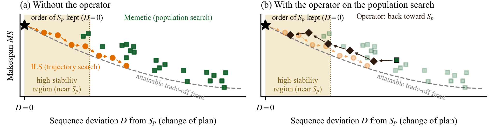
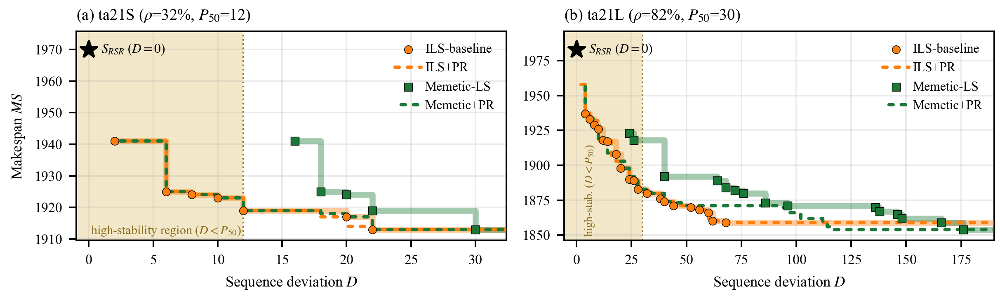
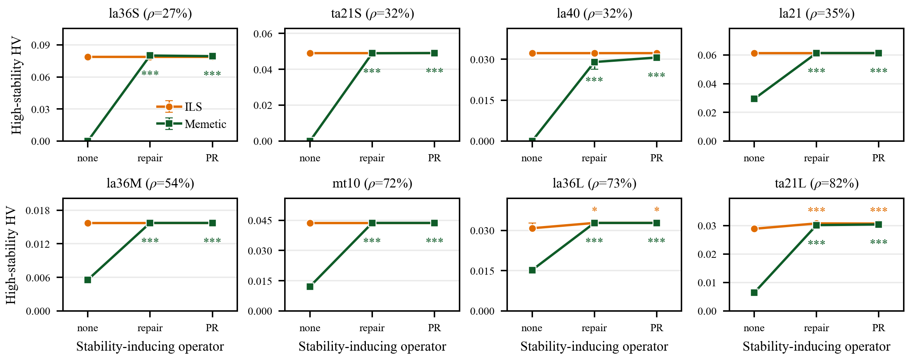
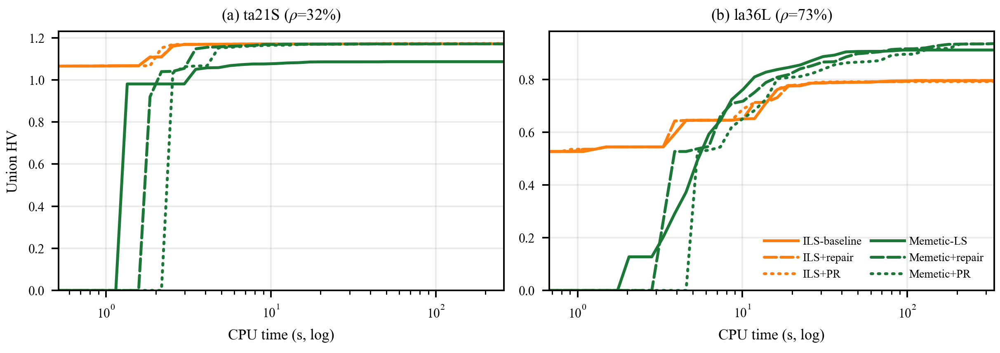

# [APIEMS 2026 投稿用・v2] Asymmetric Effects of Stability-Inducing Operators across Trajectory and Population Search in Job-Shop Rescheduling

> **このファイルの位置づけ（v2）**
> [v1](../paper_apiems2026/apiems2026_manuscript.md) の論理構成を「結論先出し・図1前倒し・§3＝実験設計・貢献1本化」に再編した版。細部の表現・数値・引用は v1 から流用し、章の役割と順序だけを変えた。v1 は `doc/paper_apiems2026/` にそのまま保持する（英訳 docx パイプライン `builder.py` / `make_docx.py` / `content_ja.py` / `content_en.py` も v1 準拠のまま同ディレクトリにある）。v2 の原稿・図・docx 生成物はすべて本ディレクトリ `doc/paper_apiems2026_v2/` に置く。
>
> **編集規約（本文には書かない。いつ何を変えたかは git log を見る）**
> 1. **章の分担**：§1 は具体、§2 は文献で論証、§3 は検定可能な形に落とす——高度＝役割で分担し、抽象度では分担しない。§1 の順序は「状況 → 特殊性 → 問い3つ → 答え3つ → 型の宣言」で、図1（(D, MS) 平面の模式図）を §1 に置く。§5 は「Q1〜Q3 の答え → 中心的貢献1本 → 限界 → 今後」。型の宣言は平文にし、典拠（Sörensen [28]・Hooker）は引用しない（[28] は v2 本文で未引用＝削除候補として残置）。
> 2. **§2 の形**：残された課題は「ギャップ2つ＋各々への本研究の対応」に束ねる。仮説の鎖（H2 は H1 の系）は v1 のまま。**評価方法論への批判は書かない**（既存評価は少数の固定重みのスカラー比較が主、という趣旨の従属文）：「分析が行われてこなかった原因が評価方法である」は他分野の慣行についての因果主張で根拠を持たせられず、かつ高安定 HV を導入する動機は §1 の「$S_p$ が既にある」という問題構造からの導出が既に担っているため、弱い根拠で同じ結論を二度言う形になる。
> 3. **§3 の形**：「因子1＝探索構造／因子2＝安定性誘導演算子／応答＝3指標」の実験設計として書く。シナリオ・予算・環境は §4.1（§3 は一般論・§4 は具体）。
> 4. **§4 の形**：**指標ごと**に組む。§4.2 は仮説を置いた高安定 HV だけで完結させ、「図2（実 Pareto フロント, ta21S/ta21L）で具体 → 図3（none/repair/PR × 探索構造の折れ線）で全 8 シナリオの定量 → H1・H2・構造間比較の箇条書き → 非対称と競合説明」の順。§4.3 は仮説を置いていない全域 HV と AOC を図4・表2 で比較し、「図4・表2 → 全域 HV → AOC（PR か repair か）→ 含意 → 探索的な気づき」の順。図2 に Memetic+PR を残すのは、§1 で答えを先出しした構成では先取りが矛盾せず、「帯内で ILS に重なる」フロントの絵が H2 の最も直接的な視覚証拠だから。
> 5. **置かないもの**（再提案しないための記録）：**機序の節（PR 経路統計の図）**——UEA が生成解を選択前に全記録するためフロントの左端が生成解の最小 D と一致し、訪問統計は図2・高安定 HV と冗長。かつ PR 経路統計は始点（単点探索は停滞後の best、多点探索は LS 直後の各個体）が揃わない交絡が残る。**スコアボード（ヒートマップ）**——「首位が指標で替わる」が行順にしか現れず読めないため図4＋表2 に置換。**claim1 棒グラフ**（H1 の 3 指標。図2＋本文数値に吸収）と**訪問密度差マップ**。**限界 (vi)（埋め残しを独立に操作した対照がない）とその今後の課題**——§4.2 が主張しているのは「効きの大きさが埋め残しで決まる」ではなく「**両構造の効き方の差**を分けるのが埋め残しの有無」であり、しかも直前で全手法共通の上限を示している以上、上限まで埋めた手法が伸びないのはほぼ算術で、独立操作を要する因果主張ではない。証拠の見え方も 16 セル（2 構造 × 8 シナリオ）が整合しており（余地のある多点探索 8 セルは全部伸び、上限の単点探索 6 セルは伸びず、余地の残る単点探索 2 セルだけ伸びる）、「有意なのは ta21L のみ」と書くとかえって弱く誤読させる。
> 6. **同じ結果を予測する競合説明は、潰す場所で 1 文ずつ閉じる**：選択が捨てた説→§3.4 の記録ポリシー、発動回数説→§4.2 の天井テスト、埋め込み差説→§4.2 の PR/repair 再現、摂動一般説→§4.2 のランダム方向対照。ランダム方向対照は §4.2 の H2 に 1 文だけ入れる（強度を repair の実測深さ分布から抽選して厳密に揃えた対照で、高安定 HV の方向効果が mt10・la36S の 2 シナリオとも完全分離したため。強度キャップを $S_p$ からの距離に取る旧実装は方向とコストが交絡していて載せられない）。
> 7. **§4.2 の非対称は媒介を経由して書く**：効きを直接分けているのは構造そのものというより「構造が高安定領域に残す埋め残しの有無」で、構造依存はその媒介を通じて現れる。これで ta21L が例外ではなく媒介の事例として読め、§5 の精密化（演算子の価値は搭載先が自力で埋めているかに条件付く）が唐突でなくなる。媒介に接地させるため §4.2 では「自力で埋め終えた」でなく「**上記の共通の上限まで**自力で埋めた」と書く。題名・Abstract・§1 は一段の「構造依存」のまま（短い場所で媒介まで言わない）。§4.3 の AOC は「原因は埋め残しではなく発動の仕方そのもの」と切り分ける（§4.2 の「発動回数では説明できない」は品質の話、AOC のコストは発動頻度の帰結、と衝突させない）。
> 8. **用語**：演算子の名称は題名（stability-inducing operators）との整合で「**安定性誘導演算子**」を維持し、§1 初出で「解を $S_p$ の方向へ引き戻す演算子」と平文で定義する。**「交互作用図」は図 3・図 4 の形の名前としてのみ使う**：交互作用図（interaction plot / SPSS の profile plot / Minitab の means plot）は「横軸に因子 A、線に因子 B、縦軸に応答」という表示の慣用名で、厳密な定義はなく、DOE の定番なので読者は形を見慣れている。本研究のデータは 2 構造 × 3 演算子 × 8 シナリオ × n=10 で実際に crossed なので、図の形を名乗るのは正確。ただし**主張の語は「非対称」のまま**（交互作用効果を検定したとは言わない。検定は構造内の対比較＋Holm）。DOE の防御文・因子分析の言及は入れない（演算子の発動方法が構造で異なるのは水準の同一性の問題で、PR と repair の 2 つの埋め込みで同じ非対称が出ることで §4.2 で閉じている）。3 指標は §1〜§3.4 では平文名（トレードオフ全体の品質／高安定領域の品質／anytime 性能。音写せずラテン文字で表記し、§3.4 初出の平文説明「いつ止めても良い解が得られる」で意味を取らせる）、§3.4 で定義した後の §4・§5 は指標名（全域 HV／高安定 HV／AOC）で呼ぶ。図のキャプションには図中にない情報だけを書く（軸ラベル・凡例・図中注記にある指標名や符号化は繰り返さない）。
> 9. **図表の構成（図 4 点・表 2 点）**：図1 `figures/fig_v2_concept_en.png`（§1 の語彙だけで読めるよう、P50・H1/H2・ホストの語を図中から外し、主な知見の箇条書きの直後に置く。(b) は演算子の経路 1 本だけを描く。**図中テキストは系列を同定するラベルに限り、主張は幾何（点群の広がり・矢印の向き）で示す**——主張を文で書くと直前の箇条書きと二重になり、読み手に差分を探させる。キャプションは**図中にも本文にもない情報だけ**を持つ（軸・パネル名・★の説明は図中にあり、高安定領域の定義は §1（語）と §2の前方参照（§3.4）が既に担うので、図1 は表題のみ）。座標の定義は §1 で 1 回だけ＝「解が $D=0$ に位置する」と述べる文で行う。模式図なので本文幅いっぱいに引き伸ばさず、`CONCEPT_W`=5.80in（他の図は `FULLW`=6.93in）で描き、`make_docx_v2.py` の `FIG_SCALE` で 5.80/6.93 を配置倍率に使う。レンダリング幅と配置幅の比を揃えるのが見定めで、これで図中の文字は他の図と同じ大きさのままになる）／図2 `fig_v2_front_en.png`（ta21 対。中央値 trial のフロントのみ表示し、x 軸はその最大 D で切る。他 trial の薄い点は `SHOW_ALL_TRIALS` で再表示可）／図3 `fig_v2_interaction_en.png`（高安定 HV。有意水準は両側検定、記号はもう一方の線から遠い側に置く）／図4 `fig_v2_anytime_en.png`（代表 2 シナリオ ta21S・la36L の anytime 全域 HV 曲線。色＝探索構造・線種＝演算子で 6 手法、trial 中央値のみ＝四分位範囲は仮説を担う図3 が持つ。縦軸は時刻 t までに 10 重みの探索が訪問した点を合併した全域 HV で**終点が表 2 の全域 HV に一致**し、AOC は各重みで同形の曲線を対数時間平均した値＝**立ち上がりの差**）。**図4 で旧案 2 つを採らない理由**：(i) スコアボードは「首位が指標で替わる」が行順にしか出ず読めない、(ii) 図3 と同形の交互作用図（生値でも RPD% でも）は伝わらない——どちらもインクをシナリオ次元に使っているが、§4.3 の主張は**手法 × 指標に住んでおりシナリオ次元にはない**。横断順位は表 2 が担い、図は「過程」を見せる役に徹する。表1 は §4.1 の設定、表2 は 3 指標の平均順位・ARPD%・首位群シナリオ数（`paper_stats_v2.py` の [E] が markdown を出力。同スクリプトは Friedman 検定の p と Kendall's W も出すが、8 シナリオが独立でない以上omnibus 検定は前提を満たさず、どの主張もこの 2 つに依存しないので原稿には載せない）。図の生成はすべて `make_figures_v2.py`（データは v1 と同じ main_v1）。検討用に旧図4（PR 経路統計 `fig_v2_mech_pr_en.png`）・旧図5（スコアボード `fig_v2_scoreboard_en.png`）・旧案図4 は `--review`、図2 のシナリオ選定用の全 8 シナリオ並べ `figures/sel_front_all8.png` は `--select` で生成できる（いずれも論文には載せない）。
> 10. **図の符号化（4 図共通・白黒対応）**：意味は必ず 2 チャネル以上で持たせ、色相だけに載せない（APIEMS は Springer IFIP AICT で、論文集は WCAG 準拠が要求される）。**探索構造＝色相＋グレー明度＋マーカー形状**（ILS: 橙 `#e06c00` L601=130・○／Memetic: 緑 `#0f5c28` L601=63・□／演算子の経路: 茶 `#2e1a0e` L601=31・◇。L601=0.299R+0.587G+0.114B）。**明度差はベタ面（帯・マーカー）には効くが、点線の点や有意記号のような細い描画には効かない**ので、色の間隔を 32 以上あけるだけでなく全色を L601≦130 に収め、白地に埋もれないようにする。**演算子＝線種**（なし: 実線、repair: 長破線、PR: 丸点線）。高安定領域の網掛けは alpha ではなく実色 `#f5ebd0`（L601=235＝紙白より 8% 暗い）で置き、白黒でも面として残す。図2 は演算子なしを太く淡い帯に退けて＋PR の点線を前に出し（主張は「＋PR がさらに $S_p$ 側へ踏み込むか」なので参照側にインクを使わない）、＋PR 2 本は明度だけでは白黒で分離しきれないため、点の大きさ（ILS+PR 2.3 pt／Memetic+PR 1.5 pt）も変え、さらに点線の位相を半周期ずらして重なる区間でも両方見えるようにする（周期は pt で固定し、matplotlib が線幅でパターンを拡大する分を割り戻す）。**カラー版と白黒版は分けない**：`make_figures_v2.py` が `figures/_gray/` にグレースケール校正を自動出力する（`--gray` で校正だけ作り直せる）。
> 11. **語彙の統一（経営工学会予稿・修論にも適用）**：同じものを複数の語で呼ばない。機構→**演算子**（説明の意味の「機序」は別）／充填・覆域・覆う→**埋める**（指標は HV）／$S_p$ 近傍→**高安定領域**（Abstract と §1 で「$S_p$ 近傍（以下、高安定領域）」と結ぶ。N5 近傍は別物）／ホスト→**両構造・載せる探索構造**（固有句「ホスト依存の非対称効果」のみ残す）。軌道ベース／集団ベース→**単点探索／多点探索**（日本語は経営工学会要旨 `doc/paper_jima2026fall/要旨と題目確定版.md` と統一。英語は trajectory-based / population-based＝[30] Blum & Roli の語法をとり、日英で対を変える。「集団」は GA の個体群を指す場合のみ残す：初期集団・集団へ戻す）。統合 HV→**全域 HV**（英: Overall HV）：「統合」は 10 重みの点を合併したことを指す語だが、その合併は高安定 HV も共有する性質で対比の軸になっておらず、名前の対が作る軸（全域 vs 高安定領域）と語の意味がずれるため。重み掃引の合併は §3.4・表1 の定義文が持つ（解析コード側のデータキー `union_hv_pt` 等は analyze_v3 と共有するため改名しない）。飾りの語（適合性・補完性・天井タイ・安定性アンカー・方向づけ移動・冗長性・引力圏・固定骨格・空振り・張り付く・煮詰める・飛散・棲み分け）は平文に戻す。残す造語は 安定性誘導演算子／高安定領域／ホスト依存の非対称効果／全域 HV・高安定 HV／併合型・範囲限定型。英語では fill・cover・host・pull back は普通の語なので造語に残るのは stability-inducing operator・high-stability region・host-dependent asymmetric effect の三つ。
> 12. **図の位置（docx）**：全幅図は Word のフロート表で、`![...]` 行の直後の段落があるページの上端に浮かぶ。図が乗り切らないページにアンカーが落ちると（図 2 のページなど）、アンカー以降の本文が図と一緒に次ページへ押し出されて段が空く。空白が出たら `![...]` 行を前後の段落へ動かしてページを変える（現在：図 3 は非対称の段落の後ろ、図 4 は全域 HV の段落の後ろ。英語版は本文の長さが違うので位置が異なる）。再生成後は PDF 化して段の空白を確認する。

---

## ⛓ 全体制約（テンプレ実測）

| 項目         | 制約                                                             |
| ------------ | ---------------------------------------------------------------- |
| 分量         | **8ページ以内**（A4・**2段組**・0.75cm段間）                     |
| 言語         | 英語（本稿は日本語ドラフト）                                     |
| 本文フォント | 10pt Times New Roman（節見出し11pt太字・タイトル20pt・著者10pt） |
| Abstract     | **200語未満**（日本語ソース目安 ≈ 380字）                       |
| キーワード   | 最大5                                                            |
| ページ番号   | 振らない                                                         |
| 見出し       | 3レベルまで（decimal）                                           |
| 数式         | 通し番号 (1),(2),... 右寄せ                                      |

## 📊 ページ＆字数予算（v2）

| 節                                   | ページ     | 日本語字数目安 | v1 からの増減                       |
| ------------------------------------ | ---------- | -------------- | ----------------------------------- |
| Title/著者/Abstract/Keywords         | 0.4        | ≈ 400          | —                                   |
| 1. Introduction（図1 含む）          | 1.1        | ≈ 1,700        | +0.2（結論先出し＋図1）             |
| 2. Related Work and Hypotheses       | 0.9        | ≈ 1,700        | −0.1（課題を2つに束ねる）           |
| 3. Problem and Experimental Design   | 2.0        | ≈ 3,000        | −0.2（スカラー化防御を圧縮）        |
| 4. Computational Experiments         | 2.7        | ≈ 4,300        | ±0（図4 を折れ線 2 段に、表2 追加、機序の節と PR 経路統計の図を削除） |
| 5. Conclusion                        | 0.5        | ≈ 900          | —                                   |
| References（16-20件）                | 0.4-0.7    | 別枠           | —                                   |
| **本文合計**                         | **≈ 8.0**  | **≈ 12,000**   |                                     |

---

---

# 本文ドラフト（日本語・v2）

## Title / Authors / Abstract / Keywords

**Title**: ジョブショップ再スケジューリングにおける安定性誘導演算子の非対称効果——単点探索と多点探索の横断比較
（英: *Asymmetric Effects of Stability-Inducing Operators across Trajectory and Population Search in Job-Shop Rescheduling*）

**Abstract（≈380字 / 英200語未満）**

予測リアクティブ再スケジューリングでは高品質な元計画 $S_p$ が既に存在し、修正解には効率（メイクスパン）と安定性（$S_p$ からの変更の小ささ）が同時に求められる。ゆえに探索手法は、$S_p$ 近傍（以下、高安定領域）をどれだけ良く埋められるかでも評価すべきである。局所探索を揃えた統制比較の結果、$S_p$ から連続変形する単点探索（ILS）は、交叉で解を組み替える多点探索（Memetic）を高安定領域の HV で全 8 シナリオの全試行で上回った。次に、解を $S_p$ へ引き戻す安定性誘導演算子（Path Relinking に基づく PR と repair）を両構造に搭載すると、効果は非対称に現れた。多点探索では高安定領域の HV が全シナリオの全試行で改善し、8 シナリオ中 7 つで単点探索と並び、トレードオフ全体の品質で首位となった一方、この領域を自力で埋めている単点探索では改善の余地がほとんど残らなかった。最良手法は評価軸によって入れ替わる。

**Keywords**: Rescheduling; Job-shop scheduling; Stability; Iterated local search; Path relinking

---

## 1. Introduction

製造現場では作業遅延や機械故障などの外乱が頻発し、当初スケジュールの実行を困難にする。これへの対応は、あらかじめ余裕を見込んで耐性を高める静的アプローチと、発生後にスケジュールを修正する動的アプローチに大別される [12]。本研究は後者のうち、実行中のスケジュールを実行可能な形へ修正する**予測リアクティブ再スケジューリング** [13] を対象とする。

再スケジューリングでは「修正後の**効率**」と「外乱前のスケジュール（以下、元計画 $S_p$）からの変更量の小ささ（以下、**安定性**）」がトレードオフの関係にある。大幅な変更は、現場の混乱・段取り替え・資材や治具の再手配・作業者の再配置・下流工程や外注先への予定変更の波及といったコスト（以下、**スケジュール変更コスト**）を生む。このため安定性は効率と並ぶ目的であり [3][14]、本研究はこれを効率と安定性の多目的最適化として定式化する。指標は、効率に**メイクスパン（MS）**、安定性に $S_p$ からの**順序偏差 $D$**（各機械上で処理順序がどれだけ入れ替わったか。小さいほど安定）を用いる。

再スケジューリングには静的スケジューリングにない特殊性がある。**元計画 $S_p$ の順序を保ったまま遅延を吸収した解が、安定性の目的では最適解であり、探索を始める前から与えられている**ことである。この解は、横軸に $D$・縦軸に MS をとった平面（図 1）の $D=0$ に位置する。$S_p$ 自体が外乱前に最適化されたスケジュールであるため効率の面でも良い水準にあるが、遅延をそのまま吸収したぶん、順序を組み直せば MS を縮められる余地が残る。変更コストが無視できない場面で求められるのは、$S_p$ の近く——本稿でいう**高安定領域**——にある、変更を小さく抑えたうえで効率も改善した解である。したがってこの問題では、手法をトレードオフ全体の品質だけでなく、**高安定領域をどれだけ良く埋められるか**でも評価する必要がある。

本研究が対象とするジョブショップスケジューリング問題（JSSP）は NP 困難であり [33]、実用規模では厳密解法でなくメタヒューリスティクスが用いられる [13]。これらは、1 つの解を少しずつ変形しながら進む**単点探索**と、複数の解を保持して互いに組み替えながら進む**多点探索**の二系統に大別される [30]。再スケジューリングを含む多目的な JSSP の解法は、GA を基軸とする多点探索が主流である（§2）。しかし、$S_p$ という高品質な初期解が与えられるこの問題では、**それを少しずつ変形していく単点探索のほうが、高安定領域を埋めるのに向いているのではないか**。これが本研究の出発点である。

本研究はこれを、局所探索を揃えた ILS（単点探索の代表）と Memetic（GA に局所探索を組み込んだ多点探索の代表）の統制比較で検証し、あわせて、解を $S_p$ の方向へ引き戻す**安定性誘導演算子**（以下、演算子）を両者に載せて、その効果が探索構造によってどう変わるかを調べる。主な知見は次の通りである。

- **単点探索（ILS）は多点探索（Memetic）より高安定領域を良く埋める.** 同じ局所探索を備えていても多点探索の埋め方は粗く、シナリオによってはほとんど届かない。
- **演算子は多点探索を単点探索の水準へ引き上げ、単点探索自身にはほとんど足さない.** 演算子が埋めるのは埋め残しであり、自力でこの領域を埋めている単点探索が伸びるのは、埋め残しの残った一部のシナリオに限られる。
- **重視する軸で最良手法は替わる.** トレードオフ全体の品質では Memetic＋演算子が、いつ止めても良い解が得られる anytime 性能では ILS が最良で、高安定領域の品質では両者が並ぶ。

図 1 はこれらの知見を模式的に示す。

本研究の主眼は、最先端手法との性能競争ではなく、仮説を立てて条件を統制し、探索構造と演算子の関係を切り分けることにある。

---

## 2. Related Work and Hypotheses

再スケジューリング研究は、効率だけを目的とするものと、安定性もあわせて求めるものに分かれる。前者が多数を占めることは繰り返し指摘されており [3][27]、本研究が前提とする後者では、安定性を確保する方法がさらに二つの系譜に分かれる。

**安定性を目的関数に組み込む系譜（併合型）.** 再スケジューリングで効率と安定性を同時に最適化する試みは、単一機械で両者を評価基準として定式化した Wu ら [14] に始まる。JSSP では Rangsaritratsamee ら [3] が GA に局所探索を組み合わせた memetic 構成の解法を、Zhang ら [4] が GA と tabu search のハイブリッドを提案し、フレキシブル JSSP（FJSP）では Fattahi & Fallahi [18] が同じく memetic 構成の解法を適用している。3 件とも効率と安定性を重みで一本のスカラーに束ねる。Pareto 支配では、Valledor ら [34] が置換フローショップで makespan・重み付き総納期遅れ・開始時刻偏差の 3 目的を NSGA-II 系で、Luo ら [35] が動的 FJSP で効率と安定性の 2 目的を並列 NSGA-II で解いている。いずれも安定性を**目的関数の一項**として扱う点で共通する。

**安定性を探索空間の制限で担う系譜（範囲限定型）.** 一方、Bean ら [15] は復帰時点までを再スケジュールする match-up scheduling を、Abumaizar & Svestka [16] は影響波及作業のみの AOR を提案した。Zakaria & Petrovic [17] は染色体を区間に限定し、Sun ら [27] は再最適化の範囲を 4 段階に整理している。いずれも安定性を**探索空間の制限**で確保する点で共通する。

**残された課題.** 上記二系譜を踏まえると、われわれの知る限り、課題は三つ残る。**第一に、探索構造の差が検証されていない。** 二系譜を通して、探索を用いる解法は多点探索に集中しており [3][4][17][18][27][34][35]、「高品質な元計画 $S_p$ が既に存在する」という再スケジューリング固有の特性が探索構造（単点探索／多点探索）の間にどのような差を生むかは、両構造を同一条件で比較する形では分析されていない。**第二に、その差を読み取れる評価の形式がない。** 比較は、少数の重み設定でのスカラー値 [3][4]、安定性を併記した効率指標 [27]、Pareto フロント全体の hypervolume 等の指標 [34][35] といった形で行われ、高安定領域に限った品質は測られていない。**第三に、解を $S_p$ 方向へ動かす手段がない。** 併合型は安定性を解の**評価**に織り込み、範囲限定型は探索**空間**を切って構造的に保証する（その代わり、制限の外側にある効率‒安定トレードオフ解を探索対象から外す）。解を $S_p$ へ近づける**移動**は、いずれも持たない。

**二つの仮説.** これらの課題に対し、本研究はフロント全体の品質とは別に**高安定領域に限った品質**を測り（§3.4）、これを応答として二つの仮説を立てる（図 1）。$S_p$ から連続変形を重ねる単点探索（ILS）は、$S_p$ を起点に外へ広がりながら高安定領域を小刻みに埋めていけるのに対し、多点探索（Memetic）は 2 親の構造を組み替えて解を作ることで探索を進める。組み替えは $S_p$ からの小さな変更では表せない飛躍を伴うため、同じ局所探索を備えてもこの領域の埋まり方が構造的に粗くなるはずである——**H1**（図 1(a)）。H1 が成り立つなら、多点探索に欠けているのは高安定領域を埋める力である。本研究は、この移動を演算子として設計する（§3.3）。$S_p$ から離れて散った個体を**外側から $S_p$ へ戻す**経路上の中間解がこの欠落を埋め、多点探索の高安定領域の品質を、単点探索が自力で到達する水準まで押し上げるはずである——**H2**（図 1(b)）。一方、$S_p$ から広がる探索で既にこの領域を埋めている単点探索に上積みがあるかは自明でないため、効果の向きは予測せず、同一の演算子を両構造へ載せて構造間で比較する。

---

## 3. Problem Formulation and Experimental Design

本節は、問題設定（§3.1）と 2 つの因子・応答の設計（§3.2〜§3.4）によって、§2 の仮説を検定可能な形に落とす。

### 3.1 Problem Definition

作業遅延は作業集合を変えず処理順序の再調整だけで対処でき、修正解を高安定領域に保つ前提が最も素直に成立する外乱である。そこで本研究は、外乱を単一の作業遅延（遅延量 $\Delta$）に限定する。$n$ ジョブ・$m$ 機械の JSSP に作業遅延が発生した後、元スケジュール $S_p$ に対し修正スケジュール $S_q$ を求める。現場は機械上の順序を $S_p$ から変えずに遅延を吸収して実行を続ける。この実スケジュールを **right-shift 解 $S_{RSR}$** と呼ぶ。$S_{RSR}$ 上で再スケジューリング時刻 $t_r$（遅延解消時刻）より前に開始済みの作業は**凍結**し、$t_r$ 以降の作業を**最適化対象**とする。決定変数は最適化対象作業の機械ごとの処理順序のみであり、解は凍結部を先頭に固定したまま各作業を $t_r$ 以降の最早可能時刻へ詰めた semi-active スケジュールとして評価する。

**安定性指標.** 逸脱量は (i) 開始時刻偏差と (ii) 順序偏差の二系統に大別される。たとえば Sun ら [27] は両者を明示的に区別したうえで前者（開始時刻の絶対偏差和）を安定性指標に採る。本研究は、探索で用いる操作（N5 近傍と安定性誘導演算子の swap 移動, §3.2–3.3）がいずれも順列操作であること、および MS との独立性が高いことから後者を採用する。

$$
D(S_p, S_q) = \sum_{(i,j) \in \mathcal{O}_{\mathrm{opt}}} \left\lvert r_{i,j}^p - r_{i,j}^q \right\rvert \quad (1)
$$

$r_{i,j}$ は機械 $i$ でのジョブ $j$ の処理順位、$\mathcal{O}_{\mathrm{opt}}$ は最適化対象（$t_r$ 以降）の作業集合である。$D=0$ は順序不変の right-shift 解 $S_{RSR}$ に対応する。

**多目的とスカラー化.** $\min_{S_q}\,(MS(S_q),\,D(S_p,S_q))$ を、重み $\lambda\in[0,1]$ の重み付き和で解く。

$$
F(S_q) = \lambda\,\hat D(S_p, S_q) + (1-\lambda)\,\widehat{MS}(S_q) \quad (2)
$$

$\hat\cdot$ は min-max 正規化値であり、$\lambda$ が大きいほど安定性を重視する。本研究は $\lambda$ を複数点で掃引し（weighted-sum sweep）、各点で独立に探索を走らせる。1 点ぶんの探索は、重みが定まった状態で再スケジューリングを 1 回行う実運用に対応する [3]。そのため、各点の探索を時間で追えば実運用での速さが、全点の解を合わせればトレードオフ全体の品質が、同じ実験から測れる（§3.4）。重み付き和は非凸フロントの凹部に届かない [8] が、全手法が同じスカラー化を共有し、探索中に訪問した凹部の解も UEA（§3.4）で記録されるため、構造差の比較への影響は限定的と考える。

### 3.2 Factor 1: Search Structure — ILS and Memetic (H1)

H1（§2）を検定するため、比較の中核を**ILS と Memetic の対比**に置き、局所探索の有無という交絡を排して探索構造（単点探索 vs 多点探索）だけを対比する。

**単点探索（ILS）.** ILS [22] は、現在解に摂動を加え、そこから局所探索で解を改善し、得られた解を受理するかを判定する、という反復で 1 つの解を改善していく枠組みである。単点探索の中で ILS を採る理由は、深掘り（局所探索）と脱出（摂動）が明確に分離されている点にある。この分離ゆえに、**摂動強度——現在解から一度にどれだけ離れるか——を挿入手数として直接制御**でき、安定性誘導演算子（§3.3）も摂動として自然に組み込める。**初期解**は $S_p$ とする。**局所探索**は ILS と Memetic で共有する JSSP 標準の N5 近傍 [1] で、候補をクリティカルブロック端の隣接 swap（makespan 改善見込みのある手）に絞り、採否は $F(\lambda)$ で評価する。**摂動**は insert 移動で、強度（挿入手数）を停滞度に応じ鋸歯状に巡回させる（VNS [10] 型）。**受理判定**は改善時受理（better acceptance）で、摂動後に得た局所最適が best の $F(\lambda)$ を厳密改善したときのみ現在解を置き換える。

**多点探索（GA / Memetic）.** H1 の比較相手となる多点探索は、先行研究で標準的な、GA に局所探索を統合した **Memetic** [29] とする。土台とする GA は operation-based 表現 [25] の標準的なもので、染色体は作業の並び、GT 法 [23] でスケジュールにデコードし $F(\lambda)$ で評価する。**初期集団**には ILS と同じく $S_p$ を 1 個体として含める。各世代は、エリート保存付きトーナメント選択で親を選び、PPX 交叉 [11] と逆位突然変異で子個体を作る。Memetic は、この GA の各個体へ上記 N5 を適用し、得られた改善解を染色体に書き戻す（Lamarckian）。局所探索をもたない素の GA は参考ベースラインとする。

### 3.3 Factor 2: Stability-Inducing Operators — PR and Repair (H2)

**Path Relinking（PR）.** PR は 2 つの高品質解を結ぶ経路上に優れた中間解が存在するという考えに基づく探索法で、一般には Scatter Search 等と組み合わせ、エリート解プール内の解どうしを結ぶ形で用いられる [5][6]。本研究はこれを再スケジューリングの構造に合わせ、**guiding solution を外乱前スケジュール $S_p$ の一点に固定する**点が特徴である。すなわち現在の局所最適解（initiating）から $S_p$（guiding）へ向かう。両者の隔たりは、式 (1) の順位が食い違う作業の数 $d=\lvert\{(i,j)\in\mathcal{O}_{\mathrm{opt}} : r^p_{i,j}\neq r^q_{i,j}\}\rvert$ で測る。1 ステップでは食い違う作業を 1 つ選び、その作業が $S_p$ での順位 $r^p_{i,j}$ に来るよう、同じ機械上でいまその順位にある作業と入れ替える。これを繰り返せば $d$ ステップ以内に $D=0$ に達し、この経路上で $F(\lambda)$ が最良の解を返す。$S_p$ に固定する理由は、(a) $S_p$ が安定性目的の最適端点ゆえ PR を「安定性の最適端点へ向かう移動」として一意に解釈できること、(b) $S_p$ へ向かう途中には、安定性を高めつつ MS の劣化を抑えた解が現れると期待でき、それが高安定領域を埋めることに直結すること、である。入れ替える作業は実行可能な候補からランダムに選び、評価回数を $O(d)$ に抑える。全候補を評価する best 選択は $O(d^2)$ で、全域 HV で約 +1% の利得に対し大きい外乱では約 8 倍の時間を要したため採らない（予備実験）。

**Stability Repair Kick（以下 repair）.** PR を途中で打ち切った演算子である。同じ swap 移動を深さ $k$（$1\le k\le d$）回だけ適用して解を $S_p$ 方向へ引き寄せ（＝$S_p$ から漂って失った安定性を"修復"し）、経路上の中間解は評価せずに到達点を局所探索で再最適化する。$k$ が $d$ に等しければ $S_p$ まで戻り、小さければ現在解の近くに留まるため、$k$ を変えて繰り返すことで現在解と $S_p$ の間を幅広く埋める。

**両構造への搭載.** 両構造には、$S_p$ 方向への swap 移動という**演算子の核を共有させ**、発動の契機と返し方は各構造の標準的な組み込み方に合わせる（表 1）。単点探索（ILS）では両演算子は摂動として働く：停滞時に発動し、repair の深さ $k$ は発動のたびに 1 から $d$ まで 1 ずつ増やし、上限に達するか best が改善したら 1 に戻す（鋸歯状）。多点探索（Memetic）では各個体の精緻化に組み込む：局所探索の後、演算子を個体ごとに確率的に適用し（repair の深さ $k$ は 1〜$d$ から一様に引く）、結果を N5 で再最適化して無条件に集団へ戻す——採否はトーナメント選択に委ねる。以下、演算子を載せない構成を **ILS-baseline**・**Memetic-baseline** と呼び、各 baseline に PR・repair を載せた版を加えた 3 手法ずつを **ILS 系**・**Memetic 系** と呼ぶ。

### 3.4 Responses: Evaluation Metrics and Hypothesis Testing

各探索が**選択にかける前に**生成した全解を対象に非劣解を保存する **UEA** [9] のもとで、Pareto フロントの hypervolume（HV）[24] を測る。記録点は両構造で揃え、解を動かす操作（単点探索の摂動、多点探索の交叉・突然変異、両者の演算子）の直後と局所探索後の双方を記録する。フロント全体をまとめて測る HV では、高安定領域が埋まっているかどうかの差は埋もれる。そこで本研究は、この HV に加え、この領域に限った品質と、いつ止めても良い解が得られる anytime 性能を測る：

- **全域 HV**（トレードオフ全体の品質）：全領域の hypervolume。
- **高安定 HV**（高安定領域の品質）：高安定領域 $D<P_\theta$ に限った hypervolume。$P_\theta$ は全手法・全 trial の Pareto 解の $D$ をプールした $\theta$ 百分位であり、$\theta$ の値と感度は §4.1 で扱う（図 1・図 2 の網掛け領域）。
- **AOC**（anytime 性能 [26]）：重みごとの HV-対-対数時間曲線の時間平均。対数時間で平均するため、探索の立ち上がりを重く見る。

HV はシナリオ横断比較のため各シナリオで $[0,1]^2$ にアフィン正規化し参照点 $(1.1,1.1)$ で算出する。$S_p$ の機械順序を保ったままの解（$D=0$。$S_{RSR}$ など）は全手法が探索せずに得る自明解なので、HV の算出から除く。全域 HV と高安定 HV は、各試行で重み掃引の全点の解を合併してから算出する。AOC は逆に**重みごとの探索を単位**とし、壁時計の対数時間で平均した値を試行ごとに全重みで平均する（時間窓は各重みで全手法共通）。

**統計.** 各シナリオ内の手法比較は Mann–Whitney の U 検定と効果量 Cliff's $\delta$ で評価し [32]、検定はすべて両側で行う。$|\delta|$=1.0 は一方の全 trial が他方の全 trial を上回る完全分離を意味する。差の大きさは中央値の倍率・相対差で示す。

**仮説と検定の対応.** 仮説を置くのは高安定 HV だけである。H1 は、局所探索を揃えた ILS-baseline と Memetic-baseline の比較で検定し、全 8 シナリオで ILS が有意に上回れば支持されたとみなす。H2 は、Memetic-baseline に対する Memetic＋演算子の伸びを同じ形で検定し、押し上げの到達点は ILS-baseline との比較で確かめる。多重比較は、同じ比較を 8 シナリオに渡したものを 1 族として Holm 補正で扱う。

---

## 4. Computational Experiments

本節では実験設定（§4.1）ののち、結果を指標ごとに示す。

### 4.1 Experimental Setup

mt10・la21・la36・la40・ta21 の 5 インスタンスに単一作業の完了遅延（$\Delta$=60〜148＝対象作業の処理時間の約 0.9〜1.5 倍）を与えた計 8 シナリオ＝la36S/la36M/la36L（27/54/73%）・ta21S/ta21L（32/82%）・mt10（72%）・la21（35%）・la40（32%）を用いる。括弧内は**再スケジューリング率** $\rho=n_{res}/\text{ops}$（全作業のうち外乱で再最適化対象 $\mathcal{O}_{opt}$ となる割合）で、8 シナリオは 27〜82% を張る。各インスタンスの元計画 $S_p$ は 500 世代の GA で生成する。**la36 ラダー**と **ta21 対**は、同一インスタンス・同一 $S_p$ のまま外乱の規模だけを段階的に変えたシナリオ群である。各シナリオの完全な定義と trial 別の生値・検定は公開リポジトリ（https://github.com/kitotakumi/stability_scheduling）に収録する。実験設定は表 1 に示す。

**表 1.** 実験設定（全 8 シナリオ共通）

| 項目 | 設定 |
| --- | --- |
| 重み掃引 | $\lambda$ = 0, 0.1, …, 0.9 の 10 点（$\lambda$=1.0 は自明解 $S_{RSR}$ に縮退するため除外） |
| 試行 | 各（シナリオ×手法）10 trial |
| 計算予算 | ILS 系 3000 反復、GA・Memetic 系 500 世代 |
| 探索 | GA・Memetic 系: $cx_{pb}$=0.85, $mut_{pb}$=0.1, pop=50（$S_p$ 以外の 49 個体は無作為生成）。ILS 系: insert 摂動 2〜5 手を鋸歯状に巡回 |
| 演算子 | Memetic 系: 各個体に発動確率 0.3、PR は経路上位 3 中間解から最良を返す。ILS 系: 無改善 400 反復で初回・以降 10 反復ごとに発動、PR は経路上の最良 1 解を返す |
| 環境 | AMD Ryzen 5 7530U／Python 3.12（NumPy・DEAP・SciPy）。全乱数シード固定 |

**妥当性の確認.** 高安定領域の境界は $\theta$=50 とし、$P_{50}$ は全手法・全 trial の Pareto 解の $D$ の中央値である。この境界は手法プールから定まるが、$\theta$ を 33〜67 に振っても H1・H2 の結論は変わらない（全シナリオで完全分離, $p<$0.001）。壁時計は Memetic+PR が ILS の 4.8〜9.4 倍だが、中央値 run は全手法とも予算の 7 割以内で最終 HV の 99% に達しており、全域 HV の差は計算時間によらない。手法パラメータは標準値で固定し、挙動を定める 11 軸（ベース探索構造側を含む）を 2 シナリオで一要因ずつ上下に振ったが、感度は全域 HV で +0.5〜2% と手法間の差（+7〜54%）より一桁小さい。

### 4.2 High-Stability HV: ILS Fills the Region Alone, the Population Fills It with Operators (H1, H2)

Memetic-baseline の埋め損ね方は二つの型に分かれる（図 2）。(a) ta21S では高安定領域に非劣解を 1 点も持たず、ILS が $D$=2 で得る MS に並ぶには $D$=16 を要する。(b) ta21L では入りはするが MS で ILS に劣り、両者が並ぶのは効率端のみである。いずれの型でも演算子を載せると両構造のフロントは高安定領域で重なり、8 シナリオ中 5 つでは ILS+PR と Memetic+PR の非劣解が点集合まで一致する。

この構図が全 8 シナリオで成り立つかを確かめる（図 3）。演算子なしの点の差が H1、Memetic の線の傾きが H2 に対応する。

- **H1：ILS-baseline は Memetic-baseline を全 8 シナリオで完全分離で上回る**（$p<$0.001, $|\delta|$=1.0）。3 シナリオ（la36S・ta21S・la40）では Memetic-baseline が高安定領域にほぼ非劣解を持てず（10 trial 中 9〜10 で 0 点。図 2(a)）、ILS のみが高安定領域を埋める。残る 5 シナリオでも ILS が 2.0〜4.5 倍。Holm 補正後も全シナリオで有意であり、H1 は支持された。
- **H2：演算子は Memetic の高安定 HV を全 8 シナリオの全試行で押し上げ、8 シナリオ中 7 つで ILS-baseline と同等以上にする**。押し上げは全シナリオで完全分離（$p<$0.001, $|\delta|$=1.0）。演算子なしでは高安定領域にほぼ解を持てなかった 3 シナリオで解が現れ、残る 5 シナリオでは高安定 HV が 2.1〜4.7 倍になる。到達点を ILS-baseline と比べると、6 シナリオでは有意差がなく（うち 5 つは中央値の差が 1% 以内）、ta21L では 4〜5% 上回り、la40 では 5〜10% 下回る（Holm 補正後 $p_{\text{adj}}<$0.015）。H2 は下回った 1 シナリオを除いて支持された。押し上げが摂動一般の効果か、$S_p$ 方向に固有の効果かは、強度を揃えて方向だけをランダム化した対照実験を 2 シナリオ（mt10・la36S）で回して確かめた：ランダム方向は押し上げの 7 割前後しか再現せず、高安定 HV では演算子に完全分離で及ばず（$p<$0.001）、同水準に達するには 1.7〜2.4 倍の時間を要する。
- **ILS では演算子を足してもほとんど伸びない**。演算子を載せた ILS が baseline を上回るのは 8 シナリオ中 2 つ（la36L・ta21L）にとどまる。PR・repair とも la36L で $p$=0.013、ta21L で $p<$0.001 だが、Holm 補正を施すと残るのは ta21L のみである（$p_{\text{adj}}<$0.002。la36L は 0.091）。その ta21L でも改善幅は中央値 0.029→0.031 と小さい（ただし演算子込みの全 trial が baseline の全 trial を上回る, $|\delta|$=1.0）。残る 6 シナリオでは差がない。

**演算子が効く条件.** 同じ演算子の効きが構造で非対称なのは、構造そのものの違いというより、その構造が到達水準に自力で届いているかの違いである。高安定 HV には、複数の手法が到達して止まる水準がある（どのシナリオでも 7 手法中 3〜5 手法が最良値の 2% 以内。図 3）。ILS に載せても Memetic に載せても、その構造が水準に届いていなければ演算子は高安定 HV を押し上げ、届いていれば伸びない。発動設計が同じ ILS 系の中でも水準に届いたかどうかで効きが変わるので、非対称は構造ごとに異なる発動設計（表 1）では説明できない。

### 4.3 Overall HV and AOC: The Best Method Changes with the Criterion Emphasized

まず代表 2 シナリオの anytime 全域 HV 曲線で、到達点と到達の早さを同時に見る（図 4）。

ta21S では Memetic＋演算子が ILS と同じ水準（1.17）に達するが、到達は ILS の 2.5 秒に対し 6.6〜7.8 秒を要する。la36L では Memetic が 7〜10 秒で ILS を追い越し、ILS が 0.80 で止まるのに対し 0.94 まで伸びる。曲線の終点と立ち上がりの速さは別の手法を最良と指す。

**表 2.** 3 指標の横断要約。各セルは「平均順位／ARPD%（最良手法からの相対偏差）／首位群シナリオ数 /8（そのシナリオの最良手法と有意差がないシナリオ数。補正なし）」で、前 2 者は 8 シナリオの平均で小さいほど、最後は多いほど良い。8 シナリオは互いに独立でない（§4.1）ため、横断順位は順位一貫性の探索的要約である。

| 手法 | 全域 HV | 高安定 HV | AOC |
| --- | --- | --- | --- |
| ILS-baseline | 4.44 ／ 10 ／ 1 | 3.44 ／ 2 ／ 6 | 2.75 ／ 4 ／ 6 |
| ILS+repair | 3.56 ／ 9 ／ 2 | 2.62 ／ 0 ／ 8 | 2.62 ／ 5 ／ 6 |
| ILS+PR | 3.75 ／ 10 ／ 3 | 2.75 ／ 0 ／ 8 | 2.50 ／ 4 ／ 6 |
| GA | 6.94 ／ 25 ／ 0 | 6.38 ／ 71 ／ 0 | 7.00 ／ 48 ／ 0 |
| Memetic-baseline | 4.81 ／ 5 ／ 2 | 6.62 ／ 78 ／ 0 | 3.50 ／ 18 ／ 2 |
| Memetic+repair | 2.50 ／ 1 ／ 6 | 3.31 ／ 2 ／ 6 | 4.00 ／ 22 ／ 1 |
| Memetic+PR | 2.00 ／ 0 ／ 7 | 2.88 ／ 1 ／ 6 | 5.62 ／ 27 ／ 1 |

**全域 HV.** 最良の水準に達するのは演算子を載せた Memetic で、表 2 でも首位群を占める。演算子が押し上げるのは §4.2 と同じく Memetic だけで、その全域 HV を 8 シナリオ中 6 で有意に上げる（+2.8〜11.7%）のに対し、ILS では全シナリオで ±0.5% 以内にとどまる。構造どうしの勝敗はシナリオで替わり、la36S・ta21S・la40・la21（以下 A 群）では ILS-baseline が Memetic-baseline を有意に上回るのに対し、la36M・la36L・mt10・ta21L（以下 B 群）では逆に Memetic-baseline が上回る（うち 1 つは有意差なし）。ILS 系が最良の水準に並ぶのは A 群だけで、B 群では 5〜38% 下回る。ゆえに §4.2 の高安定領域の差は、ILS が全体として優れていることの反映ではない。同じ分かれ方は掃引全体で到達した最小 MS にも現れ、A 群では GA を除く全手法が同じ値に達するのに対し、B 群の la36M・la36L・mt10 では Memetic 系が 1.2〜2.2% 低い（演算子の有無を揃えた 3 対すべてで有意, $p<$0.01。ta21L では 0.6% 以内）。

**AOC.** 最良の水準に並ぶのは ILS 系 3 手法で、6 シナリオで最良から 2% 以内にある（表 2。残る la36S・mt10 では Memetic-baseline が最良で、ILS 系は 10〜22% 下回る）。ILS 系の立ち上がりの早さは、$S_p$ という良解 1 点を小刻みに改善していく軌道に由来すると考えられる（図 4）。演算子はこの早さを損なわない：停滞時にしか発動しない ILS では、3 手法の差が全シナリオで 3% 以内かつ有意でない。Memetic では逆にコストになる：PR は $S_p$ までの経路を辿り切って中間解を再最適化するため 1 回が重く、個体ごとに発動するため AOC を 8 シナリオ中 5 で有意に下げる（7〜26%）。

**PR か repair か.** ILS ではどちらを載せてもほぼ同じで、3 指標とも差は 2% 以内にとどまる（有意差は全域 HV の 2 シナリオのみで、向きも逆である）。Memetic では評価軸で替わる。最終的な品質は PR がわずかに優り、有意差は全域 HV で 2/8、高安定 HV で 3/8 と少ないが、向きはいずれも PR 優位である。AOC では逆に repair が 6/8 シナリオで有意に上回る。

> 【紙面調整メモ】8 ページを超える場合は図 4 を 1 パネル（la36L）に減らす、表 2（平均順位を本文の 1 文に退避）、§2 の系譜の引用例、§3.1 の非凸フロントの注記の順に削る。表 2 を図 4 より先に削らないのは、「どの指標で何が最良か」に答えるのは表であり、図は代表シナリオの曲線なので横断順位にならないため。

---

## 5. Conclusions

再スケジューリングでは、外乱前の元計画 $S_p$ が探索を始める前から手元にある。本研究は、これを活かして安定性を確保するという目的のもとで、探索構造と安定性誘導演算子の関係を、局所探索・目的関数・$S_p$ の供給・予算を揃えた 8 シナリオ × 7 手法 × n=10 の統制比較で検証した。主な知見は次の通りである。

1. **H1：単点探索（ILS）は多点探索（Memetic）より高安定領域を良く埋める.** 高安定 HV は全 8 シナリオの全試行で単点探索が上回った。3 シナリオでは多点探索が高安定領域にほぼ届かず、残る 5 つでも 2.0〜4.5 倍の開きがある。
2. **H2 と構造間比較：演算子は多点探索を単点探索の水準へ引き上げ、単点探索自身にはほとんど足さない.** 高安定 HV には、複数の手法が到達して止まる水準がある。多点探索はこの水準に自力では届かないが、演算子を載せると全試行で高安定 HV が押し上がり、8 シナリオ中 7 つでその水準に達する。一方、自力で水準に届いている単点探索では演算子を載せてもほとんど伸びず、改善したのは単点探索自身が水準を下回った 2 シナリオに限られる。演算子が効くかは構造の違いそのものではなく、その構造が水準に自力で届いているかで分かれる。
3. **実務上の含意：重視する軸で最良手法は替わる.** トレードオフ全体の品質（全域 HV）は Memetic＋安定性誘導演算子、高安定領域の品質（高安定 HV）は ILS と Memetic＋演算子の双方、anytime 性能（AOC）は ILS 系が優れる。ゆえに計算時間を許容してトレードオフ全体の品質を追求するなら Memetic＋演算子、変更の少ない再計画を早く出すなら ILS を選ぶ（効率だけを重視する場合も Memetic 系が同等以上である）。Memetic に載せる演算子は、最終的な品質ではわずかに PR、anytime 性能では repair が上回る（§4.3）。

本研究の中心的貢献は、再スケジューリングの手法を**高安定領域に限った品質**で評価する形式を置き、その上で、主流である多点探索がこの領域を埋め切れないこと、そして $S_p$ 方向への移動を**演算子**として与えればその不足が埋まることを、局所探索を揃えた統制下で示した点にある。演算子の価値は、搭載先の構造が自力でこの領域を埋めているかで決まる。ある演算子が有効だという報告は、どの構造に載せたかを抜きにしては一般化できない。

**限界.** (i) $p$ が有意水準のきわにある比較は n=10 では決着していない。(ii) 開始時刻偏差の下での妥当性は検証していない。(iii) 外乱は作業遅延に限る。(iv) $S_p$ の品質が結果に与える影響は検証していない。(v) 各探索構造の代表は 1 手法ずつである。これらの条件を変えた再検証に加え、範囲限定型と演算子の統合、安定性を交叉自体に持たせる方式の検証、および Pareto-native 手法（NSGA-II 等）での再検証が今後の課題である。

---

## References

> ※ 番号は母艦 [research_document.md](../research_document.md) のものを暫定流用（本文中の [n] と対応）。最終版では出現順に 1 から振り直す。[32][33] は v2 で追加（母艦に無い番号）。[28] は未引用のため削除。

[1] Nowicki, E., & Smutnicki, C. (1996). A fast taboo search algorithm for the job shop problem. *Management Science*, 42(6), 797–813.

[3] Rangsaritratsamee, R., Ferrell Jr, W. G., & Kurz, M. B. (2004). Dynamic rescheduling that simultaneously considers efficiency and stability. *Computers & Industrial Engineering*, 46(1), 1–15.

[4] Zhang, L., Gao, L., & Li, X. (2013). A hybrid genetic algorithm and tabu search for a multi-objective dynamic job shop scheduling problem. *International Journal of Production Research*, 51(12), 3516–3531.

[5] Glover, F., Laguna, M., & Martí, R. (2000). Fundamentals of scatter search and path relinking. *Control and Cybernetics*, 29(3), 653–684.

[6] Peng, B., Lü, Z., & Cheng, T. C. E. (2015). A tabu search/path relinking algorithm to solve the job shop scheduling problem. *Computers & Operations Research*, 53, 154–164.

[8] Marler, R. T., & Arora, J. S. (2010). The weighted sum method for multi-objective optimization: new insights. *Structural and Multidisciplinary Optimization*, 41(6), 853–862.

[9] Ishibuchi, H., Pang, L. M., & Shang, K. (2020). A new framework of evolutionary multi-objective algorithms with an unbounded external archive. In *Proc. 24th European Conf. on Artificial Intelligence (ECAI 2020)*, IOS Press, pp. 283–290.

[10] Mladenović, N., & Hansen, P. (1997). Variable neighborhood search. *Computers & Operations Research*, 24(11), 1097–1100.

[11] Bierwirth, C., Mattfeld, D. C., & Kopfer, H. (1996). On permutation representations for scheduling problems. In *Parallel Problem Solving from Nature—PPSN IV*, LNCS 1141, pp. 310–318. Springer.

[12] Vieira, G. E., Herrmann, J. W., & Lin, E. (2003). Rescheduling manufacturing systems: a framework of strategies, policies, and methods. *Journal of Scheduling*, 6(1), 39–62.

[13] Ouelhadj, D., & Petrovic, S. (2009). A survey of dynamic scheduling in manufacturing systems. *Journal of Scheduling*, 12(4), 417–431.

[14] Wu, S. D., Storer, R. H., & Chang, P.-C. (1993). One-machine rescheduling heuristics with efficiency and stability as criteria. *Computers & Operations Research*, 20(1), 1–14.

[15] Bean, J. C., Birge, J. R., Mittenthal, J., & Noon, C. E. (1991). Matchup scheduling with multiple resources, release dates and disruptions. *Operations Research*, 39(3), 470–483.

[16] Abumaizar, R. J., & Svestka, J. A. (1997). Rescheduling job shops under random disruptions. *International Journal of Production Research*, 35(7), 2065–2082.

[17] Zakaria, Z., & Petrovic, S. (2012). Genetic algorithms for match-up rescheduling of the flexible manufacturing systems. *Computers & Industrial Engineering*, 62(2), 670–686.

[18] Fattahi, P., & Fallahi, A. (2010). Dynamic scheduling in flexible job shop systems by considering simultaneously efficiency and stability. *CIRP Journal of Manufacturing Science and Technology*, 2(2), 114–123.

[22] Lourenço, H. R., Martin, O. C., & Stützle, T. (2019). Iterated local search: framework and applications. In Gendreau, M., & Potvin, J.-Y. (eds.), *Handbook of Metaheuristics*, 3rd ed., pp. 129–168. Springer.

[23] Giffler, B., & Thompson, G. L. (1960). Algorithms for solving production-scheduling problems. *Operations Research*, 8(4), 487–503.

[24] Zitzler, E., & Thiele, L. (1999). Multiobjective evolutionary algorithms: a comparative case study and the strength Pareto approach. *IEEE Transactions on Evolutionary Computation*, 3(4), 257–271.

[25] Bierwirth, C. (1995). A generalized permutation approach to job shop scheduling with genetic algorithms. *OR Spektrum*, 17(2–3), 87–92.

[26] López-Ibáñez, M., & Stützle, T. (2014). Automatically improving the anytime behaviour of optimisation algorithms. *European Journal of Operational Research*, 235(3), 569–582.

[27] Sun, R., Cheng, G., Ding, Q., & Zhao, X. (2026). Impact of optimization scope on solution quality and stability in dynamic flexible job shop rescheduling. *Computers & Industrial Engineering*, 215, Article 111943.

[29] Neri, F., & Cotta, C. (2012). Memetic algorithms and memetic computing optimization: A literature review. *Swarm and Evolutionary Computation*, 2, 1–14.

[30] Blum, C., & Roli, A. (2003). Metaheuristics in combinatorial optimization: overview and conceptual comparison. *ACM Computing Surveys*, 35(3), 268–308.

[32] Derrac, J., García, S., Molina, D., & Herrera, F. (2011). A practical tutorial on the use of nonparametric statistical tests as a methodology for comparing evolutionary and swarm intelligence algorithms. *Swarm and Evolutionary Computation*, 1(1), 3–18.

[33] Garey, M. R., Johnson, D. S., & Sethi, R. (1976). The complexity of flowshop and jobshop scheduling. *Mathematics of Operations Research*, 1(2), 117–129.

[34] Valledor, P., Gómez, A., Puente, J., & Fernández, I. (2022). Solving rescheduling problems in dynamic permutation flow shop environments with multiple objectives using the hybrid dynamic non-dominated sorting genetic II algorithm. *Mathematics*, 10(14), 2395.

[35] Luo, J., El Baz, D., Xue, R., Hu, J., & Shi, L. (2025). A fully parallel multi-objective genetic algorithm for optimization of flexible shop floor production performance and schedule stability under dynamic environments. *Annals of Operations Research*, 351(1), 489–524.

---

---

# 付録: 計画メモ（投稿前作業用・最終稿では削除）

## 作業手順（v2）

1. 本ドラフトをレビュー → 節ごとに字数実測・過不足調整（§1 が 1.1p を超えるなら結論段落の数値を削る）。
2. 図1 の英語表現・図2 の代表シナリオ（la36S/la36L で固定か、ta21L に替えるか）を確定。
3. 英訳（`content_ja.py` / `content_en.py` を v2 構成へ差し替え、"stability-inducing operator" / "host-dependent asymmetric effect" を統一）。
4. `.docx` テンプレートへ流し込み → 8 ページ実測 → 溢れたら図4 を 1 パネル／表2／§2 引用例／§3.1 非凸注記の順で削る（§4.3 末尾の紙面調整メモと同じ順）。
5. Abstract 200 語・キーワード 5・ページ番号なしを最終チェック。
6. **参考文献を初出順に振り直す**（現在 26 件だが番号は v1 から流用していて 2・7・19・20・21・28・31 が欠番。本文の引用とリストは一致しているので壊れてはいないが、投稿前に連番へ直す）。
