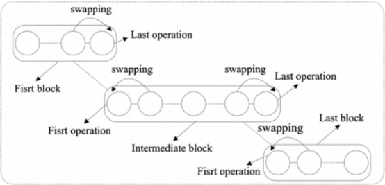
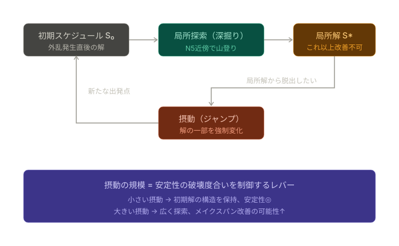
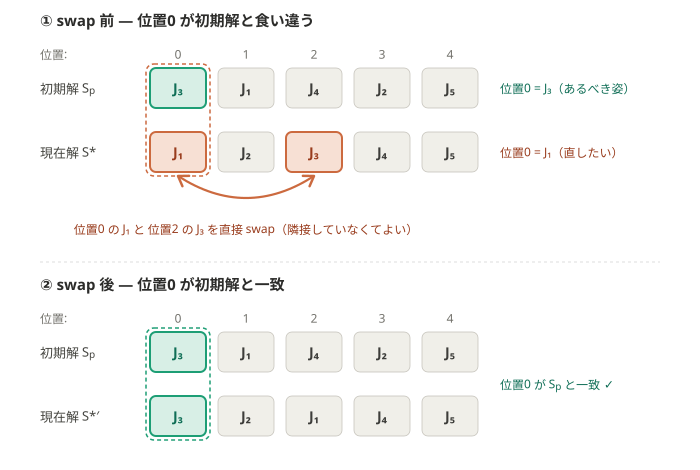

# 安定性を考慮した JSSP の再スケジューリングにおけるメタヒューリスティクス探索構造の提案と有効性分析

早稲田大学 創造理工学部 経営システム工学科
5225C013 鬼頭拓海

> **Draft status**: 実験は pilot_v4（10 trial）。本実験（30 trial × 4 問題）の結果で差し替え予定。

---

## 目次

1. 研究背景・目的
2. 既存研究
3. 提案手法
4. 計算機実験
5. 結論

---

## 1. 研究背景・目的

### 1.1 外乱と再スケジューリング

製造業の生産現場では、作業遅延や機械故障などの外乱が頻繁に発生し、当初のスケジュールを実行困難にさせる。外乱への対応アプローチは大きく 2 種類に分類される。**静的アプローチ**（事前耐性設計）は外乱の発生を見越し、ロバストなスケジュールをあらかじめ構築する。一方、**動的アプローチ**（事後再スケジューリング）は外乱の発生後にスケジュールを修正する。本研究では後者のうち、外乱発生後に実行中のスケジュールを実行可能な形へと修正する**予測リアクティブ再スケジューリング**を対象とする。

外乱には作業遅延・機械故障・緊急ジョブ挿入など複数の種類が存在するが、本研究では**作業遅延**に着目する。作業遅延は元の機械割り当てを維持したまま処理順序の調整で対処可能であり、「修正スケジュールを $S_p$ の近傍に保つ」という本研究の問題前提が最も明確に成立する外乱タイプである。機械故障のように機械割り当て自体を変更する必要がある外乱は解空間の構造が異なり別途の定式化を要するため、今後の課題とする。

### 1.2 安定性の意義

再スケジューリングでは「修正後スケジュールの効率（メイクスパン: MS）」と「修正前スケジュールとの変更量（安定性）」がトレードオフの関係にある。スケジュールを大幅に変更すると、現場の混乱・資材の再手配・作業者の再配置などのスケジュール変更コストが発生する。このコストの抑制は製造現場の実運用において重要であり [2]、安定性をメイクスパンと並ぶ最適化目標として捉える必要がある。本研究ではこの問題を、効率性と安定性を同時に最適化する**多目的問題**として定式化する。

### 1.3 研究目的

本研究は以下の 3 点を目的とする。

1. **再スケジューリング特性とアルゴリズム適合性の分析**: 高品質な初期解が存在し、かつその初期解から変更量を最小化したいという問題特性が各手法の探索挙動にどう影響するかを比較・分析する
2. **安定性確保機構の提案と有効性分析**: 安定性を積極的に向上させる探索機構（PR・repair）を設計し、ベースアルゴリズムの構造との相互作用を分析する
3. **多角的な評価方法論の提案**: 速度・Pareto 覆域・安定性帯別の性能を統合的に評価するフレームワークを構築する

---

## 2. 既存研究

### 2.1 動的 JSSP と安定性

ジョブショップスケジューリング問題（JSSP）は NP 困難問題であり、メタヒューリスティクスが主流の解法である [1]。動的環境における再スケジューリングの重要性は広く認識されており、Rangsaritratsamee ら [3] は GA に局所探索を組み込んだハイブリッド GA を提案して効率性と安定性の同時考慮を試みた。Pfeiffer ら [2] は GA ベースの解法とシミュレーション評価を通じて安定性の重要性を指摘した。Zhang ら [4] は開始時刻偏差を安定性評価関数として用いた GA と Tabu Search のハイブリッド手法を提案している。

しかしこれらの先行研究には以下の共通した課題がある。

**集団ベース手法への偏重**: 既存研究は GA を基軸とした集団ベース手法を中心としている。再スケジューリングには外乱前の高品質スケジュールが初期解として既に存在するという特殊性があるが、この性質を活かせる単一解ベース手法の探索は十分でない。

**安定性確保機構の欠如**: 安定性は評価指標として存在するものの、安定性確保を目的とした専用の探索機構を提案・分析した研究は存在しない。いずれも基本的なアルゴリズムの適用にとどまっており、安定性を積極的に向上させる機構設計が行われていない。

**評価方法論の不足**: 既存研究の大半は単一の重み設定でのスカラー値、MS、安定性を個別に報告するのみであり、探索性能を多角的に評価・考察した研究がほとんど存在しない。

### 2.2 本研究の位置づけ

以上の課題を踏まえ、本研究は以下の 3 点に取り組む。

1. **再スケジューリング特性とアルゴリズム適合性の検証**: 高品質な初期解が存在し、かつその初期解からの変更量を最小化したいという問題特性を踏まえ、単一解ベースと集団ベースの各手法の挙動を実験的に比較する
2. **安定性確保機構（PR・repair）の提案**: 両機構を単一解ベース（ILS）と集団ベース（Memetic）の双方に組み込み、ベースアルゴリズムの構造との相互作用を分析する
3. **探索性能の多角的な評価方法論の提案**: 速度・重み別品質・Pareto 覆域の 3 軸からなる評価フレームワークを構築し、詳細な性能比較を行う

---

## 3. 提案手法

### 3.1 問題定義

$n$ ジョブ、$m$ 機械の JSSP において外乱（作業遅延）が発生した後、元スケジュール $S_p$ に対して修正スケジュール $S_q$ を求める。

**安定性指標**:

再スケジューリングにおける安定性は、元スケジュール $S_p$ からの逸脱量として定義されるのが一般的である [2][3]。逸脱量の測り方には大きく、(i) 各作業の**開始時刻の偏差**と (ii) 機械上の**処理順序（順列）の偏差**の二系統が存在する。本研究では後者、すなわち機械ごとのジョブ処理順位の偏差を安定性指標として採用する。

$$D(S_p, S_q) = \sum_{i \in M} \sum_{j \in J} \left| r_{i,j}^p - r_{i,j}^q \right|$$

$r_{i,j}^p$、$r_{i,j}^q$ はそれぞれ $S_p$、$S_q$ における機械 $i$ でのジョブ $j$ の処理順位である。

開始時刻偏差ではなく順列偏差を採用する理由は、効率性指標（MS）との独立性にある。開始時刻偏差は「時間」の量であり、MS を短縮する（作業を時間的に前へ詰める）操作がそのまま各作業の開始時刻を動かすため、MS と部分的に相関してしまう。これに対し順列偏差は機械上の処理順序という組合せ的な量を測るため、時間軸上の量である MS とは異なる側面を捉え、両目的間の独立性（直交性）が高い。これにより MS–安定性の二目的トレードオフがより明確に現れ、Pareto 覆域に基づく評価が意味を持ちやすい。加えて、本研究の探索機構（PR・repair の direct swap、N5 近傍）はいずれも順列上の操作であり、探索が動く空間と安定性を測る空間が一致する点でも整合的である。

> **注**: $D(S_p, S_q)$ は偏差量であり、**値が小さいほど $S_p$ に近く安定性が高い**。本稿で「高安定性」「安定性重視」という表現は $D$ が小さい（低偏差）状態を指す。

**多目的問題**:

$$\min_{S_q} \bigl( MS(S_q),\ D(S_p, S_q) \bigr)$$

**スカラー化**: 重み $\lambda \in [0,1]$ を用いた重み付き和で解く。

$$F(S_q) = \lambda \cdot \hat{D}(S_p, S_q) + (1 - \lambda) \cdot \widehat{MS}(S_q)$$

$\hat{\cdot}$ は min-max 正規化後の値。

### 3.2 ILS 採用の根拠

再スケジューリング問題の重要な特殊性として、**外乱前の高品質スケジュール $S_p$ が初期解として既に存在し、かつ修正後のスケジュールはその $S_p$ からの変更量をできるだけ抑えることが求められる**点が挙げられる。最適解は $S_p$ の近傍に存在する可能性が高く、この「強い事前情報と近傍バイアス」を活かした探索設計が有効と考えられる。この観点から集団ベース手法（GA）と単一解ベース手法（ILS）を比較する。

| 観点 | GA | ILS |
|---|---|---|
| 状態 | 集団 (population) | 1 本の `current` 解 |
| 主操作 | 交叉 + 突然変異 | 摂動 + 局所探索 |
| 構造の保存 | 交叉で 2 親を切り貼り → 破壊的 | 元解からの連続変形 → 構造を保持 |
| 摂動強度の制御 | 交叉率は集団全体に効く（読みにくい） | 摂動強度 = $S_p$ からの距離を直接決めるレバー |

単一解ベース手法の中でも本研究が **ILS（Iterated Local Search）** を採用する理由は以下の通りである。

- **深掘りと脱出の分離**: 局所探索（深掘り）と摂動（脱出）が明確に分離されており、各操作の役割分析が容易
- **摂動強度の直接制御**: 摂動規模の制御が明示的に可能であり、$S_p$ からの距離（安定性）を直接調整できる
- **外部機構の組み込みやすさ**: 後述する PR や repair のような機構を摂動として差し込む設計が容易

### 3.3 ILS アルゴリズムの詳細

**解表現**: 機械ごとのジョブ処理順序列（machine_orders）

**局所探索（N5 近傍）**: N5 近傍 [1] はクリティカルブロック内部の操作では MS が改善しないという性質を利用し、クリティカルブロック端の隣接 2 ジョブ swap のみを候補とする絞り込み近傍である。閉路が生じないことが数学的に証明されており [1]、移動規則には最良改善（best improvement）を採用する。安定性の観点でも、少ない変更で MS を直接改善する点で本問題と相性が良い。



**摂動（insert 摂動）**: クリティカルパス上からジョブを 1 つ抜き取り、別の位置・別の機械に挿入する。swap 摂動と比較して多様な解構造への到達が可能であり、安定性の良い解に到達しやすいことが予備実験で確認されている。

**摂動強度の制御（鋸歯巡回）**: 摂動強度（insert の連続適用回数）は $S_p$ からの距離を決めるレバーであり、固定せず探索の停滞度に応じて変化させる。一定反復改善が得られないと強度を下限 `initial_strength` から `max_strength` まで段階的に増やし、上限に達したら下限へ折り返して周回する（鋸歯状の巡回）。best 解が改善した時点で下限へリセットする。これは VNS（Variable Neighborhood Search）の shaking スケジュール [10] と同型で、「まず最小の摂動を試し、抜け出せないときだけ段階的に強くする」という単一解探索の方針に対応する。停滞時に強度を上限へ単調に張り付かせる方式は、毎反復で大規模摂動を行いランダムリスタートに退化して非効率なため採用しない。



### 3.4 Path Relinking

Path Relinking（PR）は Glover ら [5] によって提案された手法であり、2 つの高品質解の間の軌跡上に有望解が存在するという仮説に基づく。PR はこれまで GA、Memetic Algorithm、GRASP、ILS など様々な手法とハイブリッド化されてきており [5]、スケジューリング問題では特に Scatter Search との組み合わせが代表的な適用形態として知られている [6][7]。JSP でも Tabu Search と PR を組み合わせた TS/PR が高い競争力を示している [6]。

本研究における PR の**設計思想**: 「現在の局所最適解（initiating solution）」から「外乱前の初期スケジュール $S_p$（guiding solution）」に向けて、解間の差分（不一致位置）を direct swap で縮めながら経路を辿り、経路上の最良解を中間解として返す。$S_p$ を guiding solution とすることで、PR は「高品質局所最適解を初期スケジュールの構造に引き寄せる」操作として機能し、安定性を明示的に減少させながら MS を可能な限り維持できる中間解を探す。

$$\text{Initiating: } S_{\text{cur}} \longrightarrow \text{Guiding: } S_p$$

**ムーブ選択**: 各ステップでは、$S_p$ との不一致位置に対応する direct swap のうち、**実行可能なものを 1 つランダムに選んで適用する**（TS/PR [6] の relinking 手順に準拠）。各ステップで全候補を評価して最良 swap を選ぶ方式（best selection）も実装可能だが、これは 1 回の PR あたりの解評価回数が不一致数 $d$ に対して $O(d^2)$ となり、外乱が大きく $d$ が大きい本問題では計算時間が支配的になる。ランダム選択は評価回数を $O(d)$ に抑え、予備実験（la36_large, $n=10$）で **best selection の約 3〜13 倍高速**であった。経路が貪欲でなくなるため解品質はわずかに低下しうるが、予備実験では Pareto 覆域（HV）に統計的有意差は認められず（Wilcoxon $p=0.72$）、安定性重視ゾーンの覆域も同等であった。以上より本研究では **ランダム選択を既定** とし、best selection はパラメータ掃引における比較対象として併用する。direct swap は JSP では閉路（実行不可能解）を生じうるため、候補は実行可能性を検証したうえで選択する。



direct swap は N5 と異なり閉路を作る可能性があるため、候補ごとに Gantt chart 再構築で実行可能性を検証する。ILS への統合では停滞検出時に PR を起動し、経路上最良解を受理判定にかける。

### 3.5 Repair 機構

PR の direct swap は「現在解を $S_p$ に 1 ステップ近づける」操作であった。この着想を ILS の摂動キックに転用したものが **repair 機構**である。PR が経路全体を辿るのに対し、repair は ILS が停滞したときに direct swap を数回だけ適用して現在解を $S_p$ 方向に少し引き寄せ、そこから局所探索を再出発させる（Mini-PR kick）。

ILS が一定反復（`stagnation_threshold`）改善しない停滞状態に入ったとき発動し、現在解に対して**ランダムに選んだ不一致位置を direct swap で $S_p$ に合わせる**操作を複数回適用して解構造を変化させる。

- **設計意図**: PR が持つ「$S_p$ への引き寄せ」という方向性を摂動に与えることで、安定性側の別盆地への脱出を促す
- **パラメータ**: `repair_trigger`（停滞判定反復数）、`repair_strength`（swap 回数の上限）

repair の適用回数（depth = $S_p$ へ向かう swap 回数）も insert 摂動と同じく鋸歯状に巡回させる。現在解から $S_p$ までの不一致数（経路長）を上限とし、キックのたびに depth を段階的に増やして上限で下限へ折り返す。これにより「best 解から $S_p$ までの経路を、浅い修正から深い修正（= $S_p$ そのもの）まで系統的に掃引」し、安定性側フロントを面で覆う。best 改善時に depth を下限へリセットする。

### 3.6 Memetic への機構適用と仮説

PR と repair を ILS に加えるのみならず、**Memetic（GA + N5 局所探索）** にも組み込む。その仮説的根拠を以下に示す。

ILS+N5 との組み合わせでは PR が利用できる「余地」が相対的に小さいと予想される。N5 局所探索は MS を最適化する過程でクリティカルパス外の順序も含めて間接的に固定し、解から「MS を壊さずに安定性を改善できる余地（冗長性）」を除去する傾向がある。PR が経路上の中間解から改善を拾うにはこの余地が必要であるため、ILS+N5 の解は冗長性が比較的少なく、PR が開拓できる安定性側フロントの幅が狭まると考えられる。加えて ILS は単一解ベースであるため、探索中の解が $S_p$ 近傍に留まりがちで PR の経路自体が短くなる。したがって PR・repair の効果は ILS でも現れるものの、集約 HV への寄与は Memetic より小さいと予想される（効果の有無ではなく程度の差を検証する）。

一方、GA の集団ベース探索は $S_p$ から遠い位置にある多様な解を維持する。GA が生成する解には N5 ほど厳密な MS 最適化が施されていないため冗長性が残りやすく、PR が「MS を維持しつつ安定性を改善できる中間解」を発見しやすい。そこから $S_p$ に向かって PR で経路を引くと、改善可能性のある中間解が多く発見できる。

```
ILS:  current(S_p 近傍) ──短い経路──▶ S_p    （中間解が少ない）

GA :  個体① (S_p から遠い) ──長い経路──▶ S_p  （中間解が多く改善余地が大）
      個体② (S_p から遠い) ──長い経路──▶ S_p
```

先行研究においても PR は集団ベース手法（Scatter Search）との組み合わせが代表的な適用形態として知られており [5]、多様な解集団の存在が PR の経路上に豊かな中間解群を生む原理はこの文脈と整合する [6]。本研究ではこの仮説を実験的に検証する。

本研究で対象とする手法は以下の 7 つである。

| 手法 | 概要 | 位置づけ |
|---|---|---|
| ILS-baseline | N5 近傍山登り + insert 摂動 | 単一解ベースライン |
| **ILS+repair** | baseline + 停滞時に repair キック | repair 機構の有効性検証（単一解） |
| **ILS+PR** | baseline + Path Relinking（初期解方向） | PR 機構の有効性検証（単一解） |
| GA | 重み付き GA | 集団ベースライン |
| Memetic-LS | GA + N5 局所探索 | 集団＋局所探索ベースライン |
| **Memetic+PR** | Memetic-LS + PR | PR 機構の有効性検証（集団） |
| **Memetic+repair** | Memetic-LS + repair | repair 機構の有効性検証（集団） |

なお摂動・repair の強度制御方式は探索構造に合わせて使い分ける。**単一解の ILS は探索軌道が 1 本である**ため、鋸歯巡回によって best から $S_p$ への 1 本の経路を浅→深と系統的に掃引するのが自然である。一方 **集団ベースの Memetic は個体ごとに $S_p$ への経路が異なり、共有すべき単一の軌道が存在しない**ため、repair の強度は経路長を上限とする一様乱択（ランダム）とする。いずれも強度範囲を規定するパラメータは共通であり、選択方式（巡回／乱択）のみが探索構造に応じて異なる。

### 3.7 重みスカラー法の採用と評価フレームワーク

実現場のスケジューラは「効率を $\alpha$ 割、安定性を $\beta$ 割重視する」といった単一の優先度ポリシーで動く。このため、アルゴリズムの基本動作は**重み付きスカラー化（weighted sum）** で設計する [8]。

ただし単一の重み設定でのスカラー値比較のみでは、重み選択に依存して結論が変わるため探索性能の全体像を捉えることが難しい。そこで本研究では、重み $\lambda$ を複数点で掃引して得られた解を統合する **weighted sum scalarization sweep** を行い、Pareto 覆域の観点から総合的な探索性能を比較する。重み付き和には非凸 Pareto front の凹部に到達できないという凸限界が存在するが [8]、本研究の目的は真の Pareto front を導出することではなく、同一のスカラー法のもとで各手法の性能を横並びに検証することである。この目的においては凸限界は本質的な問題とならない。

以下の多角的な評価指標で探索性能を比較する。評価フレームワークには **Unbounded External Archive (UEA) scenario** [9] を採用し、探索過程で訪問した全非劣解を保存することで最終解のみに依存する運依存性を排除する。

| 評価指標 | 役割 | 対応する主張 |
|---|---|---|
| per-weight anytime curve | 同一 CPU 時間での収束速度 | 目的 1 |
| per-weight スカラー値・改善成功率 | 重み別品質と GA 縮退の検出 | 目的 1 |
| **per-trial union UEA HV** | 各 trial で全重みの UEA を統合した Pareto 覆域（主筋） | 目的 1・2 |
| C-metric | 手法間の Pareto 支配関係の直接測定（参照点不要） | 目的 1・2 |
| **領域別 HV** | stab の P33/P67 分位点で 3 分割した各領域の覆域 | 目的 2 |

領域別 HV は「どの手法がどの安定性帯に強いか」を重み設定に依存せず定量化できる点が重要である。各領域境界（P33、P67）は全手法・全 trial の解の D 値を一括プールして機械的に決定する（D 値が小さい低偏差側が高安定性領域）。

---

## 4. 計算機実験

### 4.1 実験設定

| 項目 | 設定 |
|---|---|
| ベンチマーク問題 | la21（15×10）、la36（15×15）（パイロット段階。本実験: mt10/la21/la36/la40 の 4 問題） |
| 外乱 | la21_delay147、la36_delay148 |
| 重み $\lambda$ | 11 点（[1.0, 0.0] ～ [0.0, 1.0]、0.1 刻み） |
| Trial 数 | 10（パイロット）→ 30（本実験予定） |
| ILS 反復数上限 | 800（自然収束まで） |
| GA 世代数・集団サイズ | 500 世代、50 個体（自然収束まで） |
| 評価フレームワーク | UEA scenario |
| 正規化方式 | min-max（問題・外乱ごと共通パラメータ）。GT 法ランダムサンプリング（200 点）で $\min_{eff}$・$\max_{eff}$（P90 値）・$\max_{stab}$ を事前推定し、全アルゴリズム共通の固定パラメータとして使用。実験開始前に一度だけ計算してキャッシュし再利用する。 |

> **UEA からの初期解除外**: 全手法は $S_p$ を共通の出発点として与えられている（ILS は $S_p$ を初期解として探索を開始し、GA・Memetic は $S_p$ を初期集団に含める）。$S_p$（$D=0$ の共通固定点）は探索が発見した解ではなく全手法に無償で与えた入力であるため、これを UEA に含めると全手法に同一の下駄を履かせることになり、手法間の差が圧縮されて探索構造の比較が困難になる。このため $D=0$ の 1 点のみを除外して評価する。

**実験設計の方針**: 外乱を確率的に発生させるシミュレーション型の評価手法も先行研究に存在するが [2]、本研究では外乱シナリオを固定した精密比較を採用する。本研究の貢献の核心は探索構造の分析と PR・repair とベースアルゴリズムの相互作用の解明にあり、これらは個別外乱シナリオにおける手法挙動のミクロ分析によって初めて明らかにできる。シミュレーション型はマクロな平均性能は得られるものの因果帰属が困難となり、本研究の分析目的と整合しない。このため外乱シナリオを固定し、再現性と因果分析の精度を優先した。

本実験は 2 本立てで構成する。**実験 I（コア比較）** は速度・品質・探索性能の包括的比較であり、**実験 II（repair パラメータ掃引）** で `repair_trigger` × `repair_strength` を決定してから実験 I を実施する。

### 4.2 結果 1: 再スケジューリング特性と単一解探索の効率（目的 1）

#### per-trial union UEA HV

*la21_la21_delay147*

| 手法 | Union HV 中央値 | IQR | 改善成功率 |
|------|:---:|:---:|:---:|
| GA | 2001.96 | [1870, 2095] | 1.000 |
| ILS-baseline | 2355.04 | [2352, 2356] | 1.000 |
| ILS+repair | **2360.81** | [2360, 2362] | 1.000 |
| ILS+PR | 2352.70 | [2350, 2355] | 1.000 |
| Memetic-LS | 2242.39 | [2226, 2249] | 1.000 |
| Memetic+repair | 2359.28 | [2342, 2360] | 1.000 |
| Memetic+PR | 2339.02 | [2336, 2342] | 1.000 |

*la36_la36_delay148*

| 手法 | Union HV 中央値 | IQR | 改善成功率 |
|------|:---:|:---:|:---:|
| GA | 1177.09 | [1177, 1178] | 1.000 |
| ILS-baseline | **1672.88** | [1548, 1684] | 0.575 |
| ILS+repair | 1624.45 | [1444, 1682] | 0.525 |
| ILS+PR | 1558.18 | [1454, 1651] | 0.600 |
| Memetic-LS | 1537.76 | [1535, 1539] | 1.000 |
| Memetic+repair | 1627.82 | [1626, 1635] | 1.000 |
| Memetic+PR | 1622.02 | [1615, 1626] | 1.000 |

両問題とも ILS 系は GA を大幅に上回る（la21: +18%、la36: +42%）。C-metric は `C(ILS-baseline, GA) = 1.000` と ILS が GA を完全支配する。la36 では ILS 系の改善成功率が 0.5〜0.6 に留まり trial 間のばらつきが大きい点は注意を要する。

#### 収束速度（la21、w=[0.8, 0.2] 代表）

| 手法 | @3%t (約 14 秒) | @10%t (約 47 秒) | @100%t |
|------|:---:|:---:|:---:|
| GA | 97% | 100% | 100% |
| ILS-baseline | **100%** | 100% | 100% |
| ILS+repair | **100%** | 100% | 100% |
| Memetic-LS | 99% | 99% | 100% |

ILS 系は探索開始直後（CPU 時間の 3%）に最終品質に到達する。目的 1 を支持する。

### 4.3 結果 2: PR・repair の効果とベースアルゴリズムの相互作用（目的 2）

#### 機構追加による HV 変化量

| 組み合わせ | la21 ΔHV | la36 ΔHV |
|---|:---:|:---:|
| ILS-baseline → ILS+PR | **−2** | **−115** |
| ILS-baseline → ILS+repair | **+6** | **−49** |
| Memetic-LS → Memetic+PR | **+97** | **+84** |
| Memetic-LS → Memetic+repair | **+117** | **+90** |

C-metric（la21）では `C(Memetic+repair, Memetic-LS) = 1.000`、`C(Memetic+PR, Memetic-LS) = 1.000` と Memetic-LS を完全支配する。Memetic では PR・repair が集約 HV を大きく押し上げる（+90〜+117）。

> **注（旧パイロット値・要再測）**: 上表の ILS+PR / ILS+repair の ΔHV（特に la36 の負値）は、キック機構を**非適応の一律トリガーで早期に発動**させ、かつ insert 摂動強度が**上限へ単調張り付き＋キック発火のたびに浅へリセットされる交絡**を抱えた旧実装下での値である。その後、(i) ILS が収束してからキックを発動させる**適応トリガー**（`kick_trigger_first`）、(ii) 摂動・repair 強度の**鋸歯巡回化**、(iii) リセット交絡の除去、という再設計を行った。この再設計下では **ILS+PR/repair は「無効・逆効果」ではなく、特に高安定性（低偏差）領域の覆域を baseline より広げる**（予備確認）。集約 HV では低安定性帯の大覆域に希釈されて差が見えにくいが、領域別 HV で分離すると ILS でも安定性側の改善が現れる。集約 HV の押し上げ幅は依然として Memetic の方が大きいという**程度差**は残るものの、「ILS では効かない」という二値的結論は撤回し、定量値は再設計下で再測する。

### 4.4 結果 3: 領域別 HV（低安定性・高偏差領域の構造）

*la36 低安定性領域（D > P67 = 13.14、高偏差・効率重視解帯）*

| 手法 | rHV-high | 順位 |
|---|:---:|:---:|
| Memetic+repair | 1399 | 1 |
| Memetic+PR | 1389 | 2 |
| Memetic-LS | 1329 | 3 |
| ILS-baseline | 1231 | 4 |
| ILS+repair | 1169 | 5 |
| ILS+PR | 1118 | 6 |
| GA | 0 | 7 |

低安定性（高偏差）領域では Memetic 系が ILS 系を上回る。ILS は高〜中安定性領域（D 小）、Memetic は低安定性領域（D 大）でそれぞれ優れるという**領域的な分担構造**が存在する。

### 4.5 考察

#### PR・repair の効果の大きさがベースアルゴリズムに依存する理由

PR・repair は **両ホスト（ILS・Memetic）で安定性側の覆域を改善する** が、集約 HV に現れる**効果の大きさはベースアルゴリズムが生成する解の D 値（$S_p$ からの偏差）の分布に依存する**。

**Memetic で効果が大きい理由**: Memetic の GA コンポーネントが生成する解には N5 局所探索ほど厳密な MS 最適化が施されていないため、「MS を壊さずに安定性を改善できる冗長な順序変更」が残存している。PR はこの冗長性を活用して安定性を改善できる。また集団が収束した状態では交叉の多様化効果が失われるが、PR・repair は個体レベルの脱出機構として機能し、交叉では代替できない多様化を提供する。GA は $S_p$ から遠い高 D 値の解を多数保持するため PR の移動余地（経路長）が大きく、安定性を広く改善できる。

**ILS で効果が（集約 HV 上は）小さく見える理由**: ILS の N5 局所探索は MS を最適化する過程でクリティカルパス外の順序も間接的に固定し、解の冗長性を減らす。加えて ILS は $S_p$ 近傍の解を生成し続けるため、PR/repair が移動できる経路が短い。したがって PR/repair が新たに開拓できる安定性側フロントの幅は Memetic より狭く、集約 HV への寄与は小さい。ただしこれは **「効果がゼロ／逆効果」を意味しない**。再設計（適応トリガー＋鋸歯巡回＋リセット交絡の除去）下では、ILS+PR/repair も高安定性（低偏差）領域で baseline を上回る覆域を示す（4.3 節 注・予備確認）。集約 HV はメイクスパン軸幅に支配される低安定性帯に希釈されるため、この改善は領域別 HV で初めて分離して観測できる。

> なお、旧実装で観測された ILS+PR/repair の負の ΔHV は、上記の構造的要因そのものではなく、**非適応トリガーによるキックの早期浪費**と **insert 強度のリセット交絡**という実装上の要因が重畳した結果でもあった。再設計後の定量比較は今後の本実験で確定させる。

#### アルゴリズム特性と再スケジューリング適合性

再スケジューリング問題では外乱前の高品質スケジュールが初期解として存在し、最適解がその近傍に分布する。ILS の insert 摂動はこの近傍を系統的に探索し、わずか 3% の計算時間で最終品質に到達する。GA は安定性重視の重み設定（高 $\lambda$）でも Pareto 覆域全体でも ILS に劣り、速度・品質の両面で差が確認された。ただしこれは ILS の絶対的優位を示すものではなく、高品質初期解が存在するという問題特性が単一解ベース手法の探索効率を構造的に後押しすることを示している。

#### 発散型探索と収束型探索の対称性

特筆すべき構造的観察として、**探索方向が逆であるにもかかわらず類似した最終 Pareto 品質**が得られた点が挙げられる。

- **ILS（発散型）**: 初期解 $S_p$ を起点に摂動で外へ広がる単一解探索
- **Memetic+PR（収束型）**: 広い空間に散らばった集団解を $S_p$ 方向に引き寄せる多解探索

la21 では ILS+repair = 2361、Memetic+repair = 2359（差 2）と事実上同等の Union HV を達成しており、MS-安定性 Pareto 空間における高品質解が探索方向に対してロバストに到達可能であることを示唆している。この到達を圧倒的に速い収束で実現している点で、ILS の計算効率面での優位性が際立つ。

#### 限界

- la36 で ILS の改善成功率が 0.5〜0.6 に留まる。大規模問題（15×15）では ILS が局所最適に深くはまる trial が多く、探索安定性に改善の余地がある。
- 低安定性（高 D）領域では Memetic 系が ILS 系を上回る。安定性重視の実運用では ILS 系が適切な選択肢となる可能性がある。
- 本稿の結果は 10 trial のパイロットに基づく。統計的有意性の確認には 30 trial が必要。

---

## 5. 結論

本研究では動的 JSSP の再スケジューリングを対象に、安定性確保機構（PR・repair）の提案と有効性分析、アルゴリズム特性の比較、および多角的な評価方法論の構築を行った。

1. **PR・repair は両ホストで安定性側の覆域を改善し、その効果の大きさがベースアルゴリズムの構造に依存する**。Memetic に対しては集約 HV を劇的に押し上げる一方、ILS に対しては局所探索による冗長性除去と $S_p$ 近傍性のため効果が相対的に小さく、集約 HV では希釈されるが領域別 HV では高安定性領域での改善として現れる。この程度差は、摂動機構が利用できる解の「余地（冗長性）」と $S_p$ への経路長の違いに帰着する。なお初期実装で ILS に効果が出なかったのは、非適応トリガーによるキックの早期浪費と摂動強度のリセット交絡という実装要因にもより、適応トリガー・鋸歯巡回・交絡除去の再設計でこれを解消した。

2. **ILS（発散型）と Memetic+PR（収束型）は対称的な探索方向から類似した Pareto 品質に到達する**。高品質な初期解が存在するという再スケジューリングの問題特性が、単一解ベース手法の探索効率を構造的に後押しすることを示している。

3. **多角的な評価方法論の有効性**。速度・重み別品質・Pareto 覆域・領域別 HV の 4 軸による評価が、単一スカラー値では見えなかった各手法の探索特性の差異を明らかにした。

今後の課題として、本実験（30 trial × 4 問題）での統計的検定（Wilcoxon、Cliff's delta、Holm 補正）、repair パラメータの最適化、la36 での ILS 改善率の低さへの対策（VNS 拡張等）、外乱スケール感度の検証が挙げられる。

---

## 参考文献

[1] Nowicki, E., & Smutnicki, C. (1996). A fast taboo search algorithm for the job shop problem. *Management Science*, 42(6), 797–813.

[2] Pfeiffer, A., Kádár, B., & Monostori, L. (2007). Stability-oriented evaluation of rescheduling strategies by using simulation. *Computers in Industry*, 58(7), 630–643.

[3] Rangsaritratsamee, R., Ferrell Jr, W. G., & Kurz, M. B. (2004). Dynamic rescheduling that simultaneously considers efficiency and stability. *Computers & Industrial Engineering*, 46(1), 1–15.

[4] Zhang, R., et al. (2004). [GA と Tabu Search を用いた再スケジューリング手法]. ※文献情報要確認

[5] Glover, F., Laguna, M., & Martí, R. (2000). Fundamentals of scatter search and path relinking. *Control and Cybernetics*, 29(3), 653–684.

[6] Peng, B., Lü, Z., & Cheng, T. C. E. (2015). A tabu search/path relinking algorithm to solve the job shop scheduling problem. *Computers & Operations Research*, 53, 154–164.

[7] [FJSP レビュー論文]. ※文献情報要確認（Scatter Search + PR を代表手法として位置づけているレビュー）

[8] Marler, R. T., & Arora, J. S. (2010). The weighted sum method for multi-objective optimization: new insights. *Structural and Multidisciplinary Optimization*, 41(6), 853–882.

[9] Ishibuchi, H., Pang, L. M., & Shang, K. (2020). A new framework of evolutionary multi-objective algorithms with an unbounded external archive. *Proceedings of ECAI 2020*.

[10] Mladenović, N., & Hansen, P. (1997). Variable neighborhood search. *Computers & Operations Research*, 24(11), 1097–1100.
