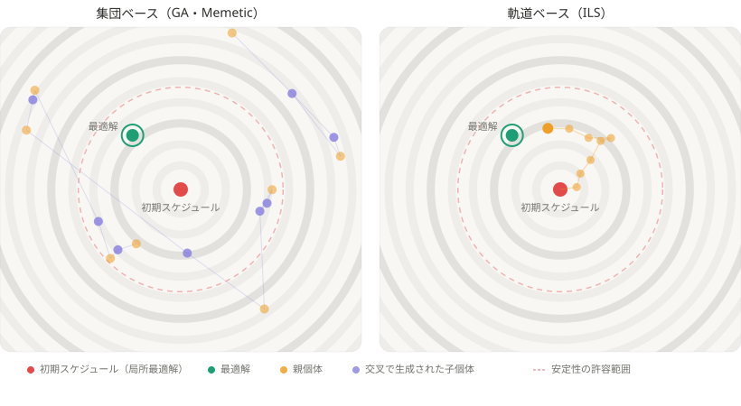
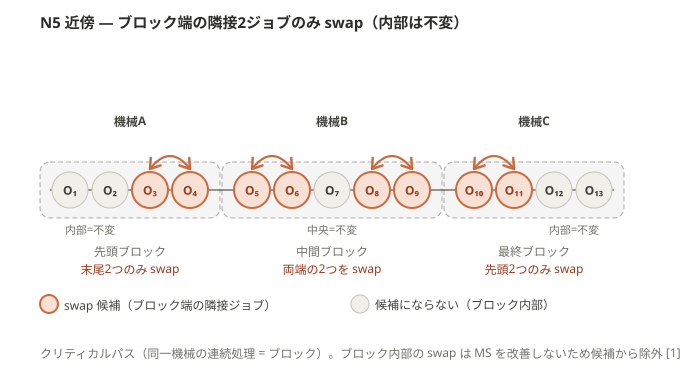

# ゼミ発表資料（2026-04-27 週）

## 今週の要点

先週の指摘を受けて **構造面の説明** を整備した。要点は 4 つ。

1. **GA vs ILS** — なぜ再スケジューリングで ILS が向くのか
2. **ILS の機構** — 何をどう繰り返しているか
3. **Path Relinking (PR)** — 「2 解を結ぶ経路を辿る」とはどういうことか
4. **repair 摂動** — PR の発想を ILS の摂動キックに転用する設計

---

## 1. GA vs ILS の構造的差異

### 1.1 再スケジューリングというタスクの特殊性

通常の JSSP は「ゼロから解を作る」が、再スケジューリングでは **崩れる前の初期解 S₀ がすでに手元にある**。
新しい解 S* は S₀ に「近い」ほど望ましい（= 安定性）。

> つまり再スケジューリングは **「強い prior (S₀) を活かす探索」** という性格を持つ。

これが GA / ILS の向き不向きを決める。

### 1.2 探索挙動の対比



- **GA**: 集団から交叉で子を作る → 子は親の中間に飛ぶが、**S₀ の構造は壊れる**。安定性の許容範囲（赤点線円）を簡単に飛び越える。
- **ILS**: S₀ から **小刻みな摂動 + 局所探索** で軌跡をたどる。許容範囲内に踏みとどまりながら最適解方向に進める。

### 1.3 メカニズム比較

| 観点 | GA | ILS |
|---|---|---|
| 状態 | 集団 (population) | 1 本の `current` 解 |
| 主操作 | 交叉 + 突然変異 | 摂動 + 局所探索 |
| 構造の保存 | 交叉で **2 親を切り貼り** → 破壊的 | 元解からの **連続変形** → 構造を保持 |
| 強度の制御 | 交叉率は集団全体に効く（読みにくい） | 摂動強度 = **「S₀ からの距離」を直接決めるレバー** |

### 1.4 帰結

- **GA**: 高 stab 重みで「S₀ に固着 (degeneracy)」 or「遠くへ飛ぶ」の二極に陥り、中間で踏みとどまれない。
- **ILS**: 摂動強度というつまみで **「どれだけ S₀ から離れるか」を直接制御** できる。

→ 主張 (A)（速度）と (D)（重み頑健性）の構造的根拠。

---

## 2. ILS の機構

### 2.1 全体フロー


ILS は **3 ステップを反復するだけ**。

```
current ← S₀
while 予算が残っている:
    perturbed ← 摂動(current)        # ① 局所最適から脱出
    local_opt ← 局所探索(perturbed)  # ② 近傍で改善し尽くす
    if 改善:
        current ← local_opt          # ③ 受理判定
```

ポイントは **「深掘り」と「脱出」が分離されている** こと。GA は交叉 1 個でこの 2 役を兼ねるので、各操作の役割が曖昧になる。

### 2.2 局所探索：N5 近傍での山登り



- **N5 近傍** (Nowicki & Smutnicki 1996): クリティカルパス上のブロック端点で隣接 swap のみを許す近傍。
- 性質: **閉路フリーが理論保証** = 必ず実行可能解になる。
- 戦略は最良改善 ('best')。FI vs BI に有意差なし、と先行実験で確認済み。

### 2.3 摂動：脱出のキック

| 種類 | 操作 | 性格 |
|---|---|---|
| swap 摂動 | N5 swap を K 回連続適用 | 緩く壊す |
| insert 摂動 | 1 op を抜いて別位置へ挿入 | やや大きく崩す |

強度 K は停滞カウンタで段階的に増える（適応的）。
→ 摂動強度 K が **「安定性 vs 効率性のレバー」** になる。

---

## 3. Path Relinking（PR）の構造

### 3.1 PR の基本アイデア

PR は **「始点 s と目標 t を結ぶ経路」** を辿る手法。

```
       s ●───────────────●───────────────● t
                  ↑               ↑
              中間解 m₁        中間解 m₂

   各 mᵢ は s の属性を t の属性へ少しずつ置き換えた解
   → 経路上の中間解に「s でも t でもない良解」が混じる、というのが経験則
```

### 3.2 JSP での「経路」とは

解を `machine_orders`（機械ごとのジョブ列）と見ると、s と t の差は **「位置 i のジョブが違う」** という形で現れる。

| 機械 m の位置 | 0 | 1 | 2 | 3 | 4 |
|---|---|---|---|---|---|
| 始点 s | J₁ | J₂ | J₃ | J₄ | J₅ |
| 目標 t | J₃ | J₁ | J₄ | J₂ | J₅ |
| 一致？ | ✗ | ✗ | ✗ | ✗ | ○ |

→ **不一致位置を 1 つずつ t に合わせていく** のが、JSP での自然な経路。

### 3.3 ムーブ戦略：direct swap


> 位置 i に t が要求するジョブ J を、現在列の中から探し、**位置 i のジョブと 1 ステップで swap する**。

- 隣接 swap でなく **離れた位置同士でも一気に交換**。
- 1 ムーブで 1 不一致位置を解消。

### 3.4 本研究での観察

> **再スケジューリングでは、目標 t として「初期解 S₀」が常に手元にある。**
> → PR の「t に寄せる」操作を、そのまま **「安定性方向への引き寄せ」** に転用できる。

これが次節 repair 摂動の出発点。

---

## 4. repair 摂動：PR を ILS の摂動キックに組み込む

### 4.1 通常の摂動との対比

| | 方向 | ねらい |
|---|---|---|
| 通常摂動 (swap / insert) | **ランダム** | 局所最適からの脱出 |
| **repair 摂動** | **S₀ に向かう** | 安定性方向の別の盆地へ脱出 |

### 4.2 構造

```
①  S₀ と現在解 S* の machine_orders を比較
        ↓
②  不一致位置を列挙し、そのうち K 個を選ぶ
        ↓
③  各々を direct swap で S₀ に合わせる   ← PR のムーブを 1 回分だけ流用
        ↓
④  S₀ に少し寄った解を出発点として LS にかける
```

= **Mini-PR kick**（PR を完走せず、1 キック分だけ借りる最小コスト版）。

### 4.3 なぜ効くのか

- 通常摂動 + LS は **元の盆地に戻りがち** → 安定性が改善しない。
- repair 摂動は **出発点を S₀ 方向の別盆地に強制的に移す** → LS は別盆地の最適に収束 → **MS をあまり犠牲にせず安定性が改善する** ケースが出てくる。

### 4.4 設計上のポイント

- 通常摂動を **置き換えない**。停滞時のキックとして混在させる。
- 制御は 2 パラメータ：`repair_trigger`（停滞何回で起動）、`repair_strength`（何位置を直すか）。
- baseline ILS との差分が、主張 (C)「repair は Pareto を安定性側へ拡張する」の検証対象。

---

## 5. 全体の構造マップ

```
   再スケジューリング = 「S₀ という強い prior 付きの探索」
            │
            ├─→ §1  ILS は摂動強度で破壊量を制御できる → ILS 採用
            ├─→ §2  ILS = N5 山登り + 摂動 の反復
            ├─→ §3  PR = 2 解を結ぶ経路 + direct swap ムーブ
            └─→ §4  PR の direct swap を ILS の摂動に転用 = repair 摂動
                    → ILS に「S₀ への引き寄せ」という方向性を追加
```

---

## 6. 議論したいこと

- §1 の構造的説明（S₀ という prior の活かしやすさで GA / ILS を分ける）の納得感。
- §3 の PR 説明と §4 の repair 摂動説明の接続（「経路の 1 キック分を借りる」というロジック）が読み取りやすいか。

---

## 付録: 用語ミニ辞典

| 用語 | 意味 |
|---|---|
| machine_orders | 機械ごとのジョブ列。本研究の解表現 |
| N5 近傍 | クリティカルブロック端点の隣接 swap のみ。閉路フリー保証 |
| direct swap | 離れた位置のジョブを 1 ステップで交換する PR の標準ムーブ |
| Path Relinking (PR) | 始点 s と目標 t を結ぶ経路上の中間解を拾う手法 |
| repair 摂動 (Mini-PR kick) | PR の direct swap を 1 キック分だけ ILS の摂動に転用したもの |
| degeneracy | GA が高 stab 重みで S₀ に固着し動けなくなる現象 |
