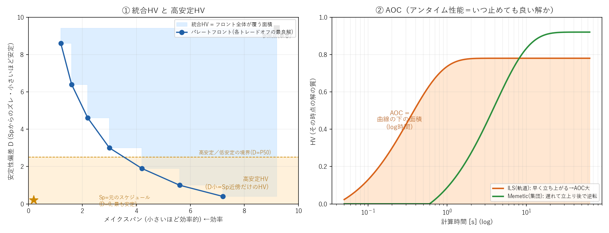
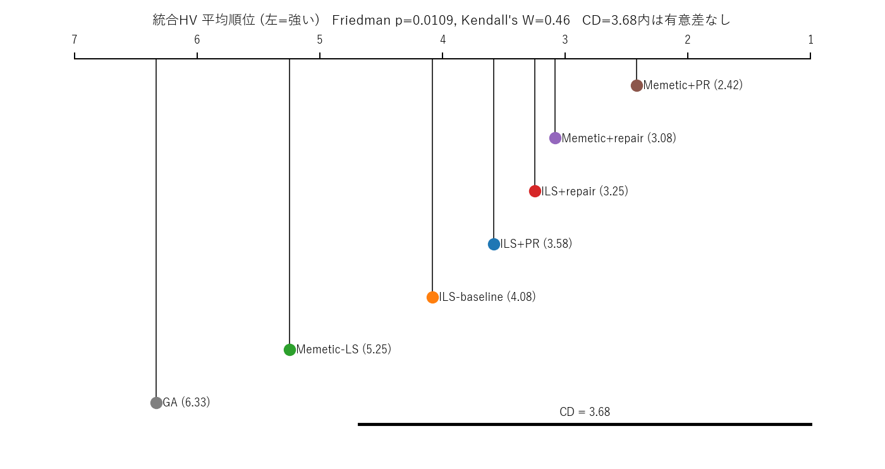
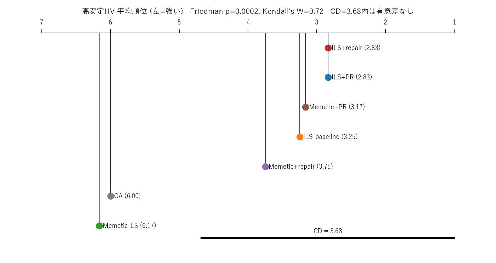
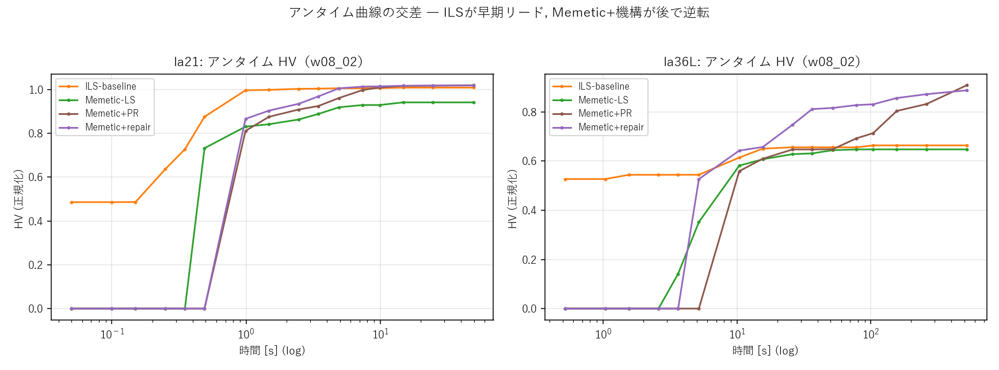

# ゼミ発表資料（2026-06-15 週）

## 今週の要点

先週確定した 6 シナリオ・7 手法でコア実験 v3（`main_v1`）を本走し、評価フレームを固めた。

1. **コア実験 v3 本走完了** — 6 シナリオ × 7 手法 × 11 重み × n=10 trial。
2. **HV を [0,1]² 正規化に変更** — 問題横断で比較可能に（共通アフィン変換なので順位・p値・Cliff d は生HVと不変）。
3. **評価フレームを確立** — 順序=Friedman+平均順位+Kendall's W／大きさ=ARPD%（ベストからの相対偏差）／分布=性能プロファイル／アンタイム性能=AOC。すべて標準手法。
4. **総合スコアボード（§2）の結論＝指標で王者が替わる**:
   - **品質(統合HV) 首位 = Memetic+PR**（LOO頑健）／ **高安定HV・アンタイム(AOC) 首位 = ILS系**。
   - 両指標とも **GA・Memetic-LS が明確に最下位**。
5. **王者が替わる理由＝非対称性**（§3-4 の主張で説明）:
   - 統合HVは互角だが**高安定HVは ILS が全問題で集団に圧勝**（p=0.001, 2〜3.6倍）。
   - **PR/Repair 機構は集団(Memetic)の高安定HVを大きく補うが、軌道(ILS)はほぼ頭打ち**。
   - → 「軌道は高安定域を地で取り速く、集団は機構で追いつき探索幅で広く取る」**相補構造**。

---

## 用語ミニ解説（はじめに ― くわしくない人向け）

鍵となる用語を先にまとめる（詳しい結果は §2 以降）。

### 手法: 軌道(ILS) と 集団(Memetic) ― 探索のしかたの違い

再スケジュール＝外乱で乱れた予定を組み直す最適化。解き方が2系統ある:

- **ILS（反復局所探索 / 軌道ベース）**: **1つの解**を局所探索で少しずつ改善し、行き詰まったら「摂動(ジャンプ)」で別の出発点へ飛んでまた改善…を繰り返す。**一本の軌道を辿る**。元の予定 Sp の近くから動くので、安定な解に速く着きやすい。
- **Memetic（GA＋局所探索 / 集団ベース）**: **多数の解の集団**を交叉・突然変異で進化させ、各個体を局所探索で磨く。広く探索できるが、集団の初期化・評価にコストがかかり立ち上がりが遅い。
- 一言: **ILS=一本道を速く深く ／ Memetic=大勢で広く**。

### 機構: PR と repair ― 解を「元の予定 Sp」へ引き戻す磨き

どちらも「現在の解を、元のスケジュール Sp に **direct swap（位置を合わせる交換）** で近づける」操作。安定な解（Sp 近傍）を作り出すのが狙い。

- **PR（Path-Relinking）**: 現在解から Sp までの**経路を1手ずつ全部たどり、途中の良い解を全部拾う**。Sp 近傍を密に埋められる＝最終品質が僅かに高いが、各手で解を評価(decode)するので**重い（O(差分²)）**。
- **repair**: Sp 方向へ**数手だけ引き戻す軽いキック**。経路は拾わず出発点を Sp 寄りへ移すだけ＝**安くて速い**。
- 一言: **PR=経路を丁寧に全探索（高品質だが遅い）／ repair=数手引き戻すだけ（軽い）**。

### 指標: 統合HV / 高安定HV / AOC

解は「メイクスパン(効率)」と「安定性偏差 D(元の予定からのズレ)」の**トレードオフ**。良い手法は色々な妥協点の良解（パレートフロント）を揃える。

- **HV（ハイパーボリューム）**: フロントが覆う**面積**。多様で良い解を持つほど大。多目的最適化の「総合的な質」を1数値にする標準指標。
- **統合HV**: 全領域（全トレードオフ）のHV ＝ **総合的な解の質**。
- **高安定HV**: **D小＝Sp 近傍**（ほとんど予定を変えない安定解）の領域に限定したHV ＝「**安定な解をどれだけ良く揃えたか**」。現場の混乱を避ける再スケジュールでは安定解が重要なので、これが**本命**。
- **AOC**: 時間をかけるほど HV は上がる。その **HV-対-時間(log)曲線の下の面積** ＝「**いつ計算を止めても良い解が手に入るか**」＝アンタイム性能（速さの総合指標）。

### 研究の仮説（これから検証する 主張1・主張2）

本研究が検証したい仮説は2つ。**安定性を重視する再スケジューリングで、軌道(ILS)と集団(Memetic)・機構(PR/repair)をどう使い分けるべきか**を問う。

- **主張1（軌道は効率的に探索できる）**: 安定性を考慮した再スケジューリングでは、集団(Memetic)より **軌道(ILS) の方が効率的に探索できる**のではないか。特に **Sp 近傍の安定解（高安定HV）** を速く・良く見つけるはず（本命=高安定HV、補助=統合HV・速さ）。
  - 直感: ILS は元の予定 Sp の近くを一本道で深掘りするので、安定解の領域を素早く密に探れるはず。
- **主張2（機構が磨く・ただし効果は非対称）**: **PR/Repair 機構が解の質を効果的に磨く**のではないか。ただし **集団(Memetic) では効果が大きいが、軌道(ILS) は構造的に伸びしろが小さい**はず（本命=高安定HV）。
  - 直感: 機構は Sp 近傍を埋める操作。近傍が手薄な Memetic は大きく伸び、すでに近傍を取れている ILS は余地が小さいはず。

→ §3 で主張1、§4 で主張2 を検定で検証する（その前に §2 で全体像＝総合スコアボードを見る）。

---

## 1. 実験設定と評価フレーム

| 項目 | 内容 |
|---|---|
| 問題 | 6 シナリオ: la21 / la36L(large=遠い外乱) / la36S(small=近傍) / la40 / mt10 / ta21 |
| 手法 | 7 手法: `GA`(参考) ／ 軌道=`ILS-baseline/+PR/+repair` ／ 集団=`Memetic-LS/+PR/+repair` |
| 重み | makespan:安定性 を 11 点。代表: `w08_02`=効率重視, `w02_08`=安定重視 |
| trial | n=10 |

**HV 正規化**: 問題ごとに ideal=(MS_min, D=0)・nadir=(MS_max, D_max) で全目的点を [0,1]² に写し、参照点 (1.1,1.1)（Ishibuchi+2018）で面積を計算（値域~[0,1.21]）。共通アフィンゆえ順位・Wilcoxon p・Cliff d は生HVと一致。

**指標と評価フレーム**:

| 観点 | 指標 | 集約・検定 |
|---|---|---|
| 解の質(全領域) | **統合HV** | per-problem 中央値＋Wilcoxon ／ Friedman順位 ／ ARPD% |
| 解の質(本命) | **高安定HV**（D小=$S_p$近傍） | 同上 |
| アンタイム性能(速度) | **AOC**（HV-対-log時間の面積, López-Ibáñez+2014） | Friedman順位 ／ ARPD% ／ 性能プロファイル |

- **検定**: 片側 Wilcoxon + Holm 補正 + Cliff δ。`*`p<.05 `**`p<.01 `***`p<.001。
- **ARPD%**（ベストからの平均相対偏差 = `(best−自分)/best×100`、低いほど良い）: HVでは Hypervolume Ratio からの偏差として定義。「平均/中央値」を併記（平均は外れ問題に弱いため）。
- **AOC**: 各手法のHV-対-log時間曲線下の時間平均（高いほど早く高品質）。"速度"ではなく**アンタイム性能**（いつ止めても得られる解の良さ）と呼ぶ。

---

## 2. 総合スコアボード（横断ランキング）★

> **同じデータでも指標で1位が替わる**（品質=Memetic+PR / 高安定・アンタイム=ILS系）。これが研究の核＝非対称性で、**なぜそうなるかは §3（主張1）§4（主張2）で説明**する。各表は Friedman 平均順位（1=最良）で降順、ARPD% は magnitude。

### 2.1 統合HV（解の質・全領域）— Friedman p=0.011, Kendall's W=0.46

| 手法 | la21 | la36L | la36S | la40 | mt10 | ta21 | Friedman順位 | ARPD%(平/中) |
|---|---|---|---|---|---|---|---|---|
| **Memetic+PR** | 1.022 | 0.938 | 1.118 | 1.158 | 0.773 | 1.171 | **2.42 ①** | 0.1 / 0.0 |
| Memetic+repair | 1.022 | 0.940 | 1.118 | 1.156 | 0.745 | 1.171 | 3.08 ② | 0.7 / 0.1 |
| ILS+repair | 1.022 | 0.796 | 1.118 | 1.159 | 0.644 | 1.171 | 3.25 ③ | 5.4 / 0.0 |
| ILS+PR | 1.019 | 0.792 | 1.118 | 1.159 | 0.644 | 1.172 | 3.58 ④ | 5.5 / 0.2 |
| ILS-baseline | 1.019 | 0.795 | 1.118 | 1.159 | 0.643 | 1.171 | 4.08 ⑤ | 5.4 / 0.2 |
| Memetic-LS | 0.973 | 0.912 | 0.000 | 1.116 | 0.732 | 1.086 | 5.25 ⑥ | 20.7 / 5.0 |
| GA | 0.926 | 0.579 | 1.118 | 1.116 | 0.542 | 0.994 | 6.33 ⑦ | 16.1 / 12.3 |

- **Memetic+PR が首位**（LOO頑健＝どの1問題を抜いても1位。駆動源は完全決着の la36L 上位独占＋mt10 の決定的勝ち）。ILS系は5%圏内だが中央値0%＝普段タイ最良・la36L/mt10だけ負ける。
- GA vs Memetic-LS は順位とARPD平均で逆転して見えるが、これは Mem-LS が la36S で崩壊(0)し ARPD平均を押し上げるため。**ARPD中央値（Mem-LS 5.0 < GA 12.3）は順位と整合**。

### 2.2 高安定HV（本命）— Friedman p=0.0002, Kendall's W=0.72

| 手法 | la21 | la36L | la36S | la40 | mt10 | ta21 | Friedman順位 | ARPD%(平/中) |
|---|---|---|---|---|---|---|---|---|
| **ILS+repair** | 0.061 | 0.033 | 0 | 0.032 | 0.044 | 0.049 | **2.83 ①** | 16.7 / 0.0 |
| **ILS+PR** | 0.061 | 0.033 | 0 | 0.032 | 0.044 | 0.049 | **2.83 ①** | 16.7 / 0.0 |
| Memetic+PR | 0.061 | 0.033 | 0 | 0.031 | 0.044 | 0.049 | 3.17 ③ | 17.5 / 0.0 |
| ILS-baseline | 0.061 | 0.031 | 0 | 0.032 | 0.044 | 0.049 | 3.25 ④ | 17.7 / 0.0 |
| Memetic+repair | 0.061 | 0.033 | 0 | 0.029 | 0.044 | 0.049 | 3.75 ⑤ | 18.4 / 0.1 |
| GA | 0.029 | 0.021 | 0 | 0 | 0.012 | 0 | 6.00 ⑥ | 76.6 / 86.1 |
| Memetic-LS | 0.029 | 0.015 | 0 | 0 | 0.012 | 0 | 6.17 ⑦ | 79.6 / 86.1 |

- **ILS系と Memetic+機構が首位群**（中央値0%＝大半の問題で天井にタイ）。**GA・Memetic-LS だけ ARPD ~78%＝壊滅**（機構なし集団は高安定域に届かない）。
- 上位5手法は同率だらけ（多くの問題で全手法が天井0.061等）。**「ILS系が首位群」は頑健だが ILS 内の序列は同率で決まらない**（ILS-baseline で既に飽和＝主張2bと整合）。「ILS+repairが1位」とは言わず「ILS系≈首位群」と書く。

### 2.3 AOC（アンタイム性能＝速度）— Friedman p=0.0001, Kendall's W=0.78

| 手法 | la21 | la36L | la36S | la40 | mt10 | ta21 | Friedman順位 | ARPD%(平/中) |
|---|---|---|---|---|---|---|---|---|
| **ILS+repair** | 0.866 | 0.625 | 1.118 | 1.126 | 0.357 | 1.113 | **1.83 ①** | 0.9 / 0.1 |
| ILS+PR | 0.847 | 0.610 | 1.118 | 1.128 | 0.351 | 1.116 | 2.17 ② | 1.9 / 1.1 |
| ILS-baseline | 0.857 | 0.609 | 1.118 | 1.116 | 0.357 | 1.112 | 2.50 ③ | 1.7 / 1.0 |
| Memetic-LS | 0.612 | 0.423 | 0.000 | 0.632 | 0.376 | 0.764 | 4.50 ④ | 39.5 / 31.9 |
| Memetic+repair | 0.601 | 0.527 | 0.322 | 0.701 | 0.318 | 0.705 | 4.58 ⑤ | 34.6 / 33.7 |
| Memetic+PR | 0.587 | 0.435 | 0.322 | 0.614 | 0.299 | 0.699 | 5.58 ⑥ | 39.5 / 34.8 |
| GA | 0.388 | 0.386 | 0.216 | 0.383 | 0.141 | 0.486 | 6.83 ⑦ | 59.8 / 59.4 |

- **ILS系がアンタイムで圧勝**（上位3独占, W=0.78＝大）。**ARPD で ILS ~1%・Memetic ~35-40%・GA 60%**＝桁違いの差（ILS は最良率50%・全問題で最良から6%差以内）。
- **機構は Memetic のアンタイムを悪化させる**（Memetic+PR は decode コストで立ち上がりが遅く、Memetic系で最下位）。＝品質とアンタイムのトレードオフ。

### 2.4 スコアボードの読み

| 指標 | 1位 | 明確な敗者 | 一言 |
|---|---|---|---|
| 統合HV(品質) | **Memetic+PR** | GA, Memetic-LS | 集団＋機構が広く取る |
| 高安定HV(本命) | **ILS系**（≈首位群） | GA, Memetic-LS | 軌道が近傍を地で取る |
| AOC(アンタイム) | **ILS系** | GA, Memetic | 軌道が速く確実 |

→ **万能手法はない。品質なら Memetic+PR、安定性重視・速さなら ILS。** この「指標で替わる王者」を説明するのが次の2主張。

---

## 3. 主張1: 軌道(ILS) vs 集団(Memetic) ― 純粋比較（効率的な探索）

機構なしの **`ILS-baseline` vs `Memetic-LS`** で、軌道ベースと集団ベースの素の性質を比べる。

### 3.1 統合HV ― 互角（一貫した勝者なし）

| 問題 | ILS-b | Mem-LS | 勝者 (p, Cliff δ) |
|------|---|---|---|
| la21 | 1.019 | 0.973 | ILS (0.001\*\*\*, δ=1.0) |
| la36L | 0.795 | 0.912 | **Memetic** (0.002\*\*, δ=0.86) |
| la36S | 1.118 | 0.000 | ILS (0.008\*\*, δ=0.70)※Mem退化 |
| la40 | 1.159 | 1.116 | ILS (0.001\*\*\*, δ=1.0) |
| mt10 | 0.643 | 0.732 | **Memetic** (0.001\*\*\*, δ=1.0) |
| ta21 | 1.171 | 1.086 | ILS (0.001\*\*\*, δ=1.0) |

→ ILS 4勝・Memetic 2勝（Memetic勝ちの la36L/mt10 は大規模/多峰で有意・大効果）。**統合HVは互角＝問題次第で逆転**。

### 3.2 高安定領域HV（本命）― ILS が全問題で圧勝【検定済】

| 問題 | ILS-b | Mem-LS | 倍率 | 検定 (片側 ILS>Mem) |
|------|---|---|---|---|
| la21 | 0.061 | 0.029 | **2.08×** | p=0.001\*\*\*, δ=1.0 |
| la36L | 0.031 | 0.015 | **2.02×** | p=0.001\*\*\*, δ=1.0 |
| la36S | 0 | 0 | — | nan（両0） |
| la40 | 0.032 | 0.000 | **∞** | p=0.001\*\*\*, δ=1.0 |
| mt10 | 0.044 | 0.012 | **3.60×** | p=0.001\*\*\*, δ=1.0 |
| ta21 | 0.049 | 0.000 | **∞** | p=0.001\*\*\*, δ=1.0 |

→ **有効5問題すべてで ILS が Memetic-LS に完全優越（p=0.001\*\*\*, δ=1.0, 2〜3.6倍 or Memetic未到達）**。$S_p$ 近傍の密な充填は軌道ベースの構造的得意領域。

### 3.3 アンタイム性能(AOC) ― ILS が一騎打ちでも優位（効率的探索の裏付け）

主張1のもともとの主旨「軌道ベースは効率的に探索する」を、統合HV同様に **AOC でも ILS-baseline vs Memetic-LS の一騎打ち** で見る:

| 問題 | ILS-b | Mem-LS | 倍率 | 勝者 |
|------|---|---|---|---|
| la21 | 0.857 | 0.612 | 1.40× | ILS |
| la36L | 0.609 | 0.423 | 1.44× | ILS |
| la36S | 1.118 | 0.000 | ∞ | ILS |
| la40 | 1.116 | 0.632 | 1.77× | ILS |
| mt10 | 0.357 | 0.376 | 0.95× | Memetic(僅差) |
| ta21 | 1.112 | 0.764 | 1.46× | ILS |

→ **AOC でも ILS が 5/6 勝（mt10のみ僅差負け）**。全体では Friedman で ILS系が有意首位（§2.3, p=0.0001）。**「軌道は速く良解に到達し続ける＝効率的探索」が定量裏付け**（アンタイム曲線の交差は §5）。

**総合順位・ARPD でも純ILS > 純Memetic-LS**（§2 スコアボードから抜粋）:

| 指標 | ILS-baseline (順位 / ARPD%) | Memetic-LS (順位 / ARPD%) |
|---|---|---|
| 統合HV | 4.08位 / 5.4 | 5.25位 / 20.7(中5.0) |
| 高安定HV | 3.25位 / 17.7 | 6.17位 / **79.6** |
| AOC | 2.50位 / 1.7 | 4.50位 / **39.5** |

→ 統合HVは僅差だが、**高安定・AOC では順位もARPDも大差**（純ILSが純Memetic-LSを明確に上回る）。

> **主張1の核**: 統合HV=互角 ↔ **高安定HV=ILS完全優越（2〜3.6倍, p=0.001）** ＋ **アンタイム=ILS優位**。全体品質では集団の幅が効いて互角でも、安定性重視・速さでは軌道が明確に優れる。

---

## 4. 主張2: PR/Repair 機構の磨き効果は非対称

機構を baseline に足したときの **高安定HV** の伸びを host 別に見る。

### 4.1 集団(Memetic): 機構が高安定HVを大きく補う

| 問題 | Mem-LS | +機構後 | 倍率 | +機構 vs LS |
|------|---|---|---|---|
| la21 | 0.029 | 0.061 | 2.1× | **0.001\*\*\* (δ=1.0)** |
| la36L | 0.015 | 0.033 | 2.2× | **0.001\*\*\* (δ=1.0)** |
| la40 | 0.000 | 0.031 | ∞ | **0.001\*\*\* (δ=1.0)** |
| mt10 | 0.012 | 0.044 | 3.7× | **0.001\*\*\* (δ=1.0)** |
| ta21 | 0.000 | 0.049 | ∞ | **0.001\*\*\* (δ=1.0)** |

→ **有効5問題すべてで機構が高安定HVを大幅改善（p=0.001, δ=1.0, 2倍以上）**。Memetic-LS が届かない $S_p$ 近傍を機構が埋め、**ILS 水準の天井へ到達**（claim1 図右で ILS と同高に並ぶ）。

### 4.2 軌道(ILS): 機構の効果はほぼ頭打ち

| 問題 | ILS-b | +機構後 | +機構 vs baseline |
|------|---|---|---|
| la21 | 0.061 | 0.061 | 天井（差なし） |
| la36L | 0.031 | 0.033 | **0.016\* (δ=0.56)** ← 唯一の伸びしろ |
| la40 | 0.032 | 0.032 | 天井 |
| mt10 | 0.044 | 0.044 | ns |
| ta21 | 0.049 | 0.049 | ns |

→ **ILS は baseline で既に高安定域を飽和**。機構が効くのは **la36L のみ**（遠い外乱＝伸びしろが残る）。

**順位・ARPD の跳ね上がり**（§2 から）: 機構で **Memetic の総合順位が大きく上昇** — 統合HV 5.25位→**2.42位(Mem+PR)**、高安定HV 6.17位→**3.17位**（ARPD 79.6%→17.5%）。一方 **ILS は元々上位で小幅改善**（高安定 3.25→2.83）。＝機構の利得は集団側に集中。

> **主張2の核**: 機構効果は「集団に大、軌道に僅少」の非対称。軌道は構造的に伸びしろが小さい（主張1.2 で baseline から既に高安定域を取れているため）。機構の真価は**集団の弱点（近傍充填）を埋める**点にある。

### 4.3 補足比較: PR vs Repair ― どちらの機構を使うか

機構には **PR（Path-Relinking）** と **repair** の2種。host を分けて、各指標の 順位・ARPD・検定で比較する（検定は片側 `+PR > +repair`、δ負=repair優・正=PR優）。

#### 4.3.1 ILS の場合 ― repair がやや有利（特にアンタイム）

| 指標 | ILS+PR (順位/ARPD%) | ILS+repair (順位/ARPD%) | 判定 |
|---|---|---|---|
| 統合HV | 3.58 / 5.5 | 3.25 / 5.4 | ほぼ互角（ta21のみ PR 有意 p=0.008\*\*） |
| 高安定HV | 2.83 / 16.7 | 2.83 / 16.7 | 同率（天井） |
| AOC | 2.17 / 1.9 | **1.83 / 0.9** | **repair 優** |

→ **ILS は repair が安全**: AOC で repair が明確に上、HV はほぼ同（ta21 統合のみ PR が僅か上）。**ILS の磨きは repair を既定**。

#### 4.3.2 Memetic の場合 ― 品質は PR・アンタイムは repair のトレードオフ

| 指標 | Memetic+PR (順位/ARPD%) | Memetic+repair (順位/ARPD%) | 判定 |
|---|---|---|---|
| 統合HV | **2.42 / 0.1** | 3.08 / 0.7 | **PR 優**（la40 p=0.016\*, ta21 p=0.004\*\*） |
| 高安定HV | 3.17 / 17.5 | 3.75 / 18.4 | PR 微優（la40 p=0.016\*, ta21 p=0.031\*） |
| AOC | 5.58 / 39.5 | **4.58 / 34.6** | **repair 優** |

AOC 問題別（repair が 5/6 で上, 太字=勝ち）:

| 手法 | la21 | la36L | la36S | la40 | mt10 | ta21 |
|---|---|---|---|---|---|---|
| Memetic+PR | 0.587 | 0.435 | 0.322 | 0.614 | 0.299 | 0.699 |
| Memetic+repair | **0.601** | **0.527** | 0.322 | **0.701** | **0.318** | **0.705** |

→ **Memetic は明確なトレードオフ**: **最終品質(統合HV)は PR が最上位**（全手法でも1位, ARPD 0.1%）だが、**アンタイム(AOC)は repair が優位**（la36L 0.435→0.527, la40 0.614→0.701）。PR は path-relinking の decode コスト（O(diffs²)）で立ち上がりが遅い（§5.1 交差図）。**最終品質最優先なら PR、総合バランス／アンタイム重視なら repair**。

#### 4.3.3 まとめ

| host | 最終品質(HV) | アンタイム(AOC) | 既定の推奨 |
|---|---|---|---|
| ILS | PR≈repair | repair | **repair** |
| Memetic | PR が僅か上 | repair | **repair**（品質最優先時のみ PR） |

> **PR vs repair の核**: HVで有意に勝つのは常に PR（la40/ta21）だが差は微小、AOCでは一貫して repair 優。**両 host とも既定は repair**、PR は Memetic の最終 union HV を僅かに押し上げたい時の選択肢。

---

## 5. 補足: アンタイム曲線・速度(q_low)・分散

### 5.1 アンタイム曲線の交差（AOCの背景）

- **ILS は t≈0 から良い incumbent を持ち早期リード**（単一軌道）。**Memetic はウォームアップ後に立ち上がり、headroom があれば後で逆転**（la36L で ~10s 交差し最終品質は上）。
- この交差＝「軌道 vs 集団」キャラクターの時間軸版。AOC はこれを1数値に集約（log時間で早期を正当に評価）→ ILS が圧勝（§2.3）。

### 5.2 速度 q_low（参考）

固定ターゲット到達時刻 q_low（全手法が届く床）でも ILS が 4/6 で最速・全問10/10到達（Memetic-LS は床にも5-9/10）。ただし**ターゲット依存で読みづらい**ので主指標は AOC とし、q_low は参考に留める（全表は `details_by_weight.md`）。

### 5.3 分散（信頼性）― host では決まらず問題依存

「集団系の分散が大きい」は一概には言えない: **la36L はむしろ ILS が分散大（CV 7-9%）**、**mt10 は Memetic+repair が大（CV 7.7%）**、la36S は Memetic-LS が崩壊。3/6問題（la21/la40/ta21）は全手法ほぼ無分散。→ 一般則化せず、mt10 の Memetic+repair 低信頼を個別に注記。

### 5.4 （付録送り）scalar・改善成功率

scalar は上位手法間で飽和（差<0.01）し弱者判別のみ HV と一致／改善成功率も大半飽和。→ **論文本文では触れず付録**。主指標は HV。

---

## 6. 解釈と論文への落とし込み

- **非対称ナラティブが定量裏付いた**:
  > 集団(Memetic)は全体品質では強いが、高安定領域は軌道(ILS)が自然にカバーし速い。PR/Repair 機構はこの非対称を埋める ― 集団を高安定域へ引き上げるが、既に飽和した軌道はほぼ動かさない。
- **評価フレーム**: 順序=Friedman順位／大きさ=ARPD%（平均+中央値）／分布=性能プロファイル／アンタイム=AOC。**国際会議水準**（むしろ過剰なくらい）。主張は「p（有意）＋δ（効果量）＋倍率（大きさ）」の3点で書く。
- **提示方針**: 7手法を一度に並べず、総合スコアボード（§2）で全体像→各主張は2-3手法に絞る（§3-4）。per-weight/scalar/改善率は付録。
- **先週の難易度仮説との接続**: 「遠い外乱(la36L)で Memetic/PR が ILS に勝てるか」は統合HVで YES（la36L で Memetic-LS が ILS に有意勝ち, δ=0.86）。ただし headroom 単独では union 勝者を説明しきれない（§7）。

---

## 7. 議論したいこと

- **話の展開**: 総合スコアボード(§2)を先に見せ「王者が替わる」を提示→主張で説明、という top-down 構成にした。これでよいか（論文も同構成にするか、主張先行にするか）。
- **「統合=互角／高安定=ILS圧勝＋速い」を主張1の主軸に**据えてよいか。union で Memetic が勝つ2問題を「規模・多峰性での逆転」と整理する筋。
- **headroom と union 勝者**: la36L(高headroom)では Memetic が union 勝ちだが、**la40 は headroom 最大でも ILS 勝ち**。union 勝者は headroom 単独では決まらない。
- **「相補」で締めるか、ILS推し/Memetic推しに寄せるか**。非対称ナラティブは相補が自然だが貢献主張は弱まる懸念。AOC/高安定で ILS が明確に勝つので「安定再スケでは軌道が有利」と寄せる手もある。
- **分散・AOCのトレードオフ**（機構が品質↑だがアンタイム↓/分散↑）を評価軸に入れるか。

---

## 付録: 図・データの所在

| 図 | 内容 |
|---|---|
| `core_v3_metrics_explained.png` | 統合HV・高安定HV・AOC の概念図（用語解説） |
| `ga_vs_ils_rescheduling.svg` / `direct_swap_focused.svg` | ILS vs Memetic / PR・repair の direct swap（用語解説, 既存図） |
| `core_v3_rank_union.png` / `core_v3_rank_highstab.png` | 統合HV / 高安定HV 総合ランキング(CD図) |
| `core_v3_crossover.png` | アンタイム曲線の交差(ILS早期/Memetic逆転) |
| `core_v3_claim1.png` / `core_v3_claim2.png` | 主張1 / 主張2 |
| `core_v3_summary_all.png` / `core_v3_la36large_bars.png` | 俯瞰 / la36L 詳細 |

- 分析サマリ: `experiments/core_comparison_v3/results/main_v1/analysis/summary.md` ／ 全数値: 同 `details_by_weight.md`
- 再生成（数値・図とも一括）: `python experiments/core_comparison_v3/analyze_v3.py --input-dir results/main_v1`
  - 数値表（スコアボード/主張/PR vs repair）= `analyze_v3.py` が summary.md・details_by_weight.md に出力。AOC は per-trial で算出。
  - 図（claim/俯瞰/ランキングCD/AOC交差/性能プロファイル）= 末尾で `figures_v3.py` が自動実行（`--no-figures` で抑止 / MD/図のみ再生成は `--from-cache`）。
  - ※旧 `tools/{summary_figures,overall_ranking,anytime_aoc,aggregate_scores}.py` は `core_comparison_v3/figures_v3.py` に統合。診断系は `core_comparison_v3/diagnostics/`。
